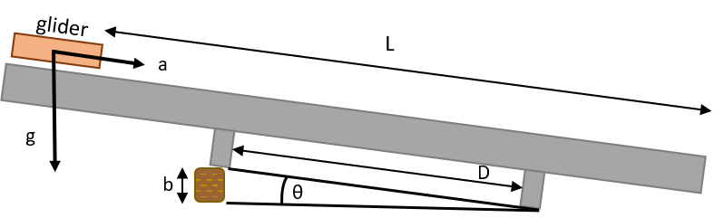

# Forces, Motion and Energy Transformation

## PART 1: MATHEMATICAL RELATIONSHIP BETWEEN THE ACCELERATION OF A MASS AND THE FORCE ACTING ON IT

### Gaining Intuition

If you stand on a skateboard, don't expect any motion to occur until you do something. You must place a foot on the ground and push-off. You observe that starting from rest, ($v_{0}$ = 0) in order to gain speed (accelerate) you must push with your foot. When you stop pushing, you stop accelerating and move at a somewhat constant speed until the combined forces due to friction (air and mechanical) bring you to rest.

:::Question
What do you need to do to attain a higher acceleration during the propulsion phase of your motion?
:::

A couple of things that can affect your acceleration are your leg strength, which determines the magnitude of the *force* you apply and that 55-lb backpack, otherwise, your total *mass* .

In this experiment, we will use gravity to apply a force to a glider riding on an inclined air track. We will measure the mass of the glider, and the applied force, and by timing the motion of the glider, its acceleration. We will then figure out what the relationship is among these quantities. Perhaps it is $F = m + a$. Or $F = m/a$. Or $F = m^{a}$.
Or perhaps it is something else. We will see.

### Procedure

:::Figure:Figure

:::

Figure 1 shows a schematic of the air track as it will be set up for this experiment. In order to demonstrate the effects of force while minimizing friction, the air track has lines of holes drilled along the top faces. A pump blows air into the track, which exits through the holes, providing a cushion on which the glider hovers along the track, virtually eliminating sliding friction. Furthermore, our setup has the following features:

- The track is tilted to an angle $\theta$ by inserting a block of height $b$ under one leg of the track. 
- The distance, $D$, between the legs of the track is 100 cm.
- The distance the glider will travel for each run, $L$, will be AVOCADO.

- The mass, $m$ of the glider is 190 g. We can attach up to four slugs (in pairs) to the glider  to increase its mass (to 290 or 390 g). AVOCADO (Check the masses.)

:::Exercise

In this exercise we want to explore how the mass $$m$$ of the glider relates to the force $$F$$ exerted on it by gravity ***along the track***. As you know, the force due to gravity is vertical, but we are only interested in the component along the track, since that is the one that generates the motion.

We use a spring scale to measure the force $$F$$. We keep the angle of the air track constant.
We release the glider from the top of the track, and record the time for the glider to travel from the start to when it hits the elastic bumper at the bottom end of the track. 
For these runs, the height b will equal GUAC.

The video below shows the setup, and the three glider runs. Use the timer on the video to find the time for each of the three runs.
AVOCADO (Need to decide how students will do timing, etc.)

1. Make a table like the one below, in which to record your data. Record the height b.
- - Height, $b$, in Fig. 2 (m) =
:::Figure:Table
| Mass (kg) | Force (N) | Distance (m) | Time (sec)| Acceleration (m/s$^{2}$) |
| --------  | --------      | --------     | --------      | --------      |
| "         |               |              |               |              |
| "         |               |              |               |              |
| "         |               |              |               |              |
:::

The following video shows the experiment:

AVOCADO: !(Video link goes here)

Video 1

2. For each run, use the kinematics you learned earlier in the quarter to calculate the acceleration from your measured values of $L$ and  $t$ (Hint: Use $$x=x_0+v_ot+1/2 a t^2$$ where $$x$$ is the coordinate along the air track).

::: Question
a) Does changing the mass affect the acceleration? 

b) What is the average acceleration you find for this particular incline?
:::

3. Using the height b, leg span D, and some trigonometry, determine the angle $\theta$.
4. The acceleration along the track is the component of the acceleration due to gravity $$g$$ along the track. The accepted value (to two sig figs) of $g=9.8$ m/s$^2$
Calculate the glider's acceleration $$a$$ from the value of $$g$$ and $$\theta$$.

::: Question
Find the percentage discrepancy between the acceleration $$a$$ you found by trigonometry and the average acceleration you found from kinematics.
:::
5. Now, from the data in your table, plot force vs. mass.

::: Question
a) Does the plot appear to be linear? 

b) How does the force depend on mass? Calculate the slope and compare it to your theoretical acceleration. 
:::

:::

####

:::Exercise
We will now repeat one of the runs from Exercise 1, but this time we will use a range finder to follow the motion of the glider as it travels down the track and then bounces back up to the top. The range finder will periodically measure the distance of the glider from the top of the track, so that at the end of the run, we will have a set of data points that give position versus time. We will keep the track at the same angle as before. The AVOCADO figure below shows the setup.

1. For two different masses repeat steps 4) through 6) from Exercise 1 for four different heights. See data sheet at the end of the lab.

We will use data points taken from when the glider bounces off the bumper at the bottom of the track to when it next returns to the bumper.

In order to use the range finder, we must attach a metal reflector plate to the glider. The mass of the glider with the plate attached is AVOCADO.

2. Make a table like the one below for the data you will use.

:::Figure:Table
|Mass $m_i$| "
| --------  | --------
| Distance (m) | Time (s) 
| "         |               |                          
| "         |               |                         
| "         |               |                        
:::

The following video shows the experiment:

AVOCADO: !(Video link goes here.)

We now have a set of position versus time data. The positions are the distance $r$ in the figure above (AVOCADO: make figure).

3. Take 10 points, roughly equally spaced, from maximum position to maximum position (the trip from the bumper, up the track and back to the bumper), and make a graph of position vs. time. What shape does this plot have?

4. From kinematics, you should know that the instantaneous slope (tangent) at any point on your position-vs.-time graph gives the velocity at that point. Now make a plot of velocity vs. time. AVOCADO -- Will we just give them the v-t plot?
:::

####
Recall from the previous lab that the instantaneous slope (tangent) of the velocity-vs.-time plot gives the acceleration at that point. If the acceleration is constant, then the velocity-vs.-time plot is a straight line. What is the slope of your velocity-vs.-time graph? How does this value compare with the other two values that you obtained before?
####

:::Exercise
In this exercise we want to explore how the acceleration $$a$$ of the glider relates to the force $$F$$ exerted on it. Thus, we will keep the mass of the glider (without the reflector) constant, and we will take four runs, each with the track at a different angle. As we did before, we will measure the force on the cart before each run.

For each set of four runs, the heights b will be, in order, AVOCADO, AVOCADO, AVOCADO, and AVOCADO.

The glider mass will be AVOCADO.

1. As before, make a table like the one below, and record the heights and mass given above. Derive the acceleration from the kinematics equation.
:::Figure:Table
| Mass $m_i$|"
| --------  | --------      | --------     | --------      | --------   |
| Height (m) | Force (N) | Distance (m) | Time (sec)| Acceleration (m/s$^{2}$) |
| "         |               |              |               |              |
| "         |               |              |               |              |
| "         |               |              |               |              |         
:::
The following video shows the experiment:

AVOCADO: !(Video link goes here.)

1. Now, with the data from your two tables, make two plots of force versus acceleration (one for $m_1$​ and one for $m_2$​).

:::Question 
a) Do these plots look linear?

b) How does force depend on acceleration? Determine the slope for each graph and compare it to the mass used for that plot.

c) Using your answers from Questions 4 and 5.1, write an equation that relates force to both mass $$m$$ and acceleration $$a$$. Clearly explain how you arrived at this equation.
:::

:::

## PART 2: ENERGY TRANSFORMATION
### Gaining Intuition
In this part of the lab you will be investigating the transformation of energy from one form to another, namely a transformation between potential energy (PE) and kinetic energy (KE). Potential energy is stored energy, for example the energy in a compressed spring, or the gravitational potential energy that an object has by virtue of its height above the ground. Kinetic energy is energy of motion. A mass, having been flung upwards by the spring after it has been released, has kinetic energy. When an object is dropped from some height above the ground, gravity accelerates it downwards, converting its initial potential energy into kinetic energy as it falls to the ground.

AVOCADO: add simulation

In the examples above, the mass starts out with zero kinetic energy. The spring, in one, and gravity, in the other, do work on the mass, thus giving it kinetic energy. This would suggest that work and energy are equivalent. Indeed, the Work-Energy Theorem states that the work done on an object is always equal to the change in kinetic energy of the object. Work and energy have the same units ($kg⋅m^2/s^2$), which represent the standard unit of energy called Joules (J). We will not discuss work in detail, but should note that it is defined as the product of the force acting on an object and the distance over which it acts, hence the aforementioned units.

For another example, loading a stone into a slingshot requires you to do work in stretching the elastic band by pulling the stone back against it. When you have pulled the stone all the way back, the work you have done is now stored as potential energy in the band. When you release the stone (a mass), the band relaxes, accelerating the stone from rest to whatever speed it has attained just as it flies free of the elastic band. Whatever potential energy was stored in the band, which you provided by stretching it, is now kinetic energy of the stone flying through the air.

Our main focus will be a fundamental law of nature called the Law of Conservation of Energy. This law states that (in the absence of dissipative forces, such as friction),

$$
PE+KE=Total energy
$$

The total energy in a closed system remains *constant*.

In the case of the slingshot, after you pull the stone back, the total energy is completely potential energy, and the kinetic energy is zero because the mass is not yet moving. Next, envision the the release in slow motion. The elastic starts to push on the stone, which begins to move. The mass now has kinetic energy.

::: Question
Where did the kinetic energy of the stone in the slingshot come from?
:::

Notice that as the kinetic energy starts to increase, the potential energy decreases by the same amount. The sum of the two energies must equal the starting energy, in this case the potential energy stored in the elastic band.

### Procedure
The figure below shows the setup we will use for this part of the lab. It is identical to the one we used in Exercise 2. For convenience, we present it here as well:

::: Exercise 

We will operate the air track in similar fashion to the way we did in Exercise 2. Again, we will place a riser block of height b under the single leg of the air track. This height will be AVOCADO.

The mass of the glider with reflector plate is AVOCADO.

1. Make a table in which to record your data. A sample table follows the math sheet below this exercise. Also record the height b and the mass of the glider with reflector plate, given above.

We will release the glider from the 160-cm mark on the air track, and the range finder will follow its motion as it rides back and forth on the track.

The following video shows this procedure:

AVOCADO: !(Video link goes here)

2. As you did before, record numerical data from the calculator for at least 10 data points of a single cycle. (Each cycle begins when the glider leaves the elastic bumper at the bottom of the air track, and ends when it returns there.)

3. Use (roughly) evenly spaced data points.

4. Include the point where the glider reached its maximum height.

5. Include the points where the speed was maximum. You may need to look at your v vs. t graph to get this.

6. For each data point, record the time, distance and velocity. By means of the mathematical formulae provided, you can use these to calculate the height, potential energy and kinetic energy of the glider for each point you record. Do this to fill in the rest of the table.

::: Question 
a) Where is the glider when its (gravitational) potential energy is maximum? 

b) Where is it when its kinetic energy is a maximum? Where is it when its kinetic energy is a minimum?

c) Do your data support the Law of Conservation of Energy?

d) When the glider hits the rubber band, what are the kinetic and potential energies right when the glider changes direction? Where did the energy go?

e) The previous question might suggest that this experiment involves two ways in which the kinetic energy of the cart is converted to potential energy, and then back to kinetic energy (or, initially, potential energy to kinetic, then back). Briefly describe these two conversion mechanisms.
:::
:::

:::Exercise 

Write a brief statement summarizing the mains points of this lab (both parts).
:::

## APPENDIX: FORCE, MOTION AND ENERGY TRANSFORMATION MATH SHEET
Gravitational potential energy is given by:

$$
PE = mgh
$$

where $m$ is the mass, $g=9.8 m/s2$ is the acceleration due to gravity , and $h$ s the height the object falls. Kinetic energy is given by:

$$
KE = \frac{1}{2}mv^2
$$

The angle $\theta$ satisfies

$$
\sin(θ) = b/D
$$
and
$$
\sin(θ) = hR − r
$$

Hence equating the right hand side of the last two equations, we obtain:
$$
h =Db(R−r)​
$$

On the air track, the distance D is 100 cm and the distance R is 200 cm. The distance r you will get from the range finder is the distance from the range finder to the car.