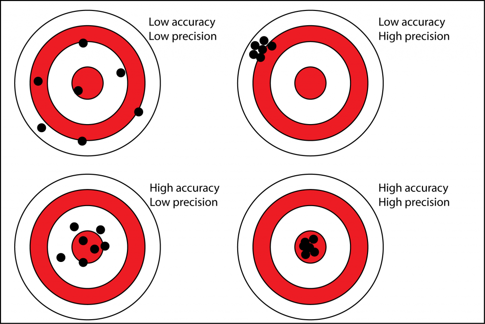
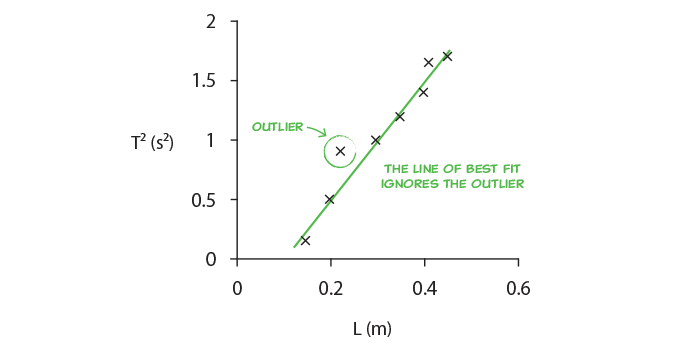

# Good Laboratory Practices

## INTRODUCTION
The goal of this assignment is to prepare you for the rest of the quarter, and even the next two quarters of the Physics 6 Lab series. We are going to walk you through some concepts that you will need to succeed in these classes. The things what will be highlighted are the following:

- The structure of the lab manuals and what is required of you.
- Uncertainty in measurement. 
- What are significant figures, and how to work with them.
- How to make a table of your data.
- How to make a *good* plot.
- What is a line of best fit or a curve fit?

## PART 0: GETTING FAMILIAR WITH THE FORMAT

In all of the lab manuals you will notice some common environments. Each environment will have different tasks that you need to do in order to get full credit.

### Exercises

::: Exercise
This is an exercise. An exercise is encapsulated task to cover one idea or concept. Inside of an exercise, you might be asked to do different subtasks. Each of these subtasks should be included in your report. **If they are not, you will lose points**.

Typical subtasks might include:
- Making a table.
- Making a plot.
- Taking a screenshot of something you did on your computer.
- Making a hand drawing, and including a picture of it. 

This is not an exhaustive list, but includes the most common subtasks you will need to do. 

As practice, for this exercise, create a list of the following three things:
1. Your name.
2. What major you want to graduate with.
3. The person who has won the largest share of the 2019 Nobel Prize in physics. 

When writing your lab report, make it as clear as possible as to which exercise you are responding. 
:::

### Questions
::: Question
This is a question. Questions will be something that you should respond directly too. There may be many different parts to a questions and you should answer each part. Sometimes questions are inside of exercises and other times they are not. 

Questions should be answered with a **full sentence** to get full credit. Some examples of bad answers are:
- Yes.
- It's bigger.
- It looks like it.
- Linear.

These sorts of answers will receive little to no credit.

Please answer the following for this question:

a.  Who is your TA?

b. What time is your section? 
:::

### Notes
::: Note
This is a note. Notes don't require you to put anything in your report. 

The main point of a note is just to highlight some critical information for you. Please make sure to read every note.
:::

## PART 1: COLLECTING DATA
Physics is the study of the laws of nature through observation and experiment. In an experiment, we perform measurements and collect data, then we interpret the data and  derive trends and relationships between our variables.

### Uncertainty in measurement
<!-- When we measure a quantity, say the length of a rod, what we measure will not be the true length.  Instead, if we were careful and thoughtful in our measurement, we will get a length close to the true length but limited by the resolution of our measurement tool. For instance, the smallest marking on the tape measure might be millimeters. Because of this barrier inherent in all measurement tools, even different measurements won't give the same result. This means that all measurements will contain a window of uncertainty about them. Some window in which we are confident that the true length of the rod lies.-->

When we measure a quantity, say the length of a rod, what we measure will not be the true length. Instead, if we were careful and thoughtful in our measurement, we will get a length close to the true length, our best guess. When we report our measurement to others, most honest way of reporting it is to provide our best guess and window of values in which the true length might fall. This window is called our **uncertainty**. We would typically write down the length of the rod in the following format.

$$
62.33 \pm 0.05 \text{ cm}
$$

The 62.33 cm is our best guess, and the 0.05 cm is our estimate of the uncertainty.  We are saying that our best guess at the true length of the rod is 62.33cm but the true length is most likely between 62.28cm and 62.38cm

:::Note
**UNCERTANTY IS INHERENT IN EVERY MEASUREMENT.**
:::

### Estimating Uncertainty

We always want to do our best to estimate the uncertainty of our measurements. This can help us in our analysis of the data. A good estimation is one that is as small as reasonable without overstating your knowledge. There are two good methods for estimating uncertainty. 

The first comes from using a graduated scale, like that of ruler. For a scale, we say the uncertainty is half of the smallest division on the scale. So if we were use a standard meter stick that as 1 mm divisions, we would say that our uncertainty is 0.05 cm. For a digital display, we say the error is half of the last digit displayed. That is if we were using an electronic balance to measure the mass of a stone and read 52g, then we would say our uncertainty is 0.5g.

The second way we estimate uncertainty is by repeated measurement. Often times this allows us to quantify a more complex measurement. For instance, if we were to be use a stopwatch to time how long someone was in the air when they jumped, we shouldn't report the uncertainty by half of the last digit display. This is because our reaction time, how quickly we can press the start and stop button, is much larger than precision of the stopwatch. Our reaction time makes it much harder to estimate the uncertainty of our measurement. 
In order to quantify the uncertainty of the stopwatch we will need to use some statistical tool that we will talk about later in this lab.

### Analyzing Results
The following concepts will help us understand uncertainty:
- ***Accuracy*** = how close the measured values are to the **true value**
-  ***Precision*** = how close the measured values are to **each other**

::: Figure:Figure

:::
#### Accuracy
The **accuracy** of your measurement is determined by *systematic errors*, which are present because of  the improper use of measurement devices or improper experimental design.  Systematic errors are those that consistently to push measurement in one direction

These errors are consistent between measurements: if you repeat the experiment, you'll get the same error.  Example of systematic error: not calibrating the scale before you measure a weight.

You can completely prevent systematic errors by understanding the equipment and experiment and using **proper measurement techniques**. Example: Taring your scale before measuring the weight of an object; keeping the line of sight perpendicular to a ruler when measuring a length.

#### Precision
The **precision** of your measurement is determined by *random errors*, which are distributed randomly around the true value.

You can't completely prevent random errors, but you can minimize them by using precise instruments and obtaining a  large data set in order to take the average of your measurements. Thus, you need to perform **multiple trials** by repeating the experiment several times to average out the random errors. 
Example: reaction time in pressing a stopwatch.

**Uncertainty** is a measure of how much your measurements deviate from the expected value, and is due to both systematic and random errors.

:::Exercise
An example of a random error is your reaction time. If you time how fast a friend runs a mile, you may start or stop the stopwatch a little too early or a little too late.

1. Measure your reaction time by going to the following website:
https://humanbenchmark.com/dashboard/reactiontime

2. Record your reaction time 10 times in a table.  Your table should look like Table 1:

:::Figure:Table
| Trial | Reaction Time (ms) | 
| -------- | -------- | 
| 1    |     | 
| 2  |     | 
| ...    |     | 
| 10    |     | 
:::

:::Question
What is your average reaction time?
:::
:::Note
Make sure to include the table in your lab report. 
:::
:::

### Measures of Precision and Accuracy

To determine if a value is accurate, we compare it to the accepted one. A qualitative measure of accuracy is the **percentage discrepancy**

:::Figure:Equation
$$\text{pecentage discrepancy} = \frac{\text{accepted - experimental}} { \text{accepted}} \times 100\%$$
:::

:::Exercise
In an experiment we measure the acceleration due to gravity to be $9.825 m/s^2$. The accepted value is $9.807 m/s^2$

:::Question
What is the percentage discrepancy in our measurement?
:::

:::
Sometimes there is no accepted value to our measurement. In this case, to measure the precision of two measurements that are determined experimentally, we look at how different the two values are as a percentage of their average. This is known as the **percentage difference**.

:::Figure:Equation
$$
\text{pecentage difference} = \frac{\text{value1 - value2}} {\text{average}} \times 100\%
$$
$$
\text{average} = \frac{\text{value1 + value2}}{2}
$$
:::

:::Exercise
In an experiment we make two measurements of the diameter of a tennis ball. They are $2.58$ in. and $2.61$ in.
:::Question
What is the percentage difference in our measurements?
:::
:::

::: Note
When comparing two values, you have two options. 
1. When comparing your measured value to a value that is well accepted by the scientific community, you want to use percentage error.
2. When comparing two values that are not generally accepted by the scientific community (two things you have measured), you want to use percentage difference. 
:::

The **precision** is also determined by the measurement instrument. In the figure below we have two rulers, one with a cm resolution and the other with a mm resolution.
The mm ruler is more precise because all measurements would be between 1.6 and 1.7 cm, while with the cm ruler, their values would be between 1 and 2 cm.

:::Figure:Figure

:::

## Significant Figures

When we quote our measurements,  the number of digits we write has to correlate with the precision of our measurement tool.
For instance, in the previous case when we use the cm scale, we quote a measurement as 1cm. We cannot quote it as 1.6723cm, since our ruler does not have that much precision. 
For the mm scale, we quote our measurement as 1.6cm, since the last digit mentioned (6) is the uncertain one.
To know the best way to write our answer, we must determine which **digits carry meaningful information**, and which ones do not. That is, we keep only those digits that are *significant*. We call these *significant figures*, which many people shorten to *sig figs*. These are all the digits whose values are certain, plus the first uncertain one. 

To determine the number of significant figures, count from left to right the number of digits.
For example: 1.67cm has 3 sig figs, whereas 1.6cm has two sig figs.
Note: The zeros at the beginning of a number are not significant, they are only used to determine the decimal point.
For example: 0.016 m has only two significant figures (this is the 1.6cm quoted before)

:::Exercise
:::Question
Determine the number of significant figures in the following measurements
a) 15.02
b) 42.120
c) 0.0004
:::
:::

### Significant Figures in Calculations
**When we add a series of numbers, the one having the greatest uncertainty determines the number of significant figures in the final result.** 
For example, the sum 53.7 + 2.63 + 0.068 equals 56.4. Since we know the value 53.7 only to the tenths place, we cannot know the sum to anything less than that digit.

**When we multiply or divide, we take the number of significant figures in the answer to be the same as that of the quantity that has the lowest number of significant figures.**
Thus, the result of the calculation (35 &times; 0.637)/256.3 is 0.087 (two sig figs).

::: Exercise

In this exercise you will practice the rules above by calculating some geometric properties about these shapes. Make sure you answers are written with the correct number of sig figs and with units. 

Here is a rectangle with length 2.4cm and width 3.2cm.

:::Figure:Figure

:::
:::Question
a. What is the perimeter of the rectangle?

b. What is the area of the rectangle?
:::

Here is a circle with radius 2.4 cm.
:::Figure:Figure

:::

:::Question
What is the area of the circle? 
:::
:::

Example:

Imagine that you&rsquo;ve been given the mass of a block of material as 75 grams, and its dimensions as 2.5 cm &times; 3.1 cm &times; 6.3 cm (it is a rectangular parallelepiped). You are told to calculate its density. Since density is mass per unit volume, you multiply the three dimensions together, and then divide the result into 75.  You do this on a calculator. For the volume, you get 48.825 cm$^3$, and for the density, the calculator spits out 1.53609831 (depending on how many digits the display gives; the units are g/cm$^3$). It may be tempting just to write down all of those digits for the final result of the calculation. The question is whether this is necessary, or whether such a number is actually meaningful. After all, given that we know the mass to the gram, and each dimension to the tenth centimeter, do we really know the density to ten nanograms per cc (the last digit in the result above), or to a microgram per cc (the 8), or even to a milligram per cc (the 6)?

For reasons that will soon become clear, the result of the density calculation above cannot contain more than two significant figures, and is properly written as 1.5 g/cm$^3$. To obtain this result, we round the three in the next place down. We always round to the nearest value of the last significant figure. To avoid biasing calculations that have multiple steps, we always round fives to the even number. For example, to two significant figures, 1.45 is 1.4, and 1.55 is 1.6.

Which brings us to a few more conventions.  If we were to write the result of the antilog above as 560, it would be ambiguous how many significant figures it had. The trailing zero could be merely a placeholder, or it could be the first uncertain digit. If it were significant, we could show this by adding a decimal point &ndash; 560. &ndash; or we could write 5.60 &times; 10$^2$. Leading zeros after the decimal point, as in 0.000325, are not significant. Certain multipliers, such as the 180, in 180/&pi;, the conversion factor to go from radians to degrees, or the 2 in 2&pi;r, the formula for the circumference of a circle, are exact.  They do not affect the number of significant figures in the result of a calculation in which they appear.

:::Exercise
We submerge a piece of unknown material in water in order to measure its volume. We also use a scale to measure its mass. Ultimately we want to calculate the density of this object.

:::Figure:Figure

:::
:::Question
What are the initial and final volumes (in mL) before and after the object is submerged? What is the volume (in mL) of the object?  Make sure you use the appropriate number of significant figures when stating all your answers.
:::
:::Question
If the mass of the object is 51.842g, what is its density (in g/mL) ? Make sure you use the appropriate number of significant figures when stating all your answers.
:::
:::Question
Knowing that the density of gold is $19.3 $ g/mL, what is the percent error in your measurement?
:::
:::

### Significant figures in unit conversions
When converting between units, you need to use the multiplication/division rule for significant figures.

:::Exercise
:::Question
A dog is 2 feet high.  What is the height of the dog in mm?
:::
:::

## Mean and Standard Deviation
To reduce the uncertainty in our measurements, we can conduct repeated measuements of the same quantity. 

If you take N measurements of a quantity $x$, known as **the mean** will be :

$$x_{avg}=(x_1+x_2+..x_N)/N$$

The standard deviation is a measure of the spread in the values $x_1, x_2,..., x_N$.

$$\text{STDEV}=\sqrt{\frac{\sum{(x_i-x_{avg})^2}}{N-1}}$$

The uncertainty of the mean can be calcualted using the standard deviation of the mean, which will be $\delta x=\text{STDEV}/\sqrt{N}$
We quote the mean value as $x_{avg}\pm\delta x$

Example: We measure the length of a table five times and get the data: 2.32m, 234m, 2.22m, 2.27m, 2.28m. In this case $N=5$ because there are 5 measurements.
The average is :
$L_{avg}=\frac{(2.32+2.34+2.22+2.27+2.28)}{5}=2.28$
Notice each measurement has 3 sig figs, so we keep 3 sig figs for the mean.

We will usually calculate the standard deviation using the STDEV() function in Excel.

:::Exercise
Use a stopwatch (either on your phone or online) to measure how long it takes you to say the sentence "I enjoy physics and learning about the laws of nature".  Make 10 measurements.

:::Question
Find the average and standard deviation of the time it takes you to say the sentence above.
:::
:::Question
Find the standard deviation for your reaction time in the previous exercise.
:::
:::

## PART 2: ANALYZING DATA

## Working with tables
We compile the data from our measurements in tables. 

In order for the table to convey the data accurately, it must contain:
1. Descriptive title of the table.
2. Data organized in columns with descriptive headers that specify variable names and units.  If a table must span multiple pages, a header needs to be added for every page.
5. Correct number of significant figures for the data. 
6. All data in a column aligned at the decimal point.

:::Exercise
We measure 
:::

## How to make a proper graph
Graphs help us visualize the **relationship between two variables**: the independent variable (on the x-axis) and the dependent variable (on the y-axis). 

### Steps in Drawing a Graph:

1. Identify the independent and dependent variables
2. Determine the range of each variable.
3. Clearly label each axis with variable name and unit of measurement.
4. Plot the data as a scatter plot. DO NOT "connect the dots"
5. Draw the line of best fit (usually linear)
6. Provide a descriptive titles that communicates the 

:::Exercise

A student measures the relationship between two variables, given in table 5:

:::Question
Identify mistakes with the following graphs

Example 1: Variable range improperly chosen.

Example 2: Missing descriptive title.

Example 3: Axes not labeled, units missing.

Example 4: Dots connected.

:::

***Note: Every time your graph contains these mistakes in this or subsequent labs you will be deducted points.**

:::
### Line of Best Fit

The line of best fit gives you the relationship between the two variables, highlighting the strongest trend in the data. It is determined by the entire data set, which makes it more accurate than only using a single data points. Thus, it reduces experimental errors.

#### How to find the line of best fit:

1.  **Outliers**. These may be due to experimental error or typing the data in the plotting program. Double check them. 

*DO NOT REMOVE AN OUTLIER without a good reason*.

2. The line of best fit is **balanced**, i.e. roughly the same number of points lie above it as below it.

:::Exercise
Which of the following lines of best fit seem reasonable, and which not

:::
### Slope significant figures
AVOCADO: Add information.

## Using Google Sheets to plot data

Watch the following video that shows how to plot data and find the line of best fit using Google Sheets.

::: GVideo
:::

:::Exercise
Use the data set given to you in Exercise AVOCADO, and make a graph. Display the equation for the line of best fit.
:::

## Putting it all together

Watch the following ruler dropping experiment to find the reaction time. AVOCADO: Add explanation of ruler drop.
1. Pause the video and record the length the ruler dropped when it is caught. 
2. Make a table with all ten values.
3. Make a column with the uncertainty in each value.
4. Convert each length to a time knowing that $$length=\frac{1}{2} gt^2$$. Use the appropriate number of significant figures.
5. Take the average of all your measurements.

Note: If you are able to do this with the help of a friend, you can use your own data.

## Conclusion

:::Exercise
Write a brief conclusion summarizing the important points of this lab.
:::

