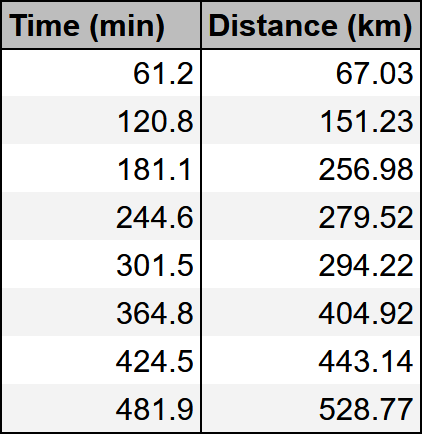
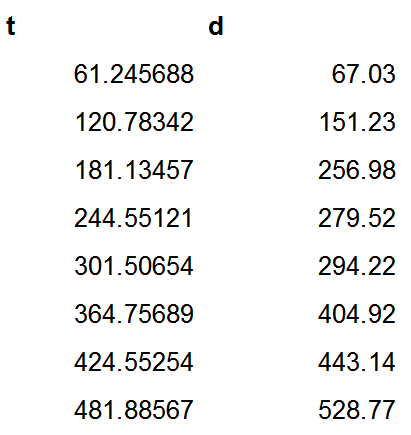
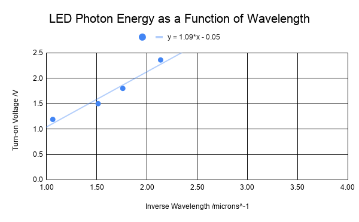
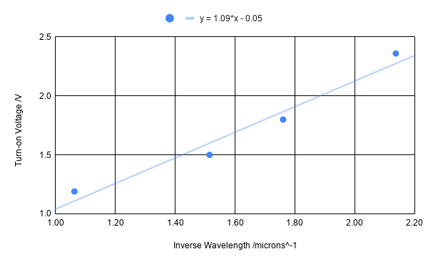
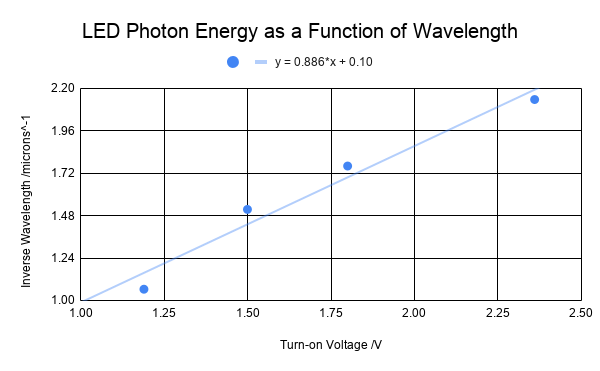

# ANALYZING DATA

---

***Make sure to include all tables, plots, pictures, drawings, screenshots or anything else asked of you in the exercises in your report, as well as answers to all the questions.***

***All responses and answers should contain the correct number of sig figs and should include units when needed.***

---

## Introduction
---

In this lab we will build on some of the concepts from the previous lab while adding some new skills. New topics we will discuss in the assignment are the following:

- What makes a good table.
- How to make a plot.
- How to perform a fit to some data.
- What makes a good plot. 
- Some guidance on how to determine if a plot is linear or not. 

---

## Making a Good Table
In the previous assignment you learned some basics about how to make a table for your lab report. Here we will write down the requirements for any table that you submit. 

In order for the table to convey the data accurately, it must contain:

1. Data organized in columns with descriptive headers that specify variable names and **units**.  If a table must span multiple pages, a header needs to be added for every page.
2. Correct number of significant figures for the data. 
3. All data in a column aligned at the decimal point.
4. If you have any calculations in your table then you should show your work for **one row** of the table. 

:::Figure:Figure

::: row

::: column

#### Good Table Example
:::

::: column

#### Bad Table Example
:::
:::
:::

Figure 1 shows two example tables. In the one on the left it, the two variables being measured is clear, the headers have units, it has the proper amount of sig figs, and the decimal points are aligned. 

The one on the right it is not clear what the two column represent. Even if you could determine what the two columns represent, there is no way for you to know the units. Is it seconds and millimeters? Hours and nanometers? Years and feet? 

Your goal with a table, is to communicate what you did as simply as possible to those reading your report. For this class, that means your TA who will be grading your report. If you are clear in your thoughts and your tables, it is more likely your TA will be able to understand any mistakes you make. This will allow them to provide better feedback, and maybe even take off less points. If your TA can't follow what you did, they are more likely to take off points.

## How to make a proper graph
Graphs help us visualize the **relationship between two variables**: the independent variable (on the x-axis) and the dependent variable (on the y-axis). 

An **independent variable** is one that *doesn't* depend on anything else. Often times, but not exclusively, it is a variable that you are measuring directly. 

A **dependent** variable is one that *does* depend on the other variables. Often times, but not exclusively, this is a variable that you get from doing calculations.

Often times in the lab manual we will ask you to plot "this vs. that." When asked to plot something with that format that means plot "dependent variable vs independent variable".

### Steps to Create a Good Graph:

1. Identify the independent and dependent variables and make sure you put them on the correct axis. 
2. Determine the range of each variable. Your data should take up most of the area of your plot. There *should not* be any large blanks areas.
3. Clearly label each axis with variable name and unit of measurement.
4. Plot the data as a scatter plot. DO NOT "connect the dots."
5. Draw the line of best fit (usually linear).
6. Provide a descriptive titles that communicates the scenario that is being plotted.

When it comes to a title, **don't** provide a title like "Distance vs Time." This is a bad title. This information can be determined from just looking at the axes. Your title should describe what is happening, e.g. "Distance Traveled by Car on Vacation Trip."

Here is an example of a good plot.

:::Figure:Figure

:::

Notice that the data takes up the entire plot. There are no large blank areas. Both of the axes are labeled and have units. The data points are not connected and there is a line of best fit. There is also a title for the plot that lets us know what the experimenter was doing.

:::Exercise

In this exercise you will use the 6 rules above to identify mistakes in graphs that other students have made.

:::Question
Identify mistakes with the following graph.

::: Figure:Figure

:::

:::

:::Question

Identify mistakes with the following graph.

::: Figure:Figure

:::
:::

::: Question

Identify mistakes with the following graph.
::: Figure:Figure

:::
:::

:::Question

Identify mistakes with the following graph.
::: Figure:Figure

:::
:::

:::Question

Identify mistakes with the following graph.
:::Figure:Figure

:::
:::

:::Note
***Every time your graph contains these mistakes in this or subsequent labs you will be deducted points.***
:::

:::

### Curve Fitting

Curve fitting gives you the relationship between the two variables, highlighting the strongest trend in the data. It is determined by the entire data set, which makes it more accurate than only using a single data points. Thus, it reduces experimental errors. 

Choosing which curve to use (line, parabola, exponential, etc.) for your data can take some practice. Your choice may depend on a few factors.

- What does theory suggest it should be?
- What message are you trying to convey to the reader?
- Does the data suggest you've selected the correct curve?

For most of the Physics 6\*L you will be doing linear fits to data, but there will be occasions where we need something non-linear. For that reason, we will provide examples mainly of linear fits, but keep in mind that these guidelines apply to any curve fit. 

#### How to analyze a fit:

For this example we will consider a student, Jillian, who is investigating different types of engines in her model rocket. She wants to evaluate the thrust of the different engines as a function of time. 

1.  **Outliers**. These may be due to experimental error or typing the data in the plotting program. When you see an outlier you should stop and assess it. In this class, more often then not, it is because a scale was read wrong, some data was transcribed incorrectly, or there was an error in the data collecting tool.

:::Note
*DO NOT REMOVE AN OUTLIER without a good reason*.
:::

On here first run she sees an outlier in here data set. She takes a closer look at her measurement system and realizes there is a loose cable which causes intermittent failures. She decides this run was not valid, and does the experiment again.

:::Figure:Figure

:::

2. The a curve fit is **balanced**, i.e. roughly the same number of points lie above the line as below it. This time Jillian plots her data and sees what looks like a balanced fit with no outliers. There are roughly the same number of points above an below the line of best fit. 

:::Figure:Figure

:::

3. Similar to 2, the data should be randomly above and below your fit. For instance, if you fit a line to your data and notice that data starts off below the line, then goes above, and then below again, your data likely isn't represented by a line, but something else. 

When Jillian takes data for her second engine, plots and does a linear fit this is her plot.

:::Figure:Figure

:::

Notice how the the data starts above the fit, then goes below the fit, then back above the fit. Jillian recognizes that this means here data is not linear because the data she be randomly above and below the fit as in Figure 9.

She reads manufacturer data sheet for the second engine and learns the thrust should increase quadratically in time. So she decides to fit a parabola to the data. This is her new plot.

:::Figure:Figure

:::

Notice how the curve follows the data more closely and how the data is randomly distributed around the curve. This is sign of using the correct function to fit your data.

:::Exercise
Which of the following lines of best fit seem reasonable, and which not

:::
### Slope significant figures
AVOCADO: Add information.

## Working with a Spreadsheet
Spreadsheets will make your life **MUCH** easier. We highly recommend that you take the time to learn how to use them. It will be a useful skill for all of your Physics 6 lab courses and you may even find it useful in the real world. 

#### Using Equations in a Spreadsheet

#### Using Spreadsheets to make a plot

#### 

## Using Google Sheets to plot data

Watch the following video that shows how to plot data and find the line of best fit using Google Sheets.

::: GVideo
:::

:::Exercise
Use the data set given to you in Exercise AVOCADO, and make a graph. Display the equation for the line of best fit.
:::

## Putting it all together

Watch the following ruler dropping experiment to find the reaction time. AVOCADO: Add explanation of ruler drop.
1. Pause the video and record the length the ruler dropped when it is caught. 
2. Make a table with all ten values.
3. Make a column with the uncertainty in each value.
4. Convert each length to a time knowing that $$length=\frac{1}{2} gt^2$$. Use the appropriate number of significant figures.
5. Take the average of all your measurements.

Note: If you are able to do this with the help of a friend, you can use your own data.

## Conclusion

:::Exercise
Write a brief conclusion summarizing the important points of this lab.
:::

