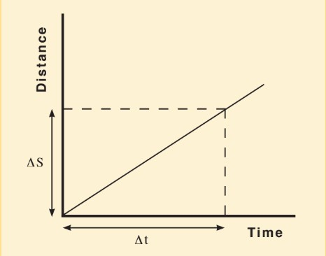

# Velocity, Acceleration, and Falling Objects

## PART 1: INTRODUCTION

### Gaining Intuition

Suppose that you are sitting in the lab and you have some time to kill before the lab starts. You just finished your bag of chips in the hall and now feel a bit thirsty. After counting your change, you decide you have the time and resources to get a soda before class starts, and you head out to the nearest vending machine. Once there, you find only one selection left, and you *so* dislike orange. So you scurry to another vending machine across campus, only to find that it is out of order. You find a third, but this nasty machine won&rsquo;t take your coins. Noticing that the time has run out, you make it back to class empty-handed and find someone in your seat. You find a lab seat three feet to the left of the one you had occupied prior to your search for a soda.
```
```
Moral of the story: Carry a bottle of water.

### Displacement

Like lawyers, doctors, engineers and others in various professions, physicists have their own vocabulary and language. The language of physics is mathematics. In the tale above, the net result of your journey was simply that you ended up three feet to the left of your original position. This distance is called the net displacement. If you connect a string from the initial position to the final position, you will reel out three feet of string to the left. Your (net) displacement is three feet to the left. The concept of position presupposes some sort of reference frame. You need to know where you were before you can figure out how far you went. By convention, we use Cartesian (rectangular) coordinates on a Euclidian (flat) plane. We locate points on the plane by means of two perpendicular axes. The horizontal, or *x*-axis, and the vertical, or *y*-axis. These cross each other at the point where the *x* and *y* coordinates are both zero (the *origin*). On the *x*-axis, left of zero is negative (-), and right of zero is positive (+). Also, any displacement towards the left is negative, and any displacement towards the right is positive. In the story above, the displacement is -3 feet, or three feet to the left of the original location. Other conventions are (for the *y*-axis) up (+) and down (-), and (for rotation) clockwise (-) [cw] and counterclockwise (+) [ccw]. You&rsquo;ll bump into these terms soon. You may have noticed that we specified the displacement with two items &ndash; 3 feet, a magnitude, and &ldquo;to the left,&rdquo; a direction. A quantity that has both magnitude and direction is called a *vector* (directed line segment). We may take &ldquo;to the left&rdquo; to mean -180 degrees. We use the horizontal direction as the zero reference, with zero degrees towards the right. A positive angle opens above the horizontal and increases in the counterclockwise direction. A negative angle opens below the horizontal and increases in the clockwise direction.
```
```
It is important to note that the initial position and the final position are vectors, **r**$_1$ and **r**$_2$. Each has its tail at the origin, and its head at the *x*, *y* coordinates of its respective position. The displacement vector is the difference **&Delta;r** = **r**$_2$ - **r**$_1$, whose components we obtain by subtracting *x* $_2$ -*x*$_1$ (call this &Delta;r$_x$ ) and *y*$_2$ - *y*$_1$ (call this &Delta;r$_y$). Since these form two sides of a right triangle, the magnitude of **&Delta;r** is $\sqrt{\rm\Delta{r}\it{_x}^{\rm{2}} + \rm\Delta{r}\it{_y}^{\rm{2}}}$ (the length of the hypotenuse), and the angle of its direction is given by tan &theta; = &Delta;r$_y$/&Delta;r$_x$.  In this lab, you will be dealing with motion along only one coordinate (the *y* coordinate), so merely subtracting one height from another will give the magnitude of the displacement, and the direction will be (vertically) downward.

### Velocity

Here is another vector. It also has two parts, a magnitude and a direction. The magnitude of the velocity is called *speed*. Speed is just a number without an associated direction. We call this type of quantity a *scalar*. 65 mph, 14 feet/second, and $3 \times 10^{8}$ meters/second are all speeds. Once one attaches a direction, however, a speed becomes a velocity. 65 mph north, 14 feet/second up, and $3\times 10^{8}$ meters/second to the left are all velocities. Let&rsquo;s say that you took 15 minutes to try, unsuccessfully, to find a soda. The velocity is defined as (your net displacement)/(the elapsed time). We have -3 feet/15 minutes, which equates to -0.2 feet/minute or -12 feet/hour. Recall that the displacement was to the left (-180&deg;). Observe that velocity is a change in position divided by a change in time. Hence,


:::Figure:Equation
$$
\bf{\bar{v}} = \frac{\Delta r}{\rm\Delta t}
$$
:::

where, $\bf\bar{v}$ is the velocity, **r** is the position ($\bf\Delta r$ is the displacement), and t is the time (&Delta;t is the elapsed time). Note: $\bf{\bar{v}}$ and **r** are bold, because they are vectors.  Note, also, that there is a bar over **v**. This is because the net displacement divided by the elapsed time gives the *average* velocity. Your search for a soda may have taken you on a long loop around the campus, over which both your speed and the direction in which you walked varied. Thus, in the 15 minutes that it took you to make the entire trip, you ended up having moved only three feet from your starting point. (Had you found your original seat empty and returned to it, your average velocity would have been zero feet/hour.)

### Acceleration

This is yet another vector. It also has two parts, magnitude and direction. The definition of acceleration is the time rate of change of velocity. This yields units that might look a bit weird. Let&rsquo;s say that you are on a skateboard and you increase your speed from 2 mph to 12 mph in 20 seconds. For the sake of argument, you are moving in a straight line due north. By this definition, your acceleration would be 10 mph/20 seconds or 0.5 mph/sec north. The formulation looks like this:

:::Figure:Equation
$$
\bf{a} = \frac{\Delta v}{\rm{\Delta t}}
$$
:::

where, **a** is the acceleration, **v** is the velocity, and t is the time. 

- Notice that displacement, velocity and acceleration are all related to each other. Let&rsquo;s say we graph the displacement of an object with respect to time, with position on the vertical axis and time on the horizontal axis. To find the velocity of the object after some time, t, we find the point on the data line above that value of t, and then extend a horizontal line from that point to the y-axis to find the displacement.

- Hint: For simplicity, the motion starts at the origin, and ***the direction stays the same***. With this condition, we can call the velocity speed, and call the displacement distance. (Note that an object can experience acceleration in which both speed and direction change, in which speed is constant but the direction changes, or in which direction is constant but the speed changes. In this lab, we will deal with only the last case &ndash; only the speed will change.)


:::Figure:Figure

:::

 - Distance vs. Time Graph. The instantaneous speed (velocity) is equal to the slope of the tangent line at the point of measurement. In the case of constant velocity (no acceleration), it is the slope anywhere on the line.

Without further ado, we present the following statements:

1. The velocity of an object at a certain time is the slope of the distance-time graph at that point.
2. The acceleration of an object at a certain point is the slope of the velocity-time graph at that point.


## PART 2: MOTION OF FALLING OBJECTS

When dropped from the same height, which one of these objects &ndash; stone or feather &ndash; will hit the ground first? Most people will say, &ldquo;That depends.&rdquo; If this is done in a normal room environment, the stone wins. If it is done in an evacuated cylinder, both hit the bottom at the same time. In the next activity, you will watch videos of someone dropping a variety of balls from a sixth-floor walkway. For one drop, you will measure and record height and time data, and for the rest, you will be given the data. You will plot these data, and use your results to test the validity of one of the motion formulas, namely,

:::Figure:Equation
$$
y = v_{0y}t + \frac{1}{2} a_{y}t^2
$$
:::

where y is the position, $v_{0y}$ the initial velocity, $a_{y}$ the acceleration, and t the time.

### Procedure

:::Exercise
In this section, you will watch several videos, each of which will show a different type of ball being dropped from the sixth-floor walkway of Broida Hall. For one of the videos, you will periodically make the video pause, and take height and time data. For the others, you will be given the data.  You will then plot the data in two different ways, and check how well the plots fit equation 3.

The drop height above the landing zone is GUAC. It will be best if you use this height as your zero reference. That is, the ball is dropped from *y* = 0, and strikes the ground at *y* = -GUAC. (You may subtract the measured heights from the drop height, to yield positive numbers, with the ball landing at GUAC. This will merely flip the graphs; they will otherwise be identical.) AVOCADO <!--  This may depend on how the students will be measuring the heights. -->

::: Figure:Video
AVOCADO !Video link goes here
:::
Watch Video 1. At several times during the descent of the ball, make the video pause, and use GUAC to measure the ball&rsquo;s height and the corresponding time. (At the start, measure the zero time; the drop height, as noted above, is GUAC.) You should be able to take six data points, including the start and when the ball hits the ground. The more points you can get, the better; take at least six.

1. Prepare a table for each ball to be dropped, with columns for height and time. (You may, of course, put all the data in one table. Depending on how you measure the heights, you will want to add columns, as necessary, so that you can subtract the initial drop height from all the measured heights. If the timing does not start exactly when the ball drops, you will want also to include extra time columns to subtract the start time from all subsequent times.) AVOCADO <!-- if the students will measure heights as differences from the drop height, this won't be necessary.-->

:::Figure:Video
AVOCADO !(Video link goes here)
:::

2. Now watch videos 2 through GUAC. You will be given data for these drops, but it will be good for you to see them. You may wish to record any observations you have as you watch.

:::Figure:Video
AVOCADO !(Video link goes here)
:::

:::Figure:Video
AVOCADO !(Video link goes here)
:::

:::Figure:Video
AVOCADO !(Video link goes here)
:::


3. For each ball, graph the height y, vs. fall time t. Label your graph with the proper units. As noted above, your graph should have at least six points (including the origin). These are enough data to check basic trends. Make a separate graph for each ball. AVOCADO <!-- In earlier quarters, the students made these graphs on paper. I would guess that we are now expecting that they do this in a spreadsheet. Do we want to include some kind of instruction here, or assume that they will have a favorite, most likely Excel? -->

:::Question
a) Are any of these plots linear?

b) In terms of displacement, velocity, or acceleration, what does it mean if the plot is linear?

*(The plots you will make for step 4., below, may help you a bit with the answers to questions c), d) and e).)*

c) Are all of the curves shaped the same way? That is, do their slopes all change the same way, or do some change more gradually than others? If you see such a difference among the graphs, what might be causing it?

d) Do any of the curves appear to have different regions, that is, parts where the slope changes at noticeably different rates? If so, what might be causing this?

e) Do any of your curves exhibit a linear region (no change in slope)? At what part of the descent might this occur? What is the name for the velocity of the ball during this part of its descent?
:::

4. On each of these same graphs, also plot $y = \frac{1}{2} a_{y}t^{2}$ (using $a_{y} = -9.8 m/s^{2} = -32 ft/s^{2}$ to get *y*, plotting out to the total fall times) and  compare this to your original data. Remember to include a few sentences of analysis with each graph.

:::Question
a) Which object’s fall matched $y = \frac{1}{2} a_{y}t^{2}$ the best?

b) Which object’s fall matched $y = \frac{1}{2} a_{y}t^{2}$ the least?

c) Why didn’t all of your plots match $y = \frac{1}{2} a_{y}t^{2}$?

d) Based on your experiment, what properties of the object affect how the object falls?
:::

:::


## Collecting the Data 

You have collected some data for a basketball falling from the sixth floor of Broida. Three other balls were dropped from the same point at Broida. Rather than have you repeat the same data collection we have collected data for you using a software called Tracker.

Tracker allows us to monitor the location of the ball at every frame of the video which happens once every 1/30 seconds. This method has two advantages. 

1. We are able to more precisely identify the location of the ball.
2. We are able to collect many more data points.

Below is a short video demonstrating how the Tracker software was used to collect data for the four drops.

:::Figure:Video
Insert Raffi OBS Video Here
:::

The data you will need is in Table 1 below, linked in a google sheet.

:::Figure:Table

| Ball Drop Data Set | 
| -------- | 
| [Link to Google Sheet](https://docs.google.com/spreadsheets/d/10RA1GWimVGeEHLYbc5dD-71jtPhEDk3WvfPQPjx9kNI)    | 

:::


## Anaylzing the Data

::: Exercise
1. Start by copying the data linked in Table 1 into separate spreadsheet. 
2. Now you will insert your data you took for the basketball into the table and plot all four ball drops on one plot. For instructions on how to do this, watch the following video. 

:::Figure:Video
Video of plotting data. 
:::
:::

::: Exercise
In this exercise we will start the analysis process of the lab.

In the next exercise, for each of the datasets, you will perform a polynomial fit of degree 2. This will draw a line of best fit by using a quadratic function. That is that it will attempt to fit the equation:

:::Figure:Equation
$$
y = ax^2+bx+c
$$
:::

The computer will adjust $a$, $b$, and $c$ to best fit the data provided. Let's start by understanding what $a$, $b$, and $c$.

Equation 4 looks a lot like our kinematic equation for motion. Let's equate Equation 4 to the kinematic equation. We do this in Table 2 below. Each row starts by defining the variable. The next column has the symbol we use to represent the variable in the fit. The final column has the equivalent symbol used in the kinematic equation.

:::Figure:Table
| Variable Name | Fit Symbol | Kinematic Symbol |
| -------- | -------- | -------- |
| Time     | $x$     | $t$     |
| Position | $y$    | $y$    |
| Acceleration| $a$ | $\frac{1}{2}g$ |
| Initial Velocity | b |  $v_0$ |
| Initial Position | c | $y_0$
:::


:::Note
** This is a critical concept that you understand before moving forward. Below are three questions. Read them and spend a few minutes trying to answer them for yourself. When you think you have the answers, click the link at the bottom to take you to the answers. **


a. For an ideal fall (one that falls exactly like the kinematic equation describes), what should the value of $a$ in your fit be?

b.  For drop like the ones in the video, where the ball is released from rest, what should the value of $b$ in your fit be?

c. When the origin is defined at the release point of the ball, like it is in the video, what should the value of $c$ in your fit be?

[Answers](https://docs.google.com/document/d/1xuPutEV_pWWWZYYmi8oLKV-G9F3q-pMSDv9B48brLp0)

:::
:::

:::Exercise
In this exercise you will perform a fit for each ball drop and start the analysis of the drops. 

1. Start by just looking at your data. Compare 


:::


