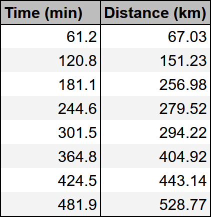
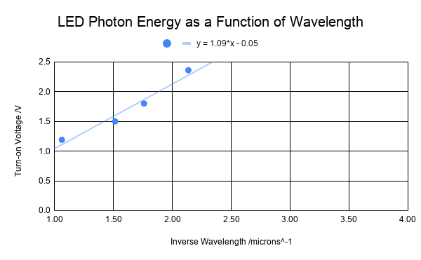
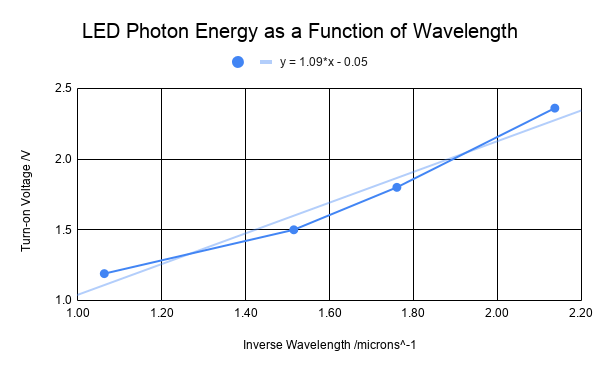
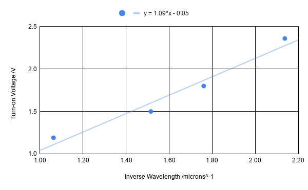
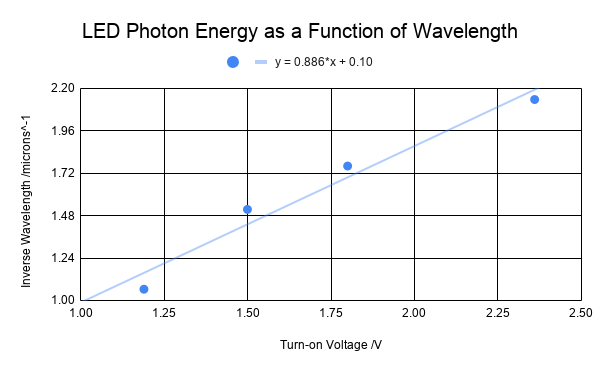

# Lab 1: Analyzing Data
---

:::Card Intro In this Lab...
 We will build on some of the concepts from the previous lab while adding some new skills. New topics we will discuss in this assignment are the following:

- What makes a good table.
- How to make a plot.
- What makes a good plot. 
- How to perform a fit to some data.
- Some guidance on how to determine if a plot is linear or not. 

:::
---

# Making a Good Table
In the previous assignment you learned some basics about how to make a table for your lab report. Here we will write down the requirements for any table that you submit. Expand the box below to see the requirements.

:::Hider Recipe for a Good Table
**In order for the table to convey the data scientifically, it must contain:**

1. Data organized in columns with descriptive headers that specify variable names and **units**.  If a table must span multiple pages, a header needs to be added for every page.
2. Correct number of significant figures for the data. 
3. All data in a column aligned at the decimal point.
4. If you have any calculations in your table, then you should show your work for **one row** of the table. 
:::

Below we show an example of an excellent table and a not-so-great table. Just by glancing at them, you can probably guess which table is which -- the bad table is visually confusing and difficult to read, independent of its poor technical qualities.

::::::RFigure table_ex m

::: col l6

Table 1
:::

::: col l6

 Table 2

:::

::::::

[Fi](#Fi-table_ex) shows two example tables. In the table on the left, the two variables that were measured are clearly described, the headers have units, the values have the proper number of sig figs, and their decimal points are aligned. 

In the table on the right the variables are not clearly described. Even if you could determine what the two columns represent, there is no way for you to know the units. Is it seconds and millimeters? Hours and nanometers? Years and feet?

Your goal with a table, is to communicate what you did as simply as possible to those reading your report. For this class, that means your TA, who will be grading your report. If you are clear in your thoughts and your tables, it is more likely that your TA will be able to understand any mistakes you make. This will allow them to provide better feedback, and maybe even take off fewer points. If your TA can&rsquo;t follow what you did, they are more likely to take off points.

# How to make a proper graph
Graphs help us visualize the **relationship between two variables**: the independent variable (on the x-axis) and the dependent variable (on the y-axis). If you are unfamiliar with these terms, take note of their definitions below:

:::Card Definition Independent Variables
An **independent variable** is one that *doesn't* depend on anything else. Often times, but not exclusively, it is a variable that you are measuring directly. 
:::

:::Card Definition Dependent Variables
A **dependent** variable is one that *does* depend on the other variables. Often times, but not exclusively, this is a variable that you get from doing calculations.
:::

Often times in the lab manual we will ask you to plot &ldquo;this vs. that.&rdquo; When we ask you to plot something with this format, that means plot &ldquo;dependent variable vs. independent variable.&rdquo;

## Creating a Good Graph

:::Hider Recipe for a Good Graph

1. Identify the independent and dependent variables, and make sure you put them on the correct axes. 
2. Determine the range of each variable. Your data should take up most of the area of your plot. There *should not* be any large blank areas.
3. Clearly label each axis with the variable name and unit of measurement.
4. Plot the data as a scatter plot. DO NOT &ldquo;connect the dots.&rdquo;
5. Draw the line of best fit (usually linear) and include its equation.
6. Provide a descriptive title that communicates the scenario that you are plotting.
:::

When it comes to a title, **don&rsquo;t** provide a title like &ldquo;Distance vs. Time.&rdquo; This is a bad title. This information can be determined from just looking at the axes. Your title should describe what is happening, *e.g.*, &ldquo;Distance Traveled by Car on Vacation Trip.&rdquo;

[Fi](#Fi-goodgraph), below, is an example of a good plot, which shows the relationship between the color (wavelength) of the light emitted by several different LEDs and the measured voltage at which they turn on.  The Inverse Wavelength is the independent variable and the Turn-on Voltage is the dependent variable.

:::Figure goodgraph xl

Example of a Good Graph
:::

Notice that the data take up the entire plot; there are no large blank areas. Both of the axes are labeled and have units. The data points are not connected, and there is a line of best fit. There is also a title for the plot that lets us know what the experimenter was doing.

::::::Exercise

In this exercise you will use the six rules above to identify mistakes in graphs that other students have made.

:::Question
Identify mistakes in the following graph.

:::

:::Question

Identify mistakes in the following graph.

:::

::: Question

Identify mistakes in the following graph.

:::

:::Question

Identify mistakes in the following graph.

:::

:::Question

Identify mistakes in the following graph.

:::

:::Note
Every time your graph contains these mistakes in this or subsequent labs you will be deducted points.
:::

::::::

## Curve Fitting

Curve fitting gives you the relationship between the two variables, highlighting the strongest trend in the data. It is determined by the entire data set, which makes it more accurate than using only a single data point. Thus, it reduces experimental errors.

Choosing which curve to use (line, parabola, exponential, etc.) for your data can take some practice. Your choice may depend on a few factors.

- What does theory suggest it should be?
- What message are you trying to convey to the reader?
- Do the data suggest that you&rsquo;ve selected the correct curve?

For most of Physics 6\*L you will be doing linear fits to data, but there will be occasions where we need something non-linear. For that reason, we will provide examples mainly of linear fits, but keep in mind that these guidelines apply to any curve fit. 

## How to analyze a fit:

For this example we will consider a student, Jillian, who is investigating different types of engines in her model rocket. She wants to evaluate the thrust of the different engines as a function of time. 

1.  **Outliers**. These may be due to experimental error or to mistakes in typing the data into the plotting program. When you see an outlier you should stop and assess it. In this class, more often than not, it is because a scale was read wrong, some data were transcribed incorrectly, or there was an error in the data collecting tool.

:::Note
DO NOT REMOVE AN OUTLIER without a good reason!
:::

On her first run, Jillian sees an outlier in her data set, shown in [Fi](#Fi-jill1). She takes a closer look at her measurement system and realizes that there is a loose cable, which causes intermittent failures. She decides that this run was not valid, and she does the experiment again.

:::Figure jill1 xl

 Jill's Line of Best Fit and apparent outlier
:::

2. The curve fit is **balanced**, *i.e.*, roughly the same number of points lies above the line as below it. This time Jillian plots her data in [Fi](#Fi-jill2) and sees what looks like a balanced fit with no outliers. There is roughly the same number of points above and below the line of best fit. 

:::Figure jill2 xl

Line of Best Fit after removing the outlier
:::

3. As shown in [Fi](#Fi-jill2), the data should be randomly above and below your fit. For instance, if you fit a line to your data and notice that data start off below the line, then go above, and then below again, your data likely aren&rsquo;t represented by a line, but by something else. 

When Jillian takes data for her second engine, plots and does a linear fit, she obtains the plot in [Fi](#Fi-jill3).

:::Figure jill3 xl

:::

Notice that the data start above the fit, then go below the fit, then back above the fit. Jillian recognizes that this means her data are not linear, because the data should be randomly above and below the fit as in Figure 4.

She reads the manufacturer data sheet for the second engine, and learns that the thrust should increase quadratically in time, so she decides to fit a parabola to the data, as in [Fi](#Fi-jill4).

:::Figure jill4 xl

:::

Notice that the curve follows the data more closely and that the data are randomly distributed around the curve. This is sign of using the correct function to fit the data.

::::::Exercise

Below are two plots of the [population of California from 1900 to 1950](https://www.macrotrends.net/states/california/population). The data are the same in both of the plots, but each plot has a different fit. The first one is a linear fit, and the second is an exponential fit.

:::Figure

Linear
:::

:::Figure

Exponential
:::

:::Question
Which function fits the data better -- linear or exponential? Explain your reasoning.
:::
::::::

## Significant Figures in the Line of Best Fit
Just as with all physical quantities, a trend or slope estimated from data is subject to the limits of significant figures for reporting purposes. In the case of the line of best fit, which may be calculated from tens -- if not hundreds -- of data points, the number of significant figures isn&rsquo;t directly inherited from the number of sig figs present in your data. This is something that must be estimated from the entire set of data you are working with.

We have to be clear about what a sig fig is, so we know how many digits to keep! When we talk about a sig fig, we are actually talking about a measure of *uncertainty*. For example, if I measure and record a velocity of 1.2 m/s, I am saying that the actual value of this velocity is greater than 1.15 m/s and less than 1.25 m/s -- in other words, that the true velocity lies in this interval of numbers that *round* to 1.2 m/s; hence, the &ldquo;2&rdquo;  is the smallest significant digit.

The same principle applies for lines of best fit: we need to determine the smallest digit that is not sensitive to the random nature of a real set of data, which will never fall exactly on a trend line. While the math and concepts that we need to fully understand this procedure are often employed in upper-division labs with error analysis components, we can use spreadsheets to help us determine the error. By using the function &ldquo;LINEST,&rdquo; we can make a spreadsheet provide us with the values for the slope and intercept, as well as the error in those values. The error will tell us the correct number of sig figs needed. We will demonstrate how to use this below.

To determine the least significant digit in your slope, you round the value of $m$ to the digit that coincides with the first non-zero decimal place of the uncertainty. For example, if you obtained $m = 12.9274...$ and an uncertainty of $0.038273$, you would report in your notebook $m= 12.93$. This is very similar to using the &ldquo;STDEV&rdquo; function that we used in the last lab.

:::Note
When determining the number of sig figs to report in our slope or intercept we will rely on the standard error reported by the LINEST function.
:::

## Significant Figures in More Complex Curve Fits
If we are doing more complicated curve fits than just lines, we require more knowledge about programming or higher level math. That is above what is needed in this class. For all of the physics 6\*L classes, we will just use the following convention:

:::Note
The number of sig figs in a non-linear curve fit will be limited by the number of sig figs in your data.
:::

As an example, if we collected data on the amount of potential energy a spring has as a function of its displacement from equilibrium, we might get data like the following:

:::::::::row

::::::col l6
::: Table
| Length (m) | Potential Energy (J) |
| -------- | -------- | 
|   0.021   | 0.012    | 
|   0.043   |  0.212   | 
|   0.065   |  0.372   | 
|   0.085   |  0.740   | 
|   0.107   |  1.061   | 
|   0.129   |  1.850   | 
|   0.150   |  2.310   | 
|   0.169   |  2.756   | 
|   0.191   |  3.764   | 
|   0.209   |  4.121   | 
|   0.228   |  4.752   | 
|   0.249   |  6.250   | 
|   0.267   |  7.563   | 
:::
::::::

::::::col l6
:::Figure

:::

::::::
:::::::::
Since we expect the result to be quadratic, *i.e.*, that it takes the form $ax^2+bx+c$, that is the fitting function we have used. The results are displayed above the graph as $82.8x^2-3.69x-0.16$ with $a=82.8$, $b=3.69$, and $c=-0.16$. If we were to report $a$, $b$ or $c$, or do any calculations with them, we would need to use the correct number of sig figs.  

To determine the correct sig figs we look to our data table. Since the lowest number of sig figs in either the length or the force is two, we will treat $a$, $b$ or $c$ as having only two sig figs. Thus, $a=83$, $b=3.7$, and $c=-0.16$. 
Again, this is not a standard way of treating the data, but a convention that we are taking on for this class. 

---

# Working with a Spreadsheet
Now that we have talked about what makes a good table, plot, and curve fit, we will show you how to do this for yourself. Spreadsheets will make your life **MUCH** easier. We highly recommend that you take the time to learn how to use them. It will be a useful skill for all of your Physics 6\*L lab courses, and you probably will even find it useful in the real world. 

We will walk through plotting and fitting the data in Figure 1. We will assume that you can make a table from having done the first lab. These data are recorded by a car traveling from San Diego to San Francisco. The driver marked the distance traveled in kilometers roughly every 60 minutes. Once the car got on the freeway, the driver put on cruise control and  never stopped (what amazing mileage!). 

**We want to answer the question: at what speed, in mph, did the driver set their cruise control?**

We know that for an object traveling at a constant velocity, $v$, starting at position $x_0$, that its position, $x$, as a function of time, $t$, is given by the following linear equation:

:::Equation

$$
x = vt+x_0
$$
:::

Our plan here is to convert the data table into units of miles and hours so that we can answer the question in the correct units, then to fit a line to our data, where the slope should be the velocity. 

## Using Equations in a Spreadsheet

The driver took data in units that we would like to convert. We do that in a spreadsheet program by using equations and functions. Watch the video below for instructions on how to use sheets to help with conversions.

:::Video

<iframe width="auto" height="565" src="https://www.youtube.com/embed/Nv4Ty11e00k" title="YouTube video player" frameborder="0" allow="accelerometer;  clipboard-write; encrypted-media; gyroscope; picture-in-picture" allowfullscreen></iframe>
:::

## Using Spreadsheets to make a plot

Now that we have made our table, let&rsquo;s plot our data and do a fit. We will have to use the LINEST function in sheets to give us the error and number of sig figs in our measurement. Watch the video below, which demonstrates all of this.

:::Video
<iframe width="auto"  src="https://www.youtube.com/embed/wkqlSuAoFLQ" title="YouTube video player" frameborder="0" allow="accelerometer; clipboard-write; encrypted-media; gyroscope; picture-in-picture" allowfullscreen></iframe>
:::

 

# Using Google Sheets to Analyze Data

Use all of the tools we have discussed in this lab to analyze the motion of an inch worm. 

:::::::::Exercise

Here is a table of data that a student collected by monitoring an inchworm as it traveled around a table. The student measured the position of the inchworm at various times as it went around the table. Here are the data:

::::::col l6
:::Table

:::
::::::

::::::col l6
::: Question
Using a similar analysis as for the car above, what is the speed of the inch worm in inches per minute? 

Make sure you answer with the correct number of sig figs and show the uncertainty in your measurement.
:::
::::::

:::Note
Make sure to include your final table with all the columns you made, a sample calculation for one row of your table, and the graph in your report.
:::

::::::::::::

# Conclusion

::::::Exercise
Write a brief conclusion summarizing the important points of this lab.
::::::

:::Summary 
Make sure to include all tables, plots, pictures, drawings, screenshots or anything else asked of you in the exercises in your report, as well as answers to all the questions.

**All responses and answers should contain the correct number of sig figs and should include units when needed.**
:::

