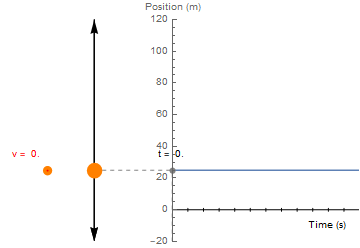
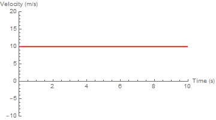
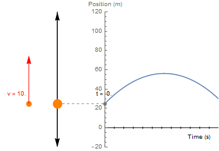
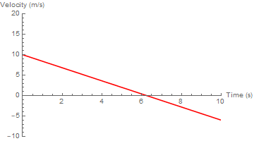
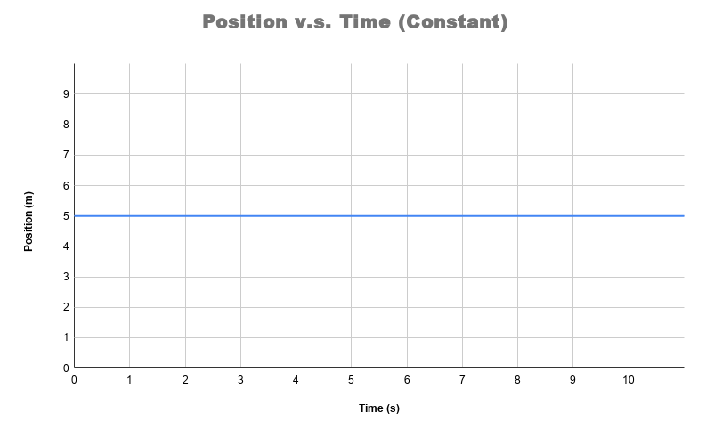
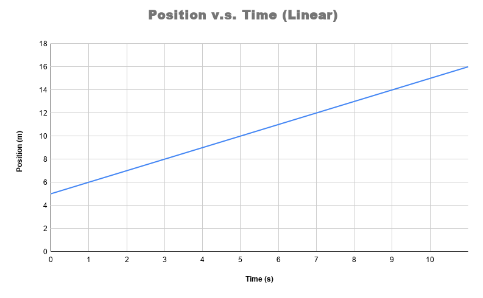
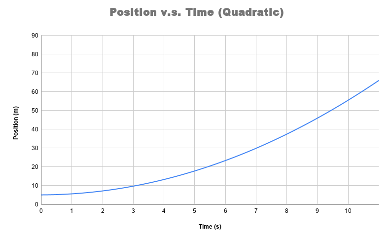

# Position, Velocity, Acceleration, and Falling Objects

---

:::Card Intro In this Lab..
We will investigate with how to describe, mathematically, the trajectory of a body moving under the influence of a force. Following this discussion we will turn our attention to a real experiment. The data from this "real-world" experiment will be analyzed and compared to the "ideal" theory and you will draw inferences about the underlying physics. 
:::
---

To get a feel for the concepts in this lab, feel free to play with [Si](#Si-balldrop). You can adjust the sliders to see how different conditions affect the trajectry of the ball.Observe how increasing and decreasing
air resistance affects the shape of the graph! In this lab you will explore this phenomenon using your analytical and mathematical skills.
	
:::Simulation balldrop
<iframe src="https://kapawlak.github.io/PhDemoJS/Apps/BallDrop/Page.html"  height="1000" style="border:none;width:100%"> </iframe>

:::

# Introduction

For 1D motion of a body, we are typically concerned with three variables which characterize the trajectory:

<!-- 1. The *position*, $x(t)$, which tells you where in space the body is located at a given time
2. The  *velocity*, $v(t)$ which tells you the speed and direction the object is traveling at a given time, and hence the *change* in the position
3. The acceleration, $a(t)$, which accounts for the forces on the body through $F=ma$, and tells you the *change* in the velocity. -->

:::Card Definition Position
 The *position*, $x(t)$, quantifies where a body is located in space at a given time. In this lab, this is simply the *height* of an object above the ground.
:::

:::Card Definition Velocity
The  *velocity*, $v(t)$, quantifies how the *position* of an object changes over time. It is a measure of the speed *and* direction the object is traveling at a given time.
:::

:::Card Definition Acceleration
The acceleration, $a(t)$, quantifies how the *velocity* of an object changes over time. Physically, it originates from the forces acting on the body through $F=ma$.
:::

These three variables are interrelated, as each quantity tells you about the *change over time* of the previous.

## Motion with No Forces
:::RFigure noforce m

The trajectory of the ball with no force and zero initial velocity. Click to expand the GIF
:::
To make our discussion concrete, we should review some basic physics in the case that there are no forces acting on the body of interest. 

Let's imagine that that at $t=0$, we have a ball at rest at a height $y_0= 25 m$. What is its position at $t=10$s? Since the ball is stationary &mdash; otherwise, $v_0= 0$ m/s &mdash; of course it will still be $y(10 s)=25 m$!

Now we imagine that this ball is given an initial velocity $v_0 = + 10$ m/s by tossing it upwards, with no forces acting upon it (for example, in space).  Since no forces are acting on the ball, the *change* in the velocity must be zero, so $v(t) = v_0=10$m/s for all time.  Note that the time, $t$, does not appear in this equation!

Since the velocity tells you how an object's *position* is changing in time, and we know that the velocity in the absence of force is constant, we can say that the position of the ball will increase by $10$ meters per second that passes. From this, we deduce that at $t=10$s, the ball is now at $y(10 s) = y_0 + v_0 t=  25$m $+ 10$ m/s $\times 10$s = $125$ m. 

::::::Figure constvel l

::: col l5

(a) When there is no force, the velocity remains constant
:::
:::col l2
.
:::
:::col l5

(b) The cosntant velocity is easily identified in a plot versus time
:::

::::::

Generally, in the absence of external forces, we can capture this relationship mathematically as:

:::Equation noforcep
$$
y(t) = v_0 t + y_0
$$
(in the absence of external forces.)
:::
In plain English, the above mathematical sentence translates to: "The position of the ball at a given time is equal to the distance it travels per each unit of time (e.g. seconds), multiplied by the time that has passed, plus its original position."

## Motion Under Constant Acceleration
Once we include external forces acting on a body, we now must think about how the velocity changes over time. Consider now that we repeat this experiment on the moon, so that our ball is accelerating toward the ground at approximately $a = -1.6$m/s$^2$. Similar to [Eq](#Eq-noforcep) for change in position, our equation for velocity is now:

:::Equation
$$
v(t) = a t + v_0 
$$
:::

So that at $t=10$, we can now calculate that our ball has a velocity of $v(10s) = -6$ m/s. This presents us with an issue when calculating the new position of our ball, however, since now the velocity is continually changing: our previous equation is no longer correct.

::::::Figure withforce l
:::col l6

:::
:::col l6

:::
:::row

:::
:::col l6
(a) Position v.s. time in the presence of an external force.
:::
:::col l6
(b) Velocity v.s. time in the presence of an external force
:::
 

::::::

Given the relationship between velocity and acceleration above, it is an exercise in calculus to show the following relationship is true:
:::Equation positionwithforce
$$
y(t) = \frac{1}{2} at^2 + v_0 t 
+y_0
$$
:::

 Putting it all together, we have that $x(10 s) = 45$ m

## Motion of Falling Objects

In the last example, we considered the motion of an object under constant acceleration due to gravity. In this lab, we will test the validity of this model under earth's gravity. 

When dropped from the same height, which one of these objects &ndash; stone or feather &ndash; will hit the ground first? Most people will say, "That depends." If this is done in a normal room , the stone wins, as your intuition may tell you. However,  if it is done in a *vacuum*, which contains no air, both hit the bottom at the same time! The question we would like to answer is: "How does the presence of the air change the equations of motion for falling objects"?

In the next activity, you will watch videos of someone dropping a variety of balls from a sixth-floor walkway. For one drop, you will measure and record height and time data, and for the rest, you will be given the data. You will plot these data, and use your results to test the validity of one of the motion formulas, namely,

:::Equation
$$
y(t) = y_0 + v_{0}t + \frac{1}{2} at^2
$$
:::

where y is the position, $v_{0y}$ the initial velocity, $a_{y}$ the acceleration, and t the time. In some of these examples, you may find that the data does not match the theoretical equation. It is your job to determine how and why these equations change using your sharp analytical skills.

## General Properties of Motion Curves
:::RFigure graphs m 

(a) Constant Position v.s. Time

(b) Linear Position v.s. Time

(c) Quadratic Position v.s. Time
:::

Before you start the lab, we have one last theoretical discussion: given a plot of position versus time, how can we make quantitative and qualitative statements about the physics of a falling object? 

To answer this, we have two important statements to make from the discussion above:

1. The velocity of an object at a certain time is the slope of the distance-time graph at that point.
2. Similarly, the acceleration of an object at a certain point is the slope of the velocity-time graph at that point.

Before discussing this, there are three plot shapes that are important to understand for this analysis: constant, linear, and curved. 

Constant refers to a value that is not changing in time, a horizontal line, as can be seen in  [Fi](#Fi-graphs)<u>a</u>  . Linear refers to value that is changing with time but has a linear slope as seen in [Fi](#Fi-graphs)<u>b</u>. Curved refers to a value that is changing with time and is not linear as seen in [Fi](#Fi-graphs)<u>c</u>.

[Fi](#Fi-motiongraphs), obtained from from Hyperphysics, shows the trajectory of a body whose acceleration is constant for each segment of time. Acceleration being constant for each segment is important for simplifying our plots.
:::row
:::
[Fi](#Fi-motiongraphs)<u>a</u> shows the three plots unobstructed. Notice how the velocity corresponds to each section of the position plot.

::::::Figure motiongraphs m
::: col l6

:::

:::col l6

:::
:::row
:::
::: col l6
(a) 
:::

:::col l6
(b)
:::
::::::

 In particular notice that:
 - Whenever the position plot is linear, the velocity is constant. 
 - Whenever the position plot is curved, the velocity is linear. 
 - If the position is curving upwards, the velocity is positive
 - If the position is curving downwards, the velocity is negative. 
 - The Acceleration plot corresponds to the velocity plot exactly the same way the velocity plot corresponds to the position plot.

 [Fi](#Fi-motiongraphs)<u>b</u> indicates points on the plots which correspond to the description of Part A. Please study the plots and notes in Part B to understand how they relate.

:::::: Exercise
Now that you have gained familiarity with position, velocity, and acceleration plots we can do analysis. In this exercise you will take a new position plot and create sketches of the velocity and acceleration plots. Please see Figure 6 below.

:::Figure

:::

The dashed lines indicate where the plot changes from one of our above mentioned plot shapes to another. 

1. Make a sketch plot for velocity with dotted lines in the same positions. **A sketch is just a quick drawing to display the important features of a plot, e.g. linear, parabolic, or constant. You should label the axes, but you don't need a title.**

2. Sketch the velocity curve for each segment in you skeleton plot.

3. Do the same to make an acceleration plot. Please note you will now have to refer to the velocity plot instead of the position one.

4. Describe the motion in words. What is happening to the object in each segment of time. 

:::Note
Make sure to take a picture of your sketch plots and include them in your report along with the description.
:::

::::::

# Obtaining the Data

## Collecting Data from an Experiment
:::RFigure balls s

The sport balls - click to enlarge
:::

In [Ex](#Ex-drop) we will look at different balls dropped from the sixth floor walkway of Broida Hall. The four balls dropped in Video are of varying sizes and weights. [Fi](#Fi-balls) shows the balls &mdash;a basketball, a volleyball, a beachball, and a dog ball &mdash; which each have different trajectories upon release. How do the properties of these sport balls affect how they fall?

The pink dog ball is small but fairly weighty for its size &mdash; in other words, it is *dense*. The basket ball is medium sized and is moderately heavy. The volley ball is smaller than the basket ball and slightly lighter as well. The beach ball is by far the largest and the lightest. These four balls should give a wide range of masses and sizes for our data set. 
:::row
:::

::::::Exercise drop

In this exercise you will be collecting data on the height of a ball in freefall versus time. All four balls are dropped, however, you will **only be taking data for the basketball.** The data on the other balls have been taken for you. 

We have annotated [Vi](#Vi-balldrop) for you with the height measurements and an embedded stopwatch. These will be useful tools for your data collection.

**Instructions:**

1. Watch [Vi](#Vi-balldrop) and see how each ball falls to the ground. 

2. Take 10 data points by pausing the video and recording the distance from the top and the timestamp on the embedded stopwatch. 

3. Place your recoded data points in a table with the headers "Time (s)" and "Y_Basket (m)."

:::Video balldrop
<iframe width="auto"  src="https://www.youtube.com/embed/OZn--kkp2vA" title="YouTube video player" frameborder="0" allow="accelerometer; clipboard-write; encrypted-media; gyroscope; picture-in-picture" allowfullscreen></iframe>

:::

::::::

## Understanding & Organizing Data
You have now collected some data for a basketball falling from the sixth floor of Broida! As mentioned above, three other balls were dropped from the same point at Broida. Rather than have you repeat the same data collection we have collected data for you using a software called Tracker.

Tracker allows us to monitor the location of the ball at every frame of the video which happens once every 1/30 seconds. This method has two advantages. 

1. We are able to more precisely identify the location of the ball.
2. We are able to collect many more data points.

Below is a short video demonstrating how the Tracker software was used to collect data for the four drops.

:::Video

<iframe width="auto"  src="https://www.youtube.com/embed/hvwjn3tAtqc" title="YouTube video player" frameborder="0" allow="accelerometer; clipboard-write; encrypted-media; gyroscope; picture-in-picture" allowfullscreen></iframe>

:::

The data you will need is in the box below, including a link to the google sheet holding it.

:::Hider Table of Data
<iframe width="100%" height ="400px" src="https://docs.google.com/spreadsheets/d/e/2PACX-1vRjap_R4TFvQqlPgrOHBNpjmNz1h0AOOVBmnvw95l6yJlgL8EKgRB0ahCc4HR-Pt9Qvho_yBRfRecRE/pubhtml?gid=0&amp;single=true&amp;widget=true&amp;headers=false"></iframe>

[Link to Google Sheet](https://docs.google.com/spreadsheets/d/1XI2mEKyuVftiG0uhUlS6Iah3zZuiGx1tUE5g1-e0ZIw/edit?usp=sharing)  

:::

Please open the link to the Google Sheet data when you are ready to start [Ex](#Ex-table).

:::::: Exercise table
**Instructions:**
1. Start by copying the data linked in Table 1 into separate spreadsheet. 
2. Now you will insert your data you took for the basketball into the table and plot all four ball drops on one plot. For instructions on how to do this, watch the following video. 

:::Video

<iframe width="auto"  src="https://www.youtube.com/embed/PT6GM85ut4I" title="YouTube video player" frameborder="0" allow="accelerometer; clipboard-write; encrypted-media; gyroscope; picture-in-picture" allowfullscreen></iframe>

:::
::::::

# Analyzing the Data

## Qualitatively Understanding your Data
In [Ex](#Ex-anal) you will begin analyzing the drop data. You will apply what you learned in the Introduction to real data, and try to **infer** something about the underlying physics.

:::Exercise anal
**Instructions:**

1. Start by just looking at your data. 
    - **Analyze it qualitatively by using the tools you learned in Part 1 of the lab.** 
    - Try to determine what parts of each drop are falling under constant acceleration or constant velocity.
2. Notice how the Dog Ball, Basket Ball, and Volleyball all look very similar. The beach ball is quite different from the other three. Pick one of the three similar data sets and the beach ball and **sketch**[fn] A sketch is just a quick drawing to display the important features of a plot, e.g. linear, parabolic, or constant. You should label the axes and the two lines, but you don't need a title. You shouldn't spend more than 5 minutes drawing this.[/fn] a velocity vs time plot for both data sets on the same graph.
3. Using the velocity lines, translate the plot into a brief description  (one or two sentences) of the drop.
4. Take a picture of your sketch and include it in your lab report, being sure to include your description.

:::

## Quantitatively Understanding your Data
In [Ex](#Ex-fit), for each of the datasets, you will perform a polynomial fit of degree 2. This will draw a line of best fit by using a quadratic function. That is that it will attempt to fit the equation:

:::Equation fit
$$
y = ax^2+bx+c
$$
:::

The computer will adjust $a$, $b$, and $c$ to best fit the data provided. Let's start by understanding what $a$, $b$, and $c$.

[Eq](#Eq-fit) looks a lot like our kinematic equation for motion. Let's equate [Eq](#Eq-fit) to the kinematic equation. We do this in  the table below. Each row starts by defining the variable. The next column has the symbol we use to represent the variable in the fit. The final column has the equivalent symbol used in the kinematic equation.
:::Table eq
| Variable Name | Fit Symbol | Kinematic Symbol |
| -------- | -------- | -------- |
| Time     | $x$     | $t$     |
| Position | $y$    | $y$    |
| Acceleration| $a$ | $\frac{1}{2}g$ |
| Initial Velocity | b |  $v_0$ |
| Initial Position | c | $y_0$
:::

:::::: Exercise fit
**Check your understanding:** 

This is a critical concept that you understand before moving forward. Below are three questions. Read them and spend a few minutes trying to answer them for yourself. When you think you have the answers, click the link at the bottom to take you to the answers. 

1. For an ideal fall (one that falls exactly like the kinematic equation describes), what should the value of $a$ in your fit be?
2.  For drop like the ones in the video, where the ball is released from rest, what should the value of $b$ in your fit be?
3. When the origin is defined at the release point of the ball, like it is in the video, what should the value of $c$ in your fit be?

:::Hider Answers
1. The value of $a$ in your fit should be $\frac{g}{2}$, which is approximately $4.8$ms$^{-2}$
2. The value of $b$ in your fit should be $0$ ms$^{-1}$ because the ball is being released from rest. It has no initial velocity.
3. The value of $c$ in your fit should also be $0$ m. This is because $c$ is the initial position of the ball, and we defined origin to be the point where the ball is released.

Keep in mind, these answers are for an ideal (not real world) drop. When we drop a ball in the real world, there will be factors and errors that shift the value of $a$, $b$, & $c$ from the ideal values. 
:::

After answering these questions, return to your spreadsheet and play with the curve fitting tools in Google Sheets. If you need a reminder how to do curve fitting, please refer to the video from the last lab:

:::Video
<iframe width="auto"  src="https://www.youtube.com/embed/wkqlSuAoFLQ" title="YouTube video player" frameborder="0" allow="accelerometer; clipboard-write; encrypted-media; gyroscope; picture-in-picture" allowfullscreen></iframe>
:::

:::Note
This exercise is designed to help you understand curve fitting. Nothing needs to be submitted for this exercise.
:::

::::::

## Quantitatively Understanding your Data 2
In this [Ex](#Ex-quant) we will be more quantitative about our analysis. We will perform specific fits to our data and use the results to analyze the underlying physics in our experiment. 

::::::Exercise quant
**Instructions:**

1. For each of the drops perform a polynomial fit of degree 2. 
2. Create a table to summarize the information from your fits. **Hint:** $a=\frac{g}{2}$, so make sure to solve this for $g$ before putting it in your table. Your table should look like the following:

:::Table

| Parameters| Ideal Drop | Dog Ball | Basketball | Volleyball | Beach Ball|
| -------- | -------- | -------- | -- | -- | -- |
| Gravitational Accel. [g] ($m/s^2$)     |      |      |   |   | |
| Initial Velocity  ($m/s$)   |      |      |   |   | |
| Initial Position    ($m$) |      |      |   |   | |

:::

3. Calculate the percent discrepancy of the acceleration from ideal for each of the four drops. You can do this in a spreadsheet if you'd like but please show your work for **one** of the calculations. 

:::Question 
1. What is the cause of this systematic error in the measurement of $g$?

2. Based on the picture of the balls, and what you know about the balls generally, why do you think the systematic error is different for the different balls? 
:::

4. Now let's look more closely at the initial velocity and intital position for the different drops. Do you notice how as the drops getting further from ideal the initial velocity and the inital position get further from ideal as well?

:::Question
1. What is the percent difference in initial velocity of the beach ball and the basketball?

2. What is the percent difference in initial position of the beach ball and the basketball?
:::

The lower percent error in the value of $g$ from the basketball indicates that it has less systematic error, or that it is a better representation of our model (objects falling under constant acceleration). The large percent difference the beach ball has in the initial velocity and initial position with the basketball, combined with the larger percent discrepancy in the value of $g$ for the beach ball, hints that the beach ball strongly doesn't follow the constant acceleration model.

::: Question
If the beach ball isn't falling under constant acceleration, what model might it be falling under?
:::

5. Create one more plot of only the beach ball falling, but only use one second of data near the end. Somewhere it looks most linear. 
6. Perform a linear fit on this data.

::: Question
From your linear fit: 
1. What is the slope of the line?

2. What does the slope represent?
:::

::::::

# Conclusion

:::Exercise
Write a brief conclusion summarizing the important points of this lab.
:::

:::Summary 
Make sure to include all tables, plots, pictures, drawings, screenshots or anything else asked of you in the exercises in your report, as well as answers to all the questions.

**All responses and answers should contain the correct number of sig figs and should include units when needed.**
:::

