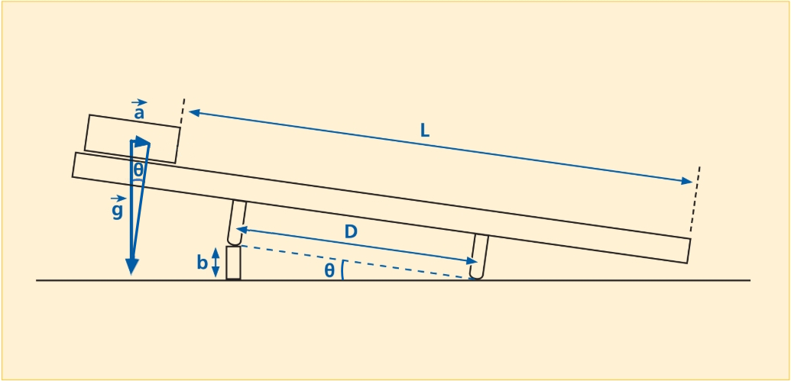
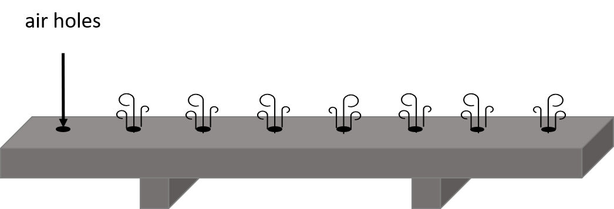
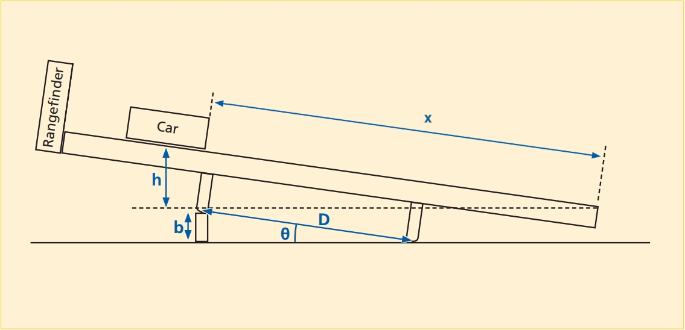

# Lab 3: Forces, Motion and Energy Transformation

---
:::Card Intro This Week...
This week we will look at the quantity that we call energy and its transformations. In classical physics, there are two categories of energy:
 1. Kinetic Energy &mdash; what you may know as *energy in motion*, or the energy stored in the inertial motion of an object. An object has *kinetic energy* if you have to perform **work** on it to bring it to rest.
 2. Potential Energy &mdash; which is stored energy an object has due to certain kinds of **work** being exerted on it, e.g. lifting a barbell above your head.

In addition to understanding energy, this week we will investigate **work** and its relationship with **force** in converting energy from one form to another.
:::
---

# Acceleration, Mass and Force

## Gaining Intuition 1
:::RFigure skater l

UCSB's preferred mode of transit
:::
If you stand on a skateboard, you wouldn't expect any motion to occur until you do something. Instinctively, you know that you must place a foot on the ground and push off to gain speed &mdash; and hence, accelerate. When you stop pushing, you stop accelerating and move at a somewhat constant speed until friction forces &mdash; air and mechanical &mdash; bring you to rest.

Your acceleration is directly controlled by how hard you push off the ground, which determines the magnitude of the **force** you apply [fn] You may notice that when you are going very fast, it is hard to gain speed because you can't push off the ground! Bicycle users overcome this with *gears*. Why do you think changing gears on a bike allows you to gain speed again?[/fn]. Your acceleration is similarly determined by your weight and the 55-lb backpack on your back &mdash; your total **mass**.

## Experiment Overview

In this experiment, we will observe the motion of a glider sliding on an inclined air track under the influence of gravity. We will measure the *mass* of the glider, the *force* acting on the glider along the track. Finally, by timing the motion of the glider, we will measure its *acceleration* indirectly. This will allow us to look for *correlations* between the quantities $F$, $m$, and $a$ 

After collecting and organizing our data, we will investigate the relationship between these quantities. From analyzing our plots, perhaps we will find that the governing equation is $F = m + a$, or $F = m/a$, or even $F = m^{a}$.

## Setup

[Fi](#Fi-setup) shows a schematic of the air track as it will be set up for this experiment. In order to demonstrate the effects of force while minimizing friction, the air track has lines of holes drilled along the top faces. 
::::::Figure setup xl
:::col l6

:::
:::col l6

:::
:::row
:::
:::col l6
(a) The overall schematic of the air track experiment
:::
:::col l6
(b) A cartoon demonstrating how air blows through the track
:::
::::::
As shown in (b), a pump blows air into the track, which exits through the holes, providing a cushion on which the glider hovers along the track, virtually eliminating sliding friction. The track is tilted to an angle $\theta$ by the insertion of a block of height $b$ under one leg of the track. 

## Mass and Force

In [Ex](#Ex-mf) we want to explore how the mass, $m$, of the glider relates to the force, $F$, exerted on it by gravity ***along the track***. As you know, the force due to gravity is vertical, but we are interested **only** in the component along the track, since that is the one that generates the motion.

::::::Exercise mf
 
The experiment is show in [Vi](#Vi-hover), below. Note the following points:
- The glider will be released three times, each time with a different mass. The angle of the air track will be constant across the three runs.
- We release the glider from the top of the track, and record the time for the glider to travel from the start (indicated by a red marker on the video) to when it hits the elastic bumper at the bottom end of the track (indicated by a second red marker on the video). 
- The distance, $D$, between the legs of the track is $100$ cm.
- The height $b$ is $7.6$ cm.
- The distance the glider will travel for each run, $L$, will be $140$ cm.
- The mass, $m$, of the glider with the reflector plate is $188.9$ g. We can attach up to four slugs (in pairs) to the glider  to increase its mass (to $289.9$ or $390.4$ g).

:::Video hover
<iframe width="auto"  src="https://www.youtube.com/embed/CyfweNs5Jww" title="YouTube video player" frameborder="0" allow="accelerometer; clipboard-write; encrypted-media; gyroscope; picture-in-picture" allowfullscreen></iframe>
:::

**Instructions:**

1. Use the template provided below to record your data. You can directly copy the template onto you own Google sheet using the link provided.

:::Hider Template
<iframe width="100%" height ="400px" src="https://docs.google.com/spreadsheets/d/e/2PACX-1vRKeVQbijFXtvvfKUfFmqDkVHL3754P25S0qW5sxSR-h7-VvxK4g93Pxvy1PxdVrgOiijfXpjfJ2FNz/pubhtml?gid=0&amp;single=true&amp;widget=true&amp;headers=false"></iframe>

[Link to Copy-able Google Sheet](https://docs.google.com/spreadsheets/d/1H5PkQxSyjVicMWPn933p0C17u88tklOp05co4sf6efc/edit#gid=0)  

:::

2.  Use the spring scale shown in the video to measure the force, $F$, along the track for each mass, recording each value in your table[fn]Hint: What is applying a force to the mass? Try drawing a free body diagram.[/fn]. 

3. For each run, use the kinematics you learned earlier in the quarter to calculate the acceleration from your measured values of $L$ and  $t$ [fn] Hint: Use $$x=x_0+v_ot+\frac{1}{2} a t^2$$ where $x$ is the coordinate along the air track[/fn].

::: Question
1. Does changing the mass of the glider affect the acceleration? 

2. What is the average acceleration you find (across the three runs) for this particular incline?
:::

3. Using the height $b$, leg span, $D$, and some trigonometry, determine $\sin{\theta}$.
4. The acceleration along the track is the component of the acceleration due to gravity, $g$, along the track. The accepted value (to two sig figs) of $g=9.8$ m/s$^2$.
Calculate the glider's acceleration $a$ from the value of $g$ and $\sin{\theta}$ [fn]]Hint: check that your expression has units of acceleration, i.e. $m/s^2$[/fn]

::: Question
Find the percent discrepancy between the acceleration $a$ you found by trigonometry (using $g$ and $\sin{\theta}$) and the average acceleration you found from kinematics (Question 1b.).
:::
5. Now, from the data in your table, plot force vs. mass. The plot should be linear. Find and plot the line of best fit.

::: Question
What  is the slope of the line of best fit? Compare it to your theoretical acceleration. 
:::

::::::

## Acceleration and Force
In [Ex](#Ex-af) we want to explore how the acceleration $a$ of the glider relates to the force $F$ exerted on it. Thus, we will keep the mass of the glider constant, and we will take four runs, each with the track at a different angle. The different incline angles will generate different accelerations along the track. As we did before, we will measure the force on the cart before each run.

::::::Exercise af

[Vi](#Vi-hover2) shows the Acceleration v.s. Force experiment. Note the following points:

- For each set of four runs, the heights $b$ will be, in order, $3.7$ cm, $2.0$ cm $1.0$ cm, and $0.5$ cm.

- The force at each height will be $0.108$ N, $0.061$ N, $0.027$ N, and $0.014$ N, respectively.

- The glider mass will be $289.8$ g.

:::Video hover2
<iframe width="auto"  src="https://www.youtube.com/embed/shEdHOzKwK0" title="YouTube video player" frameborder="0" allow="accelerometer; clipboard-write; encrypted-media; gyroscope; picture-in-picture" allowfullscreen></iframe>
:::

1. Record the heights, forces, and mass given above. The forces will be given below. For each run, derive the acceleration from the kinematics equation. Use the template given in Exercise 1 ([linked here](https://docs.google.com/spreadsheets/d/1H5PkQxSyjVicMWPn933p0C17u88tklOp05co4sf6efc/edit#gid=0) for convenience).

2. Now, with the data from your table, make a plot of force versus acceleration. The plot should look linear. Find and plot the line of best fit.

:::Question 
What is the slope of the line of best fit? Compare the slope to the mass of the glider.
:::

:::Question
Using your answers from Questions 3 and 4 write an equation that relates force to both mass $m$ and acceleration $a$. Clearly explain how you arrived at this equation.
:::

::::::

# Energy Transformation
## Gaining Intuition 2

:::Simulation transform

<iframe src="https://kapawlak.github.io/PhDemoJS/Apps/EnergyTransformation/Page.html"  width= "100%" height="1000" style="border:none;"> </iframe>
:::

In this part of the lab you will be investigating the transformation of energy from one form to another, namely a transformation between potential energy (PE) and kinetic energy (KE). Potential energy is stored energy, for example the energy in a compressed spring, or the gravitational potential energy that an object has by virtue of its height above the ground. 

:::Card Definition Potential Energy
Potential energy is the energy possessed by a body by virtue of its position relative to others, stresses within itself, electric charge, and other factors.
:::

Kinetic energy is energy of motion. A mass, having been flung upward, has kinetic energy. When an object is dropped from some height above the ground, gravity accelerates it downward, converting its initial potential energy into kinetic energy as it falls, a scenerio you can investigate yourself in [Si](#Si-transform). 

:::Card Definition Kinetic Energy
Kinetic energy is the energy a body possesses by virtue of being in motion. In order to bring a body to rest, you would need to perform an amount of work equivalent to its kinetic energy. 
:::

In example of the object being dropped from rest, the mass starts out with zero kinetic energy. The force of gravity does work on the mass, thus giving it kinetic energy. This would suggest that work and energy are equivalent. Indeed, the Work-Energy Theorem states that the work done on an object is always equal to the change in kinetic energy of the object. Work and energy have the same units (kg ⋅ m$^2$ s$^{-2}$), which constitute the standard unit of energy called the Joule (J). We will not discuss work in detail, but should note that it is defined as the product of the force acting on an object and the distance over which it acts, hence the aforementioned units.

For another example, loading a stone into a slingshot requires you to do work in stretching the elastic band by pulling the stone back against it. When you have pulled the stone all the way back, the work you have done is now stored as potential energy in the band. When you release the stone (a mass), the band relaxes, accelerating the stone from rest to whatever speed it has attained just as it flies free of the elastic band. Whatever potential energy was stored in the band, which you provided by stretching it, is now kinetic energy of the stone flying through the air.

Our main focus will be a fundamental law of nature called the Law of Conservation of Energy. This law states that, in the absence of dissipative forces such as friction,

:::Equation
$$
PE+KE=Total energy
$$
:::

Simply stated, this means that the total energy in a closed system remains *constant* even when the individual KE and PE are changing &mdash; they must always add up to the same total energy unless the system is open.

## Experiment Overview

Like the previous experiment, we will observe the motion of a glider sliding on an inclined air track under the influence of gravity. This time, however, we will be concerned with the glider's *energy*. We will collect data that will allow us to indirectly calculate the glider's kinetic and potential energy using readily measurable quantities.  

## Setup
[Fi](#Fi-hov3) below shows the setup we will use for this part of the lab.  We measure the position and velocity of the glider by means of a rangefinder.  We will denote the position of the glider along the track with $x$ and the velocity $v$. 

:::Figure hov3 xl

Setup for the energy-transformation portion of the lab
:::

Note that the position and velocity change with time as the glider moves along the track. We will set the x-axis to be along the track (with the positive direction up the track), and our origin $x=0$ at the bottom of the track.

## Obtaining the Kinetic and Potential Energies

In [Ex](#Ex-kepe) will operate the air track in a similar fashion to the way it was operated in [Ex](#Ex-af). To lift change the angle, we will place a block of height $b$ under a leg of the air track. 

- The height $b$ will be $2.0$ cm.

- The mass of the glider with reflector plate is $188.9$ g.

We will release the glider on the air track, and the rangefinder will follow its motion as it rides back and forth on the track (there is a rubber band at the bottom of the track that causes the glider to bounce back up). 

::: Note
The rangefinder records the position and velocity of the glider **starting at the first bounce (with the rubber band at the bottom of the airtrack) and ending at the second bounce**.  Remember that $x=0$ corresponds to the bottom of the airtrack.
:::

:::::: Exercise kepe
The following video shows this procedure:

:::Video
<iframe width="auto"  src="https://www.youtube.com/embed/-o_08QyCD6g" title="YouTube video player" frameborder="0" allow="accelerometer; clipboard-write; encrypted-media; gyroscope; picture-in-picture" allowfullscreen></iframe>
:::

 

1. Below is a link to the table containing the position and velocity data of the glider. **Copy the data linked in the table above into separate spreadsheet**. 
:::Hider Template
<iframe width="100%" height ="400px" src="https://docs.google.com/spreadsheets/d/e/2PACX-1vS81zYp0Msw755X1bTchxyKU-ozGzSR2wL4CSJA04cpLAMc2xG6eSNFXsj3YDx3_k1nhp-k9f5G6k82/pubhtml?gid=112862978&amp;single=true&amp;widget=true&amp;headers=false"></iframe>

[Link to Copy-able Google Sheet](https://docs.google.com/spreadsheets/d/1a-sF2TCUFwAACT4HZA4xuvlW5xBqKbF-gQUyl16__Uc)  

:::

2. Calculate the kinetic energy (KE) of the glider from the velocity data. Remember $KE=\frac{1}{2}mv^2$.
3. Calculate the (gravitational) potential energy (PE) of the glider. Remember that $PE=mgh$ where $h$ is the height of the glider. In our case, the height $h$ changes with time, so you will have to find it in terms of $x$ and $\sin{\theta}$. See the appendix for more details.
4. Calculate the total energy (PE + KE) of the glider for all given times. 
5. Plot the potential energy, kinetic energy, and total energy as a function of time (ideally on the same graph).  

::: Question 
1. Where is the glider when its (gravitational) potential energy is maximum? 

2. Where is it when its kinetic energy is a maximum? 

3. Where is it when its kinetic energy is a minimum?
:::

::: Question

Do your data support the Law of Conservation of Energy? (Hint: What happens to the sum of potential and kinetic energy over the course of the experiment?)

:::

::: Question
 At the bottom of the air track, the glider hits and stretches a rubber band, that causes the glider to change direction. When the rubber band is maximally stretched, the glider's kinetic energy is zero, because it is momentarily at rest.  Since the glider is at the bottom of the air track, its (gravitational) potential energy is also zero.  So the sum of the kinetic energy and gravitational potential energies is zero, yet energy is conserved. Where did the energy go?
:::

::::::

# Summary

::::::Exercise 

Write a brief statement summarizing the mains points of this lab (both parts).
::::::

:::Summary

Make sure to include all tables, plots, pictures, drawings, screenshots or anything else asked of you in the exercises in your report, as well as answers to all the questions.

All responses and answers should contain the correct number of sig figs and should include units when needed.

:::
# Appendix 
## Force, Motion, Linear Acceleration Math Sheet

:::::Hider Gravitational Potential Energy
Gravitational Potential Energy is given by:

:::Equation
$$
\rm PE = mgh
$$
:::

where $m$ is the mass, $g$ (= $9.8$ m/s$^2$) is the acceleration due to gravity, and $h$ is the height the object falls. 
::::::

::::::Hider Kinetic Energy

Kinetic Energy is given by:
:::Equation
$$
\rm KE = \frac{1}{2}mv^2
$$
:::

where $m$ is the mass and $v$ is the velocity.
::::::

::::::Hider Calculating height from distance
The angle of the track with respect to the horizonal, $\theta$, satisfies

$$
\rm \sin(θ) = \frac{b}{D}
$$

where $b$ is the block height used to place the ramp on an incline and $D$ is the distance between the track's legs in [Fi](#Fi-hov3). 

Similarly, for any position on the ramp, we have that

$$
\rm \sin(\theta) = \frac{h}{x} 
$$

where $h$ is the height above the bottom of the track and $x$ is the distance along the track from the bottom end. Since both expressions are equivalent to $\sin(\theta)$, we can equate them to obtain the formula:
:::Equation
$$
\rm h = \frac{bx}{D}
$$
:::

The distance between the legs, $D$, is $100$ cm. You will get the distance from the glider car to the end of the track, $x$, from the rangefinder data . 
::::::
