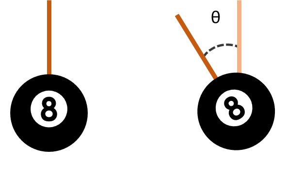
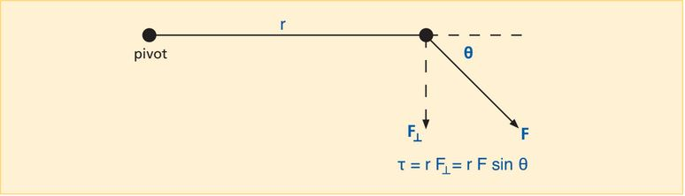
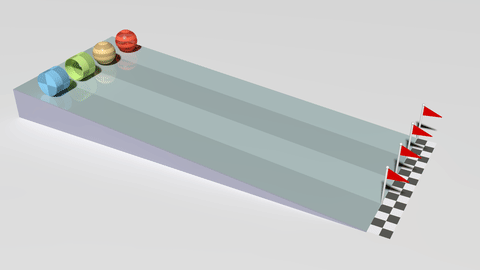
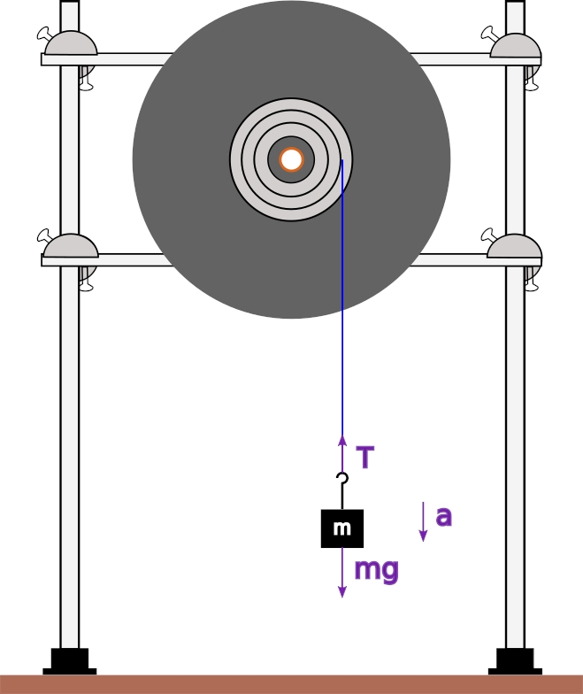

# Lab 4: Rotation
---

:::Card Intro In this Lab..
Rotation stuff. 
:::

---
# Introduction

## From Linear to Rotational Mechanics
In your study of linear mechanics, you have become familiar with terms like position and displacement (along a coordinate x, y or z), velocity ($v$), acceleration ($a$), mass ($m$), and so on. In rotational mechanics, we measure similar quantities such as angular displacement, angular velocity and angular acceleration.

The similarity between these two kinds of mechanics are so deep, that it is worth exploring how to translate the ideas, concepts and tools we have already learned for linear mechanics into something useful in the study of rotation.

## Position, Velocity, Acceleration 

### Angular displacement
:::RFigure ad s

The 8-ball on the right has been rotated to have an angular displacement of $\theta$ compared to the left one.
:::

The first quantity of importance in linear mechanics is an object's position or *displacement*, usually measured in meters relative to some place in space. In rotation mechanics, we are concerned with an objects **angular displacement** relative to some orientation 

:::Card Definition Angular Displacement
The **angular displacement** of an object, usually represented by the Greek symbol $\theta$ is a measure of the angle a body has been rotated along one of its axis relative to some initial condition
:::

:::row
:::

So, then, what is the equivalent unit to meters? While you may be inclined to guess "degrees" (&deg;), in physics and mathematics the angular displacement of an object is typically measured in the basic unit of *radians*.  

:::Card Definition Radian
**Technical Definition**

A radian is defined as the angle that is subtended by an arc equal to the radius of the circle on which it lies.

**Practical Definition** 

A radian is a unit of measurement for angles. In value, $1$ rad is equivalent to $\frac{360&deg;}{2\pi} \approx 57.3 &deg; $
:::

When working with radians, the most important thing to remember is that all circles have $2\pi$ radians, just like they have $360&deg;$. While not so important, the way this definition and equivalence is derived is given below, and can be enlightening.

:::Hider How the Radian Gets its Value
You ask, "How is the value of a radian determined?" Perhaps this will help. You buy a 15&Prime; pizza. You cut a piece of string so that it is 15 inches long, fold it exactly in half and make a mark at the midpoint. Now you use it to find the center of the pizza, and you make a straight cut from there to the edge of the pizza. Now you cut the string exactly in half, take one of the two 7.5-inch pieces, place one end of it exactly at the outer end of the cut you have just made, and carefully lay it along the edge of the pizza. From the other end of the string, you now make a second straight cut from that end of the string to the center of the pizza. You now have a slice whose length along the crust (arc length) equals the length of each side (the radius of the pizza, r). The angle subtended by this arc is thus 1 radian, but now you would like to know how many radians there are in a circle, and also, what a radian corresponds to in degree measure.

You don't have a protractor with you, but you do have a clean napkin and a pen. You note that the circumference of the pizza, C, equals 2&pi;r, and that a full circle subtends an angle of 360&deg;. This means that there are 2&pi; radians in 360&deg;. Doing the arithmetic, you find that 360&deg;/(2&pi;) (= 180/&pi;) = 57.3&deg;. Hence, 1 radian = 57.3&deg;. (You measured the diameter and radius rather precisely.) Note that because the radian is a ratio of two lengths, it is dimensionless.
:::

### Angular Velocity

Just like *velocity* measures the *change in position,*  **angular velocity**  measures the change in *angular displacement*. This is the time rate of change of angular displacement ($\rm\frac{\Delta\theta}{\Delta t}$), and it has the units of rad/s (radians/s). 

:::Card Definition Angular Velocity
**Angular Velocity** is measure of an object's rotation rate, that refers to how fast an object rotates or revolves relative to another point, i.e. how fast the angular position or orientation of an object changes with time. It is typically represented with the Greek symbol $\vec \omega$
:::

### Angular Acceleration

You probably recall that the change in velocity is *acceleration*. Similarly, the change in *angular velocity* is, of course, **angular acceleration**. This is the time rate of change of angular velocity ($\rm\frac{\Delta\omega}{\Delta t}$). It has the units rad/$\rm s^2$.

:::Card Definition Angular Acceleration
**Angular Acceleration** is the time rate of change of angular velocity. It is typically represented with the Greek symbol $\vec \alpha$
:::

Note that in the text above, the arrow symbols over the variable are vectors &mdash; $\vec\omega$ and $\vec\alpha$ have both magnitude and direction. The direction is along the axis of rotation, and the sense is in the direction in which your right thumb points when you curl the fingers of your right hand in the direction of the rotation. Since it is only the sense that changes, and since we are not so much concerned with direction, for convenience we will use the scalar forms of the equations in which all these variables appear.

## Mass, Force, Momentum

Some of the equivalences in the previous section may have been obvious to you &mdash; the change from *distance* to *angle* might not be so mind bending. However, not all the changes are as straight forward. You may have noticed that we didn't move on to define "angular force", or **torque**, for example. Your first instinct is likely to borrow from $\vec F = m \vec a$ and define $torque = m \vec \alpha$. This would be a good guess, but very wrong!  

Why it is wrong may be surprising: you can't simply plug "mass" into this formula. Indeed, we need to talk about the strange angular version of mass, the **moment of inertia**

### The Moment of Inertia

:::Card Definition Moment of Inertia.
The **Moment of Inertia** is a quantity expressing a body's tendency to resist angular acceleration, typically represented by the symbol $I$. 

It can be calculated by taking the the sum of the products of the mass of each particle in the body with the square of its distance from the axis of rotation.
:::

In linear mechanics, an object possesses *inertia* in proportion to its mass; it resists change to its velocity. Similarly, according to its mass and how that mass is distributed about a particular axis of rotation, an object resists change in its **angular velocity** about that axis. The further a portion of the mass is from the rotation axis, the greater its moment, or resistance to rotation. We will return to this later.

### Torque

After defining the *moment of inertia*, we are able to write down the correct angular form of Newton's second law as such:

:::Equation
$$
\vec \tau = I \vec \alpha 
$$
:::
Where $\tau$, as you may have guessed, is the *angular force* known as **torque**. 

:::Card Definition Torque
**Torque** is the rotational equivalent of linear force, typically represented by the Greek symbol $\vec\tau$. Just as a linear force is a push or a pull, a torque can be thought of as a twist to an object around a specific axis.
::: 
Where force has units of newtons (kg&middot;m s$^{-2}$), torque has units of N &middot; m. Torque can be applied to an object by applying a force to it. The torque exerted on an object by a force $F$  around a pivot point is equal to the distance r  from the axis of rotation to where the force acts multiplied by the component of force perpendicular to the position vector ${\vec r}$. If the force is perpendicular to the position vector, we call the distance $r$ the lever arm.

:::Figure torque xl

Torque is equal to the perpendicular force multiplied by the distance from the axis of rotation
:::

### Angular Momentum
Since we have a the angular version of mass, we can also discuss the angular equivalent to *momentum*

::::::Card Definition Angular Momentum
 *Angular Momentum* is the angular version of Linear momentum ($p = mv$), typically denoted by $\vec L$. It is defined by the analogous relation
 
:::Equation
$$
\vec L = I \vec{\omega}
$$
:::
::::::

Note that whereas linear momentum is in kg&middot;m/s, angular momentum is in kg m$^2$ s$^{-2}$.

### Kinetic Energy

We will wrap up this review of angular mechanics by giving the expression for Kinetic Energy that applies to rotating bodies:
:::Equation
$$
K = \frac{1}{2} I \omega^2
$$
:::
  We shall see later why this is so. Since this is just an energy, it has the same units (J, which are N&middot;m or kg&middot;m$^2$ s$^{-2}$). 

## The Final Dictionary
The table below gives a summary of the above discussion, with their expressions:

:::Table
|Linear Motion|Rotational Motion|
|-----------------|----------------------|
| Displacement, x|Angular Displacement, $\theta$|
|Velocity, v   |Angular Velocity, $\omega$|
|Acceleration, a|Angular Acceleration, &alpha;|
|Mass, m|Moment of Inertia, I|
|Momentum, p = mv|Angular Momentum, L = I$\omega$|
|Force, F = ma|Torque, &tau; = I&alpha;|
|Kinetic Energy, K = $(\frac12)$mv$^2$|Rotational Kinetic Energy, K$\rm_r = (\frac12)$I$\omega$$^2$|
:::

We see that for each quantity involved in the description of an object's linear motion there is an analogous quantity for the description of its rotational motion. Whereas in linear dynamics you would find the net force on an object to determine its acceleration (or vice versa), in rotational dynamics you find the net torque on an object to determine its rotational acceleration (or vice versa). Just as linear momentum is conserved, so is angular momentum.

# Measuring the Moment of Inertia

## Constructing a "scale" for "angular mass"

:::RFigure rolling l

Objects with identical mass, $m$, but different mass *distributions* rolling down an incline arrive at different times. Despite the fact that gravity is acting on all of them equivalently, the difference in their *moments of inertia* results in different torques, and hence angular velocities.
:::

Even though mass is analogous to moment of inertia, we may not be able to measure them the same way. To measure mass, we can merely place the object on a balance. As noted above, however, an object's moment of inertia depends on how its mass is distributed about the axis about which it is rotating. 

If the object has uniform density and is symmetrical, it may be possible to measure its mass, and then based on its shape, calculate the moment of inertia. If this is not possible (perhaps the object has an odd shape or is of varying density), we must measure the moment of inertia by applying a torque to rotate it, and then by measuring its acceleration, find its moment of inertia. In this lab, we will do both of these things and compare the results.

:::Hider More on the "Moment"

As noted above, the farther a portion of a rotating object is from the rotation axis, the greater its moment.  But what is this moment? 

If the object is rigid, all points on it have the same angular speed, $\omega$, but each has an instantaneous linear speed,  $v=\omega r$, where $r$ is its distance from the rotation axis. 

The angular momentum, $L$,  for the special case of a particle going in a circle around a central point at a distance $r$ (as do all the mass points in our rotating object) equals $m\cdot v \cdot r$. Since $v=\omega r$, this equals $mr^2\omega$. 

This angular momentum is often called the *moment of momentum*. If we add the momenta for all the mass points in our rotating object, we have $L = \sum m r^2\omega$. Since $\omega$ is the same for all points on the object, $L =(\sum a mr^2)\omega$. The sum in parentheses is the moment of inertia, $I$, and $L = I \omega$.

We can also see this by taking the kinetic energy of each mass point, which is $K_{point}=(1/2)mv^2$. From the equations above, we see that this also equals $K_{point}=\frac{mr^2\omega^2}{2}$. 

The total kinetic energy for the rotating object is the sum for all points on it: $K\rm_r= \Sigma(1/2)mr^2\omega^2$. We can pull out the (1/2), and since $\omega^2$ is the same for all points, this is $K\rm_r = (1/2)\big[\sum mr^2\big]\omega^2$. The sum in brackets is $I$, the moment of inertia. Its units are kg&middot;m$^2$ (or in cgs units, g&middot;cm$^2$).
:::

## Setup

For our dynamic measurement of the moment of inertia, we will use a vertically-mounted turntable that has a hub attached at its center, which has three grooves of different radius, around which one can wind a string. A mass hanging from the free end of the string provides tension, which exerts a torque on the turntable, thus causing it to rotate. [Fi](#Fi-device) shows a schematic of the apparatus: 

:::Figure device l

:::

By measuring the time it takes the mass to fall from its initial height to the table top (or some reference line just above it), we can find a, its (linear) acceleration. From this we can calculate &alpha;, the angular acceleration of the turntable. From the weight of the mass, and its linear acceleration, we can find T, the tension in the string. Once we know all these things, we can calculate the torque, &tau;, and from $\tau = I \alpha$ find $I$, the moment of inertia of our turntable platter.

:::Note

When we attach a mass to the string on the turntable and release it, the force exerting the torque on the turntable is the tension in the string. 

The tension on the string provides, in turn[fn]pun intended[/fn], an opposing force to gravity on the hanging mass.  
:::
<!--In this experiment, we must make sure that the pulley on the front edge of the apparatus is in line with the string (along the tangent that runs perpendicular to the front edge), and that its top is at the same height as the groove in which we are winding the string. Since the string is tangent to the pulley (it cannot be otherwise), sin $\theta$ equals one; F and F$_\perp$ are identical.-->

:::Question
1. What is the formula for the torque on the turntable in terms of tension $T$ in the string and the lever arm distance $r$? 

2. What is the tension in the string if the turntable is held fixed, with the mass hanging from the pulley (i.e. the mass is stationary)?

3. When the mass is falling, what is the tension in the string? Use Newton's second law to determine the tension $T$ in the string as a function of $m$, the falling mass, $g$, the acceleration due to gravity, and $a$, the linear acceleration of the falling mass. Refer to [Fi](#Fi-device).
:::

When you release the mass, it accelerates toward the earth with acceleration, $a$. To find this acceleration, we measure the time it takes for the mass to fall to the floor from a known height, h. We then use the following equation to calculate $a$[fn]Because the mass starts from rest, we can ignore the $v_{0} t$ term, which equals zero.[/fn]:

:::Equation
$$
\rm h = v_{0}t +\left (\frac{1}{2}\right)a_{}t^2=\left (\frac{1}{2}\right)a_{}t^2
$$
:::

The tangential acceleration of a point at the lever arm distance is:

:::Equation
$$
\rm a = r\alpha
$$
:::

where $a$ is the acceleration of the falling mass, $r$ is the lever arm distance, and $\alpha$ is the angular acceleration of the turntable.

:::Question
Show that the equation $a=r\alpha$ is consistent in terms of units. 
Note: Radians can be ignored as a unit.
:::

:::Note
Be sure you understand the difference between the **angular acceleration**, $\alpha$, of the turntable and the **linear acceleration**, $a$, of the falling mass.
:::
# Determining the moment of inertia from torque and angular acceleration
We will first calculate the moment of inertia $$I$$ of the turntable using the equation $$\tau=I\alpha$$.

::::::Exercise
In this exercise we will set up the table needed to record our data.

1) The three grooves in the turntable hub have radii of $1.5$, $2.0$ and $2.5$ cm. We will only be using one value of the radius, $2.5$cm. Record the radius of the one we will use. This will be your lever arm r since the tension $T$ is perpendicular to it.

:::Question
What effect does the diameter of the string have on the lever arm? Explain why we can ignore this effect.
:::

2) We will select and record six test masses (one at a time). To each mass, we must add the mass of the hanger, which is $50$ g.

3) Before we release each mass, we will measure and record its height of $90$ cm above the floor.

4) We will release the mass, then measure and record the time it takes to strike the floor. Use a stopwatch, online timer or a clock to  measure the time from the video.

5) Use this time and the equations above, to calculate the linear acceleration of the mass  a, the angular acceleration of the platter $\alpha$, the tension $T$, and the torque $\tau$.

***You should make a table for the data that you will collect, with space for values that you will need to calculate. Given the steps above, you can see that you will need a column each for r, m, h, t, a, &alpha;, T and &tau;. Per step 6) below, you will need six rows for data.***

6) We will repeat this procedure (steps 1-5) for all our different masses.
::::::
::::::Exercise
The following video will show steps above being performed.

1) Watch the video, and record for each mass, r, m, h and t

:::Video
!(https://www.youtube.com/watch?v=0i6CmxgNM34)
:::

2) Fill in your table by calculating for each mass, a, &alpha; , T and &tau;.

3) Now take the values you obtained for &tau; and &alpha;, and plot them on a graph of &tau; vs. &alpha;.

4) Recall that at the beginning of this lab you learned

$$
\rm\tau = I\alpha
$$

where I is the moment of inertia. Calculate I (with proper units) from the slope of your graph.
::::::

# Determining the moment of inertia from geometry
As we noted earlier, the moment of inertia of an object depends not only on the mass of the object, but also on how the mass is distributed around the axis of rotation. If an object is symmetrical, we can derive an expression for the sum of the moments described above. For a disc, like the plater of your turntable, the moment of inertia is:

$$
\rm I = \left(\frac12\right)MR^2
$$

where M is the mass of the disc and R is the radius of the disc. Do not confuse the radius of the disc $R$ with the lever arm $r$ where the tension is applied. Do not confuse the mass of the disc $M$ with the hanging mass $m$. We will lift the platter off the apparatus and weigh it. We will also measure its diameter.

::::::Exercise

1) The video below shows the measurement of the mass and the diameter of the turntable platter. Record these values.
:::Video
!(https://www.youtube.com/watch?v=gFbj7EOupxc)
:::
2) Given the mass  $M=976.5 g$ and radius $R=12.7 cm$ of the turntable platter, use the equation above to calculate its moment of inertia. (Remember to use the radius, and not the diameter.)
:::

:::Question
1. How do your two calculated moments of inertia compare to each other?

2. What assumptions did we make when we used the mass and dimensions of the platter to calculate its moment of inertia?

3. In what way could these assumptions cause a discrepancy between the two values you obtained for the moment of inertia? Hint: Using Video 2, inspect how the mass of the turntable is distributed around the axis of rotation.

4. What else might cause a discrepancy between these two values? 
::::::
:::Exercise
Write a brief statement summarizing the main points of this lab.
:::
