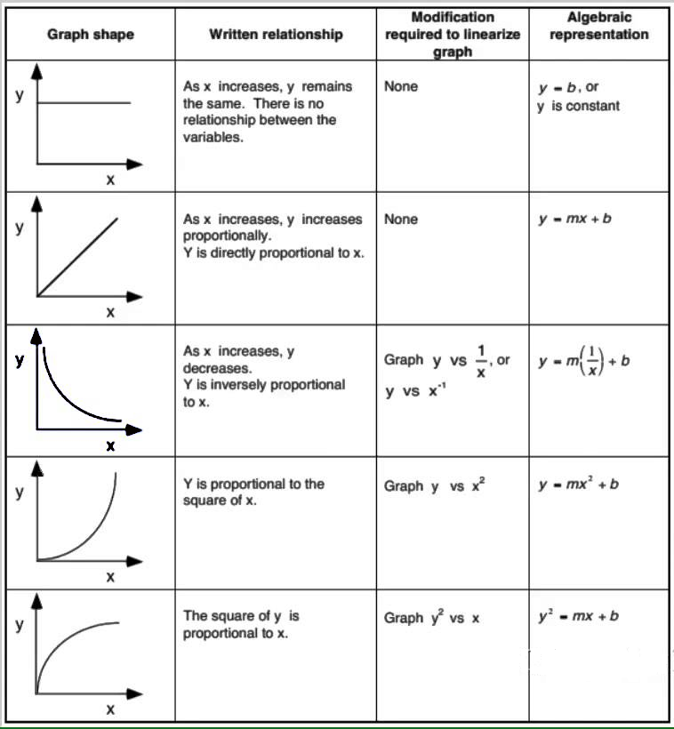
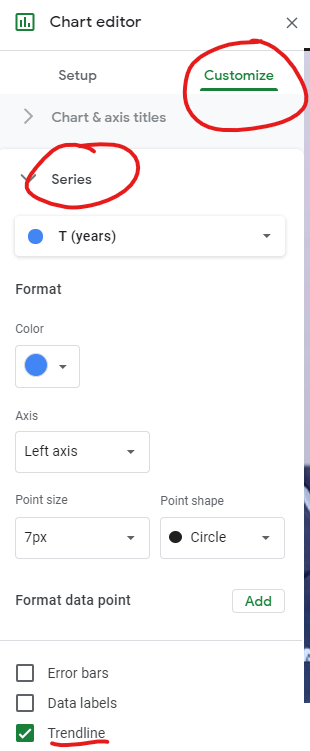
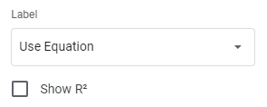

# Lab Math 6BL

# Introduction

When you wish to study the behavior of a physical system, a common technique to use is to choose a pair of quantities whose relationship you wish to examine, and, keeping everything else fixed, to vary one and to measure the second as you do so. A plot of the quantity you measure (dependent variable) vs. the one you varied (the independent variable), allows you to see the shape of the mathematical relationship between those two variables. If you can then fit the data to a mathematical function, you will have a good sense of what that relationship is. You might also be able to confirm that the data fit an equation that you had proposed before you did the experiment. If the data form a straight line, then such a fit is fairly simple. In 6A, you performed such a fit for the force data you generated in the experiment with the air track. As you might guess, though, the relationships between physical quantities are often nonlinear, and, in fact, they could take any of a number of forms. While it might be possible to identify a nonlinear function by looking at the shape of a plot, and while it is possible to perform fits to nonlinear functions, it is generally easier to fit to a straight line. If we can get our data into linear form, such a fit can provide information that tells us the form of the original function.

## Changing the Independent Variable

:::Figure plotExamples

From AP Physics 1 Online, by John Horwat, at [https://sites.google.com/site/apphysics1online/appendices/2-data-analysis/graph-linearization](https://sites.google.com/site/apphysics1online/appendices/2-data-analysis/graph-linearization)
:::

If we know the form of the original equation, then performing the appropriate operation on the *x* or *y* values and then plotting, yields a straight line.  For example, if the function is $y=(\frac1x)$, then plotting *y* vs. $(\frac1x)$ yields a straight line, if $y=x^2$, then plotting *y* vs. $x^2$ gives a straight line, and so on. The figure below shows some examples, and the simulation that follows it lets you see how the shape of some such curves becomes linear.

:::Simulation
<iframe src="https://kapawlak.github.io/PhDemoJS/Apps/MathLab/MathLab.html" width= "100%" height="1000" style="border:none;"></iframe>
:::

## Using Log-Log plots 
	
If we don&rsquo;t know the form of the equation, there is something else that we can do.

We note here the rules of logarithms:

::: Equation logProduct
$$
\log ( AB) = log( A ) + \log( B ) 
$$
:::

::: Equation logProduct
$$
\log \left(\frac{A}{B}\right) = \log( A ) - \log(B)
$$
:::

:::Equation logPower
$$
\log(C^{D}) = D \log(C)
$$
:::

:::Equation logInverse
$$
10^{\log(F)} = F
$$
:::

Thus, if we have an equation
$$
y=ax^b
$$

we can take the logarithm of both sides:

$$
\log (y)= \log (a) + b\log(x)
$$

We thus obtain a linear equation with slope $b$ and intercept log($a$). The slope is the exponent in the original equation, and the intercept is the logarithm of the proportionality constant (which we can recover by taking its antilogarithm, $a = 10^{\log (a)}$, if we are using common logarithms, or base 10 logarithms.). Manipulating data in either of these ways to cause them to fall on a straight line is often called *linearizing* the data. 

The simulation below allows you to plot some data from a pair of experiments. The first involves a phenomenon called black body radiation.  You are most likely familiar with the glow of electric heating elements when they are on, as on an electric stove top or in a toaster, or the glow of the hot filament in an incandescent lamp. Among those who studied this type of radiation during the late nineteenth and early twentieth centuries, was Josef Stefan, who formulated a law that stated that the radiated power of an emitting object went as a certain power of its temperature. This law is called *Stefan&rsquo;s Law* or the [Stefan-Boltzmann law](https://en.wikipedia.org/wiki/Stefan%E2%80%93Boltzmann_law). The second experiment involves the relationship between animal mass and basal metabolic rate. In the early 1930s, Max Kleiber proposed that the energy consumed by an animal was a function of its mass. The equation he used to describe this relationship is known as [Kleiber&rsquo;s law](https://en.wikipedia.org/wiki/Kleiber%27s_law#:~:text=Symbolically%3A%20if%20q0%20is,the%20energy%20the%20mouse%20uses). For each of these experiments, see if you can guess the correct equation based on the slope of the line, and check your answers in the linked articles!

:::Simulation
<iframe src="https://kapawlak.github.io/PhDemoJS/Apps/MathLab_Data/MathLab_Data.html" width= "100%" height="1000" style="border:none;"></iframe>
:::

## In Summary	
We have shown two ways to determine an unknown relationship between experimental variables given a set of data. In this lab, you will use the logarithm technique to linearize data from a set of astronomical observations, with the goal of discovering the equation that relates two observable variables.

>***REPORT REQUIREMENTS: For your report you should explicitly answer each question in the report. You should also include all your work for the exercises, which will consist of one table and two plots.***
>

# Experiment

As early as the time of the ancient Greeks, people sought to understand the motion of the planets. Ptolemy (ca. 85 - ca. 165, Greek astronomer, geographer) proposed a *geocentric* system, that is, one in which the earth is stationary and all other bodies revolve around it. For this model to work, though, the planets must take very complicated paths; they must travel in epicycles &ndash; small circular paths superimposed on their larger circular orbits. In the sixteenth century, Nicolaus Copernicus (1473-1543, Polish astronomer) proposed a *heliocentric* theory, in which all the planets, including earth, revolved around the sun, and the earth rotates on its axis. (Oddly enough, the inspiration for this may have come from a model proposed by Aristarchus of Samos (ca. 310 B.C.E.- ca. 230 B.C.E.), but which never gained broad acceptance). 

Copernicus&rsquo;s model was much simpler than Ptolemy&rsquo;s, but it still had problems. Because Copernicus held that planets traveled in exact circles, he still needed to use epicycles to explain their observed motion. There was also need for better information regarding the motion of the planets. This would soon be provided by Tycho Brahe (1546-1601, Danish astronomer), who made very careful and precise observations of the motions of the planets in the solar system (without a telescope!). 

Some time later, Johannes Kepler (1571-1630, German astronomer), who had been Brahe&rsquo;s assistant, analyzed these data and arrived at his Three Laws of Planetary Motion. His Third Law relates the orbital periods of the planets to their mean distance from the sun. This distance is equal to the semimajor axis of the orbit, which according to his First Law, is an ellipse with the sun at one focus. Later, when Newton was working on his Law of Universal Gravitation, he found that from this law, he could derive Kepler&rsquo;s Third Law. Kepler&rsquo;s Third Law takes the form

:::Equation keplerGeneral
$$T^i=Ka^j$$

which can also be written as

$$T=\sqrt[i]{K}a^{(j/i)}$$
:::

Note that $\sqrt[i]{K}$ is the same as $K^{(1/i)}$. For convenience, in the exercises that follow, we will let $k=\sqrt[i]{K}$ and $j/i=z$, and we will write the equation

:::Equation keplerGeneralSimplified
$$T=ka^z$$
:::

We are expressing the equations this way, because your goal is to find out what these exponents are. Note that $z$ is not an integer, but a value that can be expressed as a ratio of small whole numbers.

In the equations above, $T$ is orbital period, $a$ is the semimajor axis of the orbit, and $K=(\frac{ 4\pi^2}{GM})$, where $G$ is the gravitational constant ($=6.67 \times 10^{-11} \frac{N\cdot m^2}{kg^2}$), and $M$ is the mass of the sun ($1.988 \times 10^{30}$ kg). Strictly speaking, the denominator should be $G(M_{planet} + M)$, but the sun is so much more massive than the planets, that for describing the orbital motion of the planets, the equation is accurate without the planetary mass. We will give the period in years, and the semimajor axis in a.u. (astronomical units; 1 a.u. = $149.6 \times 10^6$ km).

This choice of units (years and a.u.) has an interesting consequence for the value of $K$, and thus also $k$, which makes the data easier to work with, and which you will notice when you make your log-log plot of the data.
	
# Data

::: Note
We will not use Tycho Brahe&rsquo;s data.  We will use data from the [NASA Planetary Fact Sheets](https://nssdc.gsfc.nasa.gov/planetary/planetfact.html).
:::

::: Table
|Planet|Orbit Semimajor Axis (a.u.)|Period (years)|
|:--------|--------:|--------:|
|Mercury|0.3871|0.2408|
|Venus|0.7233|0.6152|
|Earth|1.000|1.000|
|Mars|1.524|1.881|
|Jupiter|5.204|11.86|
|Saturn|9.582|29.46|
|Uranus|19.20|84.01|
|Neptune|30.05|164.8|
|Pluto*|39.48|247.9|

$*$ Yes, we know that Pluto is no longer considered a planet. It does, however, orbit the sun, and it obeys the same laws as the planets.
:::

> **REPORT REQUIREMENTS: For your report you should explicitly answer each question in the report. You should also include all your work for the exercises, which will consist of one table and two plots.**

:::Exercise
Make a copy of the provided [Google Sheet ](https://docs.google.com/spreadsheets/d/1MUMMf5RxccOF99fp0DZ0Zg-1wgxVVgf1typklwK0UvI/edit?usp=sharing)containing the data for this exercise. This has been provided to help you get familiar with simple tools for looking at data, and you will use software such as this throughout the course, so pay attention!

You are, of course, encouraged to use Excel, Google Sheets, MATLAB, or any other data processing package of your choice to create your own version of the table above, if you&rsquo;d like.
:::

# Plot 1

::::::Exercise
1. Make a plot of the data in your table. In Google Sheets, you can accomplish this by highlighting the two columns of interest and clicking &ldquo;Insert chart&rdquo; (  ). Plot orbital period (on the $y$- axis) vs. orbit semimajor axis (on the $x$- axis). 

2. However the plot looks, include a best-fit (straight) line. In Google Sheets, this option is found under &ldquo;Series&rdquo; in the &ldquo;Customize&rdquo; tab

:::Figure trendlineHowTo

:::

**Make sure that your graph has all of the components of a good plot in order to receive full credit.**

:::Question
1. Does this graph look linear, quadratic, exponential, or something else?

2. How can you tell?

3. Does it make sense to perform a linear fit with this data set? Why or why not? (Don&rsquo;t use $R^{2}$ in your answer.)
:::

::::::

# Linearizing the Data

:::::::::Exercise exLinearize
According to the rules of logarithms given above, take the log of both sides of [Eq](#Eq-keplerGeneralSimplified)

::::::Question
Your result from  Exercise 3 should look something like:

$$
y = m x+b
$$

Make a similar table to the one below in your report, and fill in the missing column with the equivalent parts from your result from [Ex](#Ex-exLinearize).

:::Table
| Name | Variable | Variable|
| -------- | -------- | -------- |
| Dependent Variable | y |
| Independent Variable | x |
| Slope | m |
| Y-Intercept | b |  |
:::

::::::
:::::::::

# Plot 2

::::::Exercise
In your data table, add two more columns. These will be for the logarithm of the orbital period and of the orbit semimajor axis. If you are using Google sheets, use the LOG10 function to take the log of data points in both columns, filling in the table with the appropriate values. 
:::Note
**If you use a computer to calculate the logarithms, in many cases, the &ldquo;LOG&rdquo; function is either the natural logarithm (ln) or log base 2 by default. If you are using Excel or Google sheets, you will want to use the LOG10 function, not the LOG function.**

**As long as you use the same base when you take the antilog to find the proportionality constant, this makes no difference. If, however, you need to compare the actual logarithms of the data, or of the constant, to those calculated by someone else, you will need to use the same base that that person did.**

**Therefore, for consistency, please make sure to use log base 10.**
:::
::::::

::::::Exercise exPlot1
Now make a plot of the data in these two columns. (Be sure to take the log of  **both** columns. That is, plot $\log(T)$ vs. $\log(a)$.) Again, make sure that your graph has all of the components of a good plot in order to receive full credit.

:::Question
1. Does this graph look linear, quadratic, exponential, or something else?

2. How can you tell?

3. Does it make sense to perform a linear fit with this data set? Why or why not? (Don&rsquo;t use $R^{2}$ in your answer.)

4. Compare and contrast this plot with the previous one.
:::

::::::

:::::::::Exercise
Create a best-fit line for the new log-log plot. In Google Sheets, you can do this as described in [Ex](#Ex-exPlot1), or you can find it under &ldquo;Label&rdquo; in the &ldquo;Series&rdquo; menu trendline options.

:::Figure showEquation

:::

:::Question
1. What is the equation for your line of best fit?

2. According to this equation, and the relationship between the Log-Log and Raw Data equations, what is the value of the exponent $z$? 

3. What is the numerical value of *k*? (You might find this result interesting. If the value you get seems too simple, don&rsquo;t panic; it&rsquo;s probably right!)
:::

::::::Question
As we noted earlier, Kepler&rsquo;s law is frequently written in the form

:::Equation

$T^{i}=K a^{j}$
:::

1. Use the fact that this may be rewritten as
:::Equation

$T=(K)^{(1/i)} a^{(j/i)}$
:::
to determine the simplest (*i.e.*, smallest) possible integers $i$ and $j$ consistent with your fit, and write down Equation 6 with these integers.

2. Given these values of $i$ and $j$, determine $K$  (Remember: $k=(K)^{(1/i)}$. Again, if your answer looks too simple, don&rsquo;t panic.  It&rsquo;s probably right!)
::::::

:::::::::
# Units

For the equation for Kepler&rsquo;s Third Law, although the power relationships do not depend on what units we choose for our variables, the proportionality constant, and hence its logarithm, does. Thus, a note about units and their conversion is in order.

:::Note
As noted above, for the period, *T*, we used years, and for the semimajor axis of the orbit, *a*, we used a.u. (1 a.u. = $149.6 \times 10^6$ km). $K=(\frac{ 4\pi^2}{GM})$, where *G* is the gravitational constant ($=6.67 \times 10^{-11} \frac{N\cdot m^2}{kg^2}$), and *M* is the mass of the sun ($1.988 \times 10^{30}$ kg). You may have noticed that years and a.u. are not SI units. The SI units for these values are seconds and meters. As it turns out, if you make the conversion from seconds to years, and from meters to a.u., *K* = 1; when you multiply and divide *K* by the appropriate conversion factors, raised to the appropriate powers, the result is unity. You should have found this in your answer to questions 4. c and 5.b.
:::

:::Question

1. Say we wished to use SI units, that is, seconds for the orbital period and meters for the semimajor axis, instead of years and $\rm a.u.$ We would need one conversion to change the time from years to seconds, and one to change the distance from $\rm a.u.$ to meters, and we would have to raise each to the power of its respective variable in the equation ($i$ or $j$). If we wished to make this conversion by multiplying only our values for $T$, instead of having to convert both our $T$ values and our $a$ values, we could combine these two conversion factors into one.

If you were to do this, by what factor should you have to multiply the values for the periods? (Note that when you arrive at your conversion factor, you can check it by comparing it to the value that you  get if you evaluate $K^{(1/i)}$, by calculating $(\frac{ 4\pi^2}{GM})^{(1/i)}$, with the values given above for $G$ and $M$.)

2. How would this have changed the intercept of your log-log graph? What would its value have been?
:::

<!--

# 7. POWER PLOT
:::Exercise
In the introduction, we noted that if you know the function, then if you manipulate the *x* variable according to that function, you get a linear plot.  For example, if $y = ax^3$, then plotting *y* vs. *x* gives a curved line, but plotting *y* vs. $x^3$ yields a straight-line plot with slope *a*. Thus, for your planetary orbital data, if you plot either *T* vs. $a^z$ ($=a^{(j/i)})$, or $T^i$ vs. $a^j$, you should get a straight line (with slope *K* = 1).

a. According to the two choices above, in your data table make either one or two more columns, and do one of the following:

- Make one additional column for $a^{(j/i)}$, and fill it appropriately. Now plot *T* vs. $a^{(j/i)}$.

- Make two additional columns, one for $T^i$ and one for $a^j$, and fill them appropriately. Now plot $T^i$ vs. $a^j$.

Whichever plot you choose to do, include a best-fit line. As usual, make sure that it has all the characteristics of a good plot.
:::Question
1. How does this plot look? Does it fit a straight line?
:::
:::

-->

:::Hider Historical Note
Until the work of Brahe and Kepler, there was great confusion regarding the motion of the planets. Also, our understanding of gravity was limited, and until Newton, no one had imagined the possibility that gravity could act not only close to earth, but over astronomical distances as well. Newton&rsquo;s Law of Universal Gravitation provided a deeper understanding of Kepler&rsquo;s laws, and together these formed part of the bedrock of classical physics. We hoped that fitting the data associated with the motion of the planets would provide a pleasant exercise.
:::
# Conclusion

:::Exercise
Write a brief conclusion summarizing the important points of this lab.
:::

:::Summary

You must show work for all problems!
:::