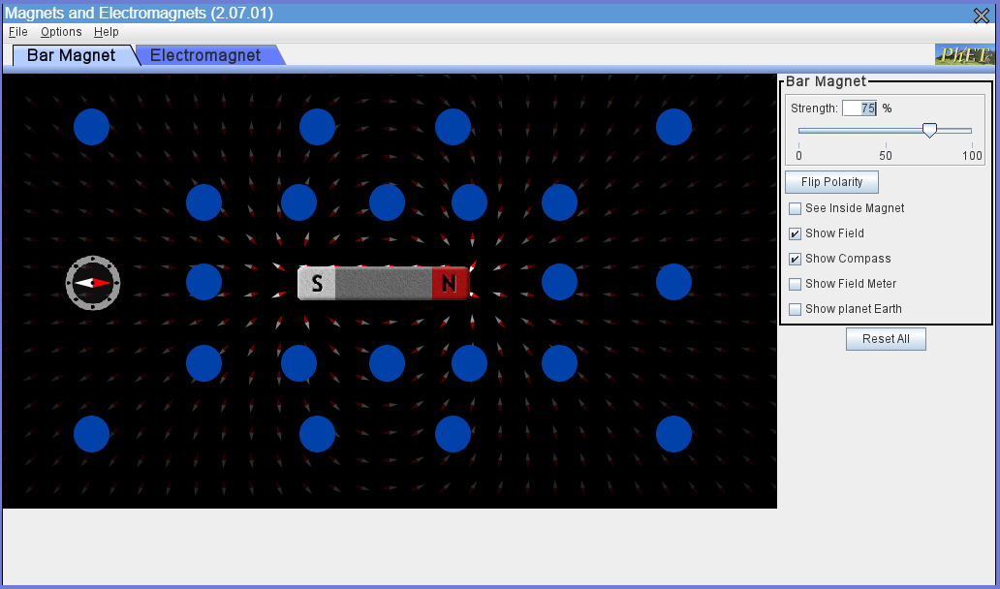
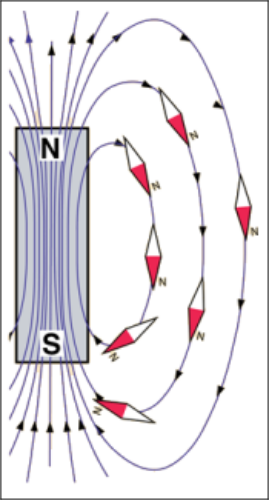

# Magnets and Inductors
---

:::Note
Make sure to include all tables, plots, pictures, drawings, screenshots or anything else asked of you in the exercises in your report, as well as answers to all the questions.

All responses and answers should contain the correct number of sig figs and should include units when needed.
:::

# Introduction

:::Video
<iframe src="https://drive.google.com/file/d/1HCorUFXEPEtfkIyGYHVCCxuUs8mFQ8WW/preview" width="100%" height="100%" allow="autoplay"></iframe>
:::

# Permanent Magnets and Electromagnets

## Gaining Intuition with Magnets

::::::::: Exercise permanentMagnet

In this exercise you will gain intuition on magnetic fields and  magnetic field lines. In [Si](#Si-permanentMagnet) you will explore how permanent magnets affect the region surrounding them.

1. Examine the &ldquo;Bar Magnet&rdquo; tab of [Si](#Si-permanentMagnet). There is a permanent bar magnet with its north and south poles labeled, which creates a magnetic field around it. Notice the many compasses laid out in the background, and the single compass laid out in the foreground.  Each compass will orient itself in the direction of the magnetic field at its location.

:::Simulation permanentMagnet
<iframe src="https://phet.colorado.edu/sims/cheerpj/faraday/latest/faraday.html?simulation=magnets-and-electromagnets" width="100%" height="800px" scrolling="no" allowfullscreen></iframe>
:::

::: Note
The north pole of each compass is painted red, similarly to that of the permanent bar magnet. In this simulation there is no magnetic field due to the Earth, so these compasses are affected only by the magnetic field of the permanent bar magnet. This represents an idealized situation for study, where there is only one source of a magnetic field. In the real world, we would also see effects from the Earth&rsquo;s magnetic field, and from any magnetized objects nearby. 
:::

<!-- For instance, if we performed this experiment on a table that had iron braces underneath the top, or other iron-containing hardware, and some of the braces or hardware had become magnetized, their magnetic fields could deflect the compass needles in unexpected ways. -->

1. Move the permanent bar magnet to the middle of the window.
    
2. Slowly move the large compass in the foreground to different locations to see the orientation of its needle.

:::Figure compassLocations

:::

3. Take a piece of paper and sketch a rectangle in the center to represent your permanent bar magnet. Move the large compass around the permanent bar magnet to ***roughly*** the locations of each of the blue dots in [Fi](#Fi-compassLocations),  and draw an arrow on your paper in each location, pointing in the direction of the compass&rsquo;s north pole. Take about 20 data points.

::::::Note
**Magnetic fields are vector fields, meaning that every point in space has both a magnitude and a direction associated with it. This direction of the magnetic field is the direction in which the north pole of a compass needle points under the influence of the field.**

:::RFigure magnetFieldLines

:::

The compasses show the direction of the magnetic field created by the permanent bar magnet at the locations where they are placed. A *magnetic field line* is a directed line that is tangent to the magnetic field at each point along its length.  Notice that the direction of a compass needle is along the field line passing through its location. Magnetic field lines originate from the North pole of the magnet and loop back into the South pole.

[Fi](#Fi-magnetFieldLines) shows the magnetic field lines around a permanent bar magnet and a few representative compass directions.
::::::
:::::::::

## Air Core Electromagnet

A coil of wire with current flowing through it generates a magnetic field. We call this an electromagnet. If there is nothing but air inside of the coil, it is an &ldquo;air core&rdquo; electromagnet. We can also place other materials such as iron inside of the coil to amplify the magnetic field. We call this an &ldquo;iron core&rdquo; electromagnet.

:::::: Exercise airCoreField
In [Ex](#Ex-permanentMagnet) you gained intuition with a permanent bar magnet. In this exercise you will be using [Si](#Si-electroMagnet) to visualize the magnetic field of an electromagnet. Note that this is an air core electromagnet. The circuit diagram for this experiment is shown in [Fi](#Fi-airCoreField).

:::Figure airCoreField
.2 – Wiring for basic electromagnet](imgs/Lab4/Figure1.2_Wiring_basic_electromagnet.jpg)
:::

1. Examine the &ldquo;Electromagnet&rdquo; tab of [Si](#Si-electroMagnet). 
::: Note
You will have to change to the &ldquo;Electromagnet&rdquo; tab from the default &ldquo;Bar Magnet&rdquo; tab.
:::

:::Simulation electroMagnet
<iframe src="https://phet.colorado.edu/sims/cheerpj/faraday/latest/faraday.html?simulation=magnets-and-electromagnets" width="100%" height="800px" scrolling="no" allowfullscreen></iframe>
:::

2. Move the electromagnet coil to the middle of the window. 
3. Make sure the voltage on the battery is set to &ldquo;10 V.&rdquo;
   
::: Note
The electromagnet is the coil, not the battery.
:::

4. Slowly move the large compass in the foreground to different locations to see the orientation of its needle.
5. Take a piece of paper and sketch a coil in the center to represent your electromagnet. Move the large compass around the magnet to roughly the same 20 locations you took in Exercise 1. Draw arrows as you did before.

::: Question
Two magnetic fields are similar if, for all points in one field, a compass placed there points in the same direction as it does at the same point in the other field.

Based on your 20 compass locations, is the magnetic field of a bar magnet similar to that of an electromagnet? Why or why not?
:::

6. Drag the slider on the battery to the center mark so that it reads &ldquo;0 V.&rdquo; This means that there is no current passing through the coil. Notice that the compasses in the background are gone.
7. Slowly move the large compass in the foreground to different locations.

::: Question
1. What happens to the direction of the needle of the large compass when is it moved around while the battery is set to 0 V? 
2. What can you conclude about the strength of the magnetic field?

:::

8. Drag the slider back to 10 V. Then drag the slider on the battery to the far left in order to switch the direction of the current flowing through the coil. The battery should now read -10 V. (The positive and negative terminals should have exchanged ends.)

:::Question
What happens to the directions of the needles of the small compasses when you reverse the direction of current flow, that is, when you drag the slider from 10 V to -10 V ?
:::

::::::

# Magnetic Field Strength

## Compass on the Axis of the Electromagnet

:::::: Exercise airCoreStrength

In this exercise we will be exploring the strength of magnetic fields. 

We will be working with the system described in [Fi](#Fi-airCoreStrength). This system uses an electromagnet that has an air core, just as in [Ex](#Ex-airCoreField). The large compass is placed on the axis of the coil, about 4 cm away.

:::Figure airCoreStrength
.1– Shows wiring, also shows compass on axis of coil](imgs/Lab4/Figure2.1_Wiring_compas_onaxis.jpg)
:::

:::Note
The Earth’s magnetic field will affect the compass needle. Remember, this did not occur in previous exercises, because we were dealing with ideal simulations.  Thus we will align the entire apparatus, both the electromagnet and the compass, so that the compass needle is nearly perpendicular to the axis of the coil when the electromagnet is not powered.
:::

:::Note
Note: In all of the videos, we refer to the electromagnetic coil as a solenoid. In this context these two terms are interchangeable.
:::

:::Video airCoreStrength
<iframe width="100%" height="100%" src="https://www.youtube.com/embed/-UGxgsBJ7Qw" title="YouTube video player" frameborder="0" allow="accelerometer; autoplay; clipboard-write; encrypted-media; gyroscope; picture-in-picture" allowfullscreen></iframe>
:::

In [Vi](#Vi-airCoreStrength) we see the system from [Fi](#Fi-airCoreStrength),  built and powered (*i.e.*, with current flowing through the coil). The air core electromagnet will be moved away from the compass. At certain distances, current will be applied for a short time by means of the momentary-contact switch shown in [Fi](#Fi-airCoreStrength). When the electromagnet is at its farthest distance from the compass, an iron rod will be placed inside it. Current will again be applied via the momentary-contact switch.

1. Watch [Vi](#Vi-airCoreStrength), and note the difference in how the compass needle behaves when the electromagnet is powered versus when it is not.
2. Note the angle (in degrees) of deflection of the compass needle at three different distances. Make the video pause to make these measurements.
3. Note at what distance the needle barely deflects. 
4. At 1:45 an iron core is put into the coil. Observe what occurs when the coil is powered with the iron core inserted.

::: Question
1. How many degrees does the compass needle deflect when the electromagnet is originally powered at 4 cm away?

2. How many degrees does the compass needle deflect when the electromagnet is 8 cm away? Is the deflection at 8 cm smaller or greater than the one at 4 cm away?  What can you conclude about the magnetic field strength at the two distances?

3. At what distance is the needle&rsquo;s deflection just barely noticeable?

4. How does the needle&rsquo;s deflection change once the iron core is placed into the coil in comparison to when the core was an air core? What can you conclude about the magnetic field strength when we place an iron core into an air core electromagnet?
:::
::::::

::: Note
**Ferromagnetic materials greatly increase the strength of a magnetic field. This is due to the atomic and molecular structures of the material lining up with the externally applied field.**
:::

:::::: Exercise currentFieldStrength

This exercise continues our investigation of magnetic field strength. Instead of varying the distance between our compass and our electromagnet as we did in [Ex](#Ex-airCoreStrength), we will vary the current flowing through our electromagnet. We will use a circuit containing a variable resistor  (a rheostat), as shown in [Fi](#Fi-currentFieldStrength). We apply a fixed voltage, and vary the resistance of the rheostat; thus we vary the amount of current flowing through the coil (according to Ohm&rsquo;s Law). [Vi](#Vi-currentFieldStrength) shows the circuit in [Fi](#Fi-currentFieldStrength), with the rheostat being slowly adjusted from zero resistance at the beginning, to maximum resistance at the end.

:::Figure currentFieldStrength
.2 – Wiring diagram showing rheostat in series.](imgs/Lab4/Figure2.2_Wiring_rheostat_inseries.jpg)
:::

:::Video currentFieldStrength
<iframe width="100%" height="100%" src="https://www.youtube.com/embed/mF1zZxNNjMc" title="YouTube video player" frameborder="0" allow="accelerometer; autoplay; clipboard-write; encrypted-media; gyroscope; picture-in-picture" allowfullscreen></iframe>
:::

[Vi](#Vi-currentFieldStrength)  shows a rheostat being used to vary the current passing through the coil of the electromagnet. The video begins with the wiper of the rheostat at the $0$ position, and shows it being slowly moved to the opposite end ($1$, maximum resistance). As the resistance increases, the current in the circuit decreases.

1. Watch [Vi](#Vi-currentFieldStrength), which shows the current being changed slowly from maximum to minimum.
2. Note the angle of the compass needle for 5 data points; the rheostat at $0$, $\frac{1}{4}$, $\frac{1}{2}$, $\frac{3}{4}$, and $1$ positions.

::: Question
1. How many degrees does the compass needle deflect with the rheostat at each position; $0$, $\frac{1}{4}$, $\frac{1}{2}$, $\frac{3}{4}$, and $1$? (Make the video pause for each position to make the measurement.)

2. The magnetic field strength is proportional to the angle of deflection of the compass needle.  How does the magnetic field strength change as we increase the resistance of the rheostat?
:::
::::::

::: Note
**Moving charges give rise to magnetic fields. More current means more moving charges. More moving charges means a stronger magnetic field. By decreasing the current in the electromagnet we reduce the magnetic field strength.**
:::

# Magnetization

:::::: Exercise magnetization
In this exercise we will explore magnetization and how objects can become magnetized. We will start with an iron bar that is not magnetized, and place it in an external magnetic field to magnetize it. 

:::Video magnetization
<iframe width="100%" height="100%" src="https://www.youtube.com/embed/cUli9nLH3lE" title="YouTube video player" frameborder="0" allow="accelerometer; autoplay; clipboard-write; encrypted-media; gyroscope; picture-in-picture" allowfullscreen></iframe>
:::

1. Watch [Vi](#Vi-magnetization) and make it pause at 1:15.

::: Question
Does the iron core create its own magnetic field after it is placed in an external field? Justify your answer.
:::

2. Finish watching the rest of [Vi](#Vi-magnetization). 

::: Question
Did the north pole of the magnetized iron core change? How do you know?
:::
::::::

::: Note
**In some materials, the magnetic domains remain aligned after the external magnetic field has been removed. As a result, the material itself becomes a magnet. This phenomenon is called *ferromagnetism*. A material that behaves this way is said to be *ferromagnetic*.**
:::

# magnetic Flux and Faraday&rsquo;s Law

<!-- Galvanometers are sensitive current meters. The terminals are connected to a small coil of wire enclosed within a permanent magnet; the coil is mechanically linked to the readout needle. Current flowing through the coil produces a magnetic field, which because of its orientation in the field of the permanent magnet, creates a torque on the needle. More current produces a stronger field and thus greater deflection of the needle. A hairspring connected to the needle balances this torque, and restores the needle to its original position when current is removed.-->

## Flux

In [Ex](#Ex-permanentMagnet), we discussed magnetic field lines between the N and S poles of the bar magnet.  When these lines cross an area they produce *magnetic flux*. Magnetic flux is associated with a given surface and represents a measure of the number of field lines crossing that surface. 

For a uniform magnetic field perpendicular to a surface, the magnetic flux is defined as the product of the magnetic field strength and the area of the surface.

For a given area, a greater magnetic field strength yields a greater flux. A smaller field strength yields a smaller magnetic flux.

For a given magnetic field strength, a greater area yields a greater flux. A smaller area yields a smaller flux.

## Faraday’s Law

Consider an area bounded by a loop of wire. If the amount of flux through the area is changing, then a voltage is
induced in the loop. This, in turn, gives rise to a current, which we will refer to as the induced current. 

## Lenz’s Law

Lenz’s Law states that a magnetic field produced by an induced current always opposes the change in magnetic flux that produced the current. If the magnetic flux is increasing, current flows in the direction that causes its magnetic field to point in the opposite direction to the increasing flux; it tries to cancel the change in flux. You can determine the direction of the induced current by means of the right-hand rule. If you point the thumb of your right hand in the direction of the magnetic field from the induced current (opposite to the direction of the change in flux that is causing it), your fingers will curl in the direction of the induced current. (See Figure 6c below. The thumb points north.)

:::Note
The right hand rule holds that when your right thumb is aligned with the direction of current flow, your fingers will wrap in the direction of the magnetic flux. (They will point north. See the Figure 6b below.)
:::

:::Figure
gure 6a. F = q v x B. Your index finger goes in the direction of v, middle finger in the direction of B. Your thumb is the direction of F.](imgs/Lab4/Figure4.1a_RHR.jpg) 
gure 6b. For a wire, when your thumb points in the direction of positive current flow, your fingers wrap in the direction of the magnetic field.](imgs/Lab4/Figure4.1b_RHR.jpg)
gure 6c. For a coil, when your fingers wrap in the direction of positive current flow (look at the windings to determine this), your thumb points in the direction of the magnetic field.](imgs/Lab4/Figure4.1c_RHR.jpg)
:::

:::::: Exercise lenzLaw

In this exercise we will explore laws critical to the study of electromagnetism. We will be using [Si](#Si-lenzLaw) to explore how a moving magnet produces current in a nearby coil of wire. The simulation shows a system similar to the one described in [Fi](#Fi-lenzLaw). 

:::Figure lenzLaw
.1 – Lenz’s law setup](imgs/Lab4/Figure4.1_LenzsLaw.jpg)
:::

1. Examine [Si](#Si-permanentMagnet). You may notice that in [Fi](#Fi-lenzLaw) we show a Galvanometer, which measures current, and [Si](#Si-lenzLaw) has a voltmeter, which measures voltage. As we learned in the Ohm&rsquo;s Law lab, $V=IR$. Thus, for a resistive element such as the light bulb in [Si](#Si-lenzLaw), we can use these interchangeably for the purposes of this lab. 
<!-- (You may also remember that the current that flows is the result of an induced voltage, often referred to as an *emf*, which stands for &ldquo;electromotive force.&rdquo; We may measure either one as we move our magnet around near the coil.) -->

:::Simulation lenzLaw
<iframe src="https://phet.colorado.edu/sims/html/faradays-law/latest/faradays-law_en.html" width="100%" height="800" scrolling="no" allowfullscreen></iframe>
:::

2. Bring the north pole of the permanent magnet close to the end of the coil on the right side and note the motion of the voltmeter needle. Experiment with different approach and recession speeds, and note the relationship between the speed and the needle’s deflection.

::: Question
1. Which way does the needle deflect when you move the magnet towards the coil? Which way does it deflect when you pull the magnet away from the coil?

2. What is the relationship between the magnet’s approach speed and the degree to which the needle is deflected?
:::

::: Question
1. Magnetic field strength decreases as you get farther from the poles of the magnet. Does the flux through the face of the coil change as you move the magnet? Explain your answer.

2. Why does the meter needle deflect? Is the deflection in accordance with Lenz’s Law? Justify your answer in terms of Lenz’s law and your above answers. 
:::

3. Reverse the polarity of the magnet by pressing the button on the bottom right of [Si](#Si-lenzLaw). Take the magnet to the left side of the coil and repeat the above experiment (step 2). Be sure that the north pole of the magnet is the one facing the coil.

::: Question
Describe what you’ve observed. Comment on the direction in which the meter needle deflects and the relative degree to which it does so.
:::

4. While leaving the magnet&rsquo;s polarity the same as it was in step 3, move it back to the right side of the coil. Repeat step 2 with the south pole of the magnet facing the coil.

::: Question
1. What is different when you use the south pole instead of the north pole?

2. How does Lenz’s law explain this phenomenon?
:::
::::::

# Conclusion
::: Exercise
Write a brief conclusion summarizing the important points of this lab.
:::
