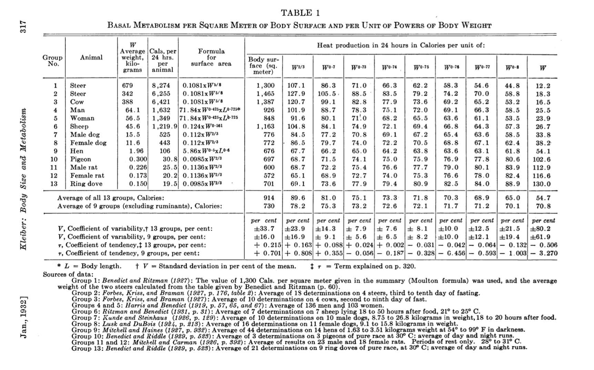
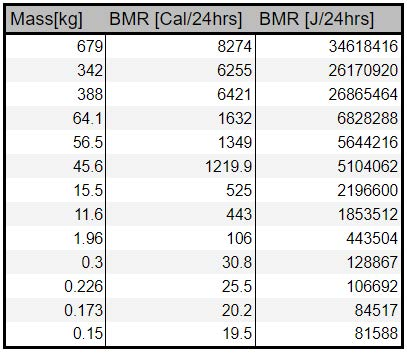

# Lab Math 6BL

## 1. INTRODUCTION

When you wish to study the behavior of a physical system, a common technique to use is to choose a pair of quantities whose relationship you wish to examine, and, keeping everything else fixed, to vary one and to measure the second as you do so. A plot of the quantity you measure (dependent variable) vs. the one you varied (the independent variable), allows you to see the shape of the mathematical relationship between those two variables. If you can then fit the data to a mathematical function, you will have a good sense of what that relationship is. You might also be able to confirm that the data fit an equation that you had proposed before you did the experiment. If the data form a straight line, then such a fit is fairly simple. In 6A, you performed such a fit for the force data you generated in the experiment with the air track. As you might guess, though, the relationships between physical quantities are often nonlinear, and, in fact, they could take any of a number of forms. While it might be possible to identify a nonlinear function by looking at the shape of a plot, and while it is possible to perform fits to nonlinear functions, it is generally easier to fit to a straight line. If we can get our data into linear form, such a fit can provide information that tells us the form of the original function.

If we know the form of the original equation, then performing the appropriate operation on the *x* or *y* values and then plotting, yields a straight line.  For example, if the function is $y=(\frac1x)$, then plotting *y* vs. $(\frac1x)$ yields a straight line, if $y=x^2$, then plotting *y* vs. $x^2$ gives a straight line, and so on. The figure below shows some examples.

:::Figure:Figure

From AP Physics 1 Online, by John Horwat, at [https://sites.google.com/site/apphysics1online/appendices/2-data-analysis/graph-linearization](https://sites.google.com/site/apphysics1online/appendices/2-data-analysis/graph-linearization)
:::

If we don&rsquo;t know the form of the equation, there is something else that we can do.

We note here the rules of logarithms:

::: Figure:Equation
$$
\rm log (\it AB\rm) = log(\it A\rm ) + log(\it B\rm ) \:and\:log(\it\frac AB\rm) = log(\it A\rm ) - log(\it B\rm )
$$
:::

:::Figure:Equation
$$
\rm log(\it C^{D}\rm ) = \it D\:\rm log(\it C\rm )
$$
:::

:::Figure:Equation
$$
10^{\rm log\it (F)} = F
$$
:::

Thus, if we have an equation
$$
y\:=\:ax^b
$$

we can take the logarithm of both sides:
$$
\rm log\it (y)\:=\:\rm log\it (a)\:+\:b\:\rm log\it(x)
$$
We thus obtain a linear equation with slope *b* and intercept log(*a*). The slope is the exponent in the original equation, and the intercept is the logarithm of the proportionality constant (which we can recover by taking its antilogarithm, *a* = $10^{\rm log\it (a)}$, if we are using common logarithms, or base 10 logarithms.). Manipulating data in any of these ways to cause them to fall on a straight line is often called *linearizing* the data. The simulation below will allow you to plot functions of various shapes, and to see what happens when you perform the types of linearization described above.

:::Figure:Simulation
AVOCADO -- Kelly's simulation goes here.
:::

:::Note
In this lab, you will be assigned one of three experiments, for which we will provide data. You will perform the following steps:

1) You will plot the original data as they sit, and describe what you observe.

2) You will then make a log-log plot of the data (by taking the logarithm of each column of values, then plotting the resulting data).

3) From the log-log plot you will determine *b*, the power, and *a*, the proportionality constant. (For some of the data it may not be possible to determine *a*, but in each case we will discuss this term.)

4) Along the way, we will pose questions.
:::

>***REPORT REQUIREMENTS: For your report you should explicitly answer each question in the report. You should also include all your work for the exercises, which will consist of one table and two plots.***
>

## 2. THE EXPERIMENTS

AVOCADO (We need to make sure that we wish to use all three of these, and if so, whether to have each student use only one, and whether to divide them as set forth here.)

::: Note
As noted above, we have data for three experiments. We will assign these according to birthday, as follows:

If your birthday occurs in January through April, you will use the data from Experiment A, *Planetary Orbital Period as a Function of Distance from the Sun*.

If your birthday occurs in May through August, you will use the data from Experiment B, *Thermal Radiation of a Blackbody as a Function of Temperature*.

If your birthday occurs in September through December, you will use the data from Experiment C, *Basal Metabolic Rate as a Function of Body Mass*.
:::

### Experiment A &ndash; *Planetary Orbital Period as  a Function of Distance from the Sun*

Tycho Brahe (1546-1601, Danish astronomer) made very careful and precise observations of the motions of the planets in the solar system (without a telescope!). Some time later, Johannes Kepler (1571-1630, German astronomer), who had been Brahe&rsquo;s assistant, analyzed these data and arrived at three laws. His Third Law relates the orbital periods of the planets to the semimajor axes of their orbits. Later, when Newton was working on his Law of Universal Gravitation, he found that from his law, he could derive Kepler&rsquo;s Third Law. Kepler&rsquo;s Third Law takes the form

:::Figure:Equation
$T^2=Ka^3$

which can also be written as 

$T=\sqrt{K}a^{3/2}$
:::

where *T* is orbital period, *a* is the semimajor axis of the orbit, and $K=(\frac{\rm 4\pi^2}{GM})$, where *G* is the gravitational constant ($=6.67 \times 10^{-11} \rm\frac{N\cdot m^2}{kg^2}$), and *M* is the mass of the sun ($1.988 \times 10^{30}$ kg). Strictly speaking, the denominator should be $G(M_{planet} + M)$, but the sun is so much more massive than the planets, that for describing the orbital motion of the planets, the equation is accurate without the planetary mass. We will give the period in years, and the semimajor axis in a.u. (astronomical units; 1 a.u. = $149.6 \times 10^6$ km).

### Experiment B &ndash; *Thermal Radiation of a Blackbody as a Function of Temperature*

You are most likely familiar with the glow of electric heating elements when they are on, as on an electric stove top or in a toaster, or the glow of the hot filament in an incandescent lamp. You probably also know that as such an element heats up, at first it glows a dull red, then brighter red, then orange, glowing more brightly as it heats, until it reaches its final temperature. There are two aspects of such radiation, which generated tremendous interest during the late nineteenth and early twentieth centuries. First, as the temperature increases, the distribution of energies in the emitted radiation broadens and shifts towards higher energy (shorter wavelength, so in the direction from red to blue). Second, the power of the emitted radiation increases with temperature. The first of these behaviors is described by *Wien&rsquo;s Law*, which we will not examine in this lab. The second is described by *Stefan&rsquo;s Law*, which Josef Stefan formulated in 1879, and which is

:::Figure:Equation
$R=\sigma T^4$
:::

where *R* is radiated power (in $\rm watts/m^2$), $\sigma$ is the Stefan-Boltzmann constant ($\rm 5.670 \times 10^{-8}\frac{watts}{m^2\cdot K^4}$), and *T* is the absolute temperature of the emitting body. When we write the equation this way, we are assuming that the radiating body is a perfect emitter. The full equation is  $R=e\sigma T^4$, where *e*, the *emissivity* of the radiating body, ranges from 0 to 1. Difficulties in the formulation of these theories led Max Planck to a formula from which one can derive Stefan&rsquo;s law, to his idea of the quantization of energy, and to the development of quantum mechanics.

### Experiment C &ndash; *Basal Metabolic Rate as a Function of Body Mass*

In 1932 Max Kleiber publish a paper titled ["Body Size and Metabolism"](http://hilgardia.ucanr.edu/fileaccess.cfm?article=152052&p=VOWQRB). He was interested in the relationship between an animal&rsquo;s size and the amount of energy it uses. For mammals, the rate at which an animal uses energy is known as the Basal Metabolic Rate (BMR). To determine the size of the animals, Kleiber focused on the animals&rsquo; mass. It was known that smaller animals have lower BMRs while larger animals have higher BMRs, but the relationship between size and BMR is not linear. The relationship takes the form of a power law. That is to say,

:::Figure:Equation
$$
\rm BMR\:\it = a\rm W^{\it b},
$$
:::

where *a* and *b* are both unknown constants and W is the mass of the animal. There was a theory based on the surface area to volume ratio of animal that suggested that the value for *b* is *2/3*. This was called the surface law. We will look at the collection of data in Kleiber's original paper and use our knowledge of logarithms to see what value of *b* was reported by Kleiber.

## 3. DATA

::: Note
**Experiment A &ndash; Planetary Orbital Period as a Function of Distance from the Sun**

We will not use Tycho Brahe&rsquo;s data.  We will use data from the [NASA Planetary Fact Sheets](https://nssdc.gsfc.nasa.gov/planetary/planetfact.html).

::: Figure:Table
|Planet|Orbit Semimajor Axis (a.u.)|Period (years)|
|:--------|--------:|--------:|
|Mercury|0.3871|0.24084|
|Venus|0.7233|0.615188|
|Earth|1.000|1.00000|
|Mars|1.524|1.8808|
|Jupiter|5.204|11.8618|
|Saturn|9.582|29.4566|
|Uranus|19.20|84.0107|
|Neptune|30.05|164.78|
|Pluto*|39.48|247.94|
$*$ Yes, we know that Pluto is no longer considered a planet. It does, however, orbit the sun, and it obeys the same laws as the planets.
:::
:::

::: Note
**Experiment B &ndash; Thermal Radiation of a Blackbody as a Function of Temperature**

Though Josef Stefan used data from an experiment by John Tyndall to find the relation shown above, we will use data from John William Draper, from *Scientific Memoirs*, p. 44 (1878), which Stefan included in his paper *On the Relationship between Thermal Radiation and Temperature, Part III &ndash; On the Attempts by Draper and Ericsson*, in *Proceedings of the Royal Academy of Science &ndash; Natural Sciences, Vienna* **79**(1879) p. 391.  For such experiments, people typically used heated filaments as the radiating source, and thermopiles (devices that have many thermocouples in series, and are sensitive to thermal radiation). These data from Draper are an average of two runs. The temperatures are in kelvins, but units are not given for the intensity values for the emitted radiation. For experiments for which intensity calibration is not important, it is not uncommon to find it given in arbitrary units. For this type of experiment, such calibration is, of course, possible, but could be a difficult process. In cases where one is looking only for the power of the function, but not the proportionality constant, this is not important. We will discuss this issue of units in a later section.

:::Figure:Table
|Temperature (K)|Intensity of the Thermal Radiation|
|----------:|----------:|
|800|0.87|
|864|1.10|
|927|1.50|
|991|1.80|
|1055|2.20|
|1119|2.80|
|1183|3.70|
|1247|5.00|
|1311|6.80|
|1375|8.60|
|1439|10.00|
|1502|12.50|
|1566|15.50|
:::
:::

::: Note
**Experiment C &ndash; Basal Metabolic Rate as  Funcion of Body Mass**
:::Figure:Figure
 Kleiber's Data
:::

Above in Fig. (1) are the raw data that were printed in Kleiber's report. Because it is hard to parse the important information, we did that for you. Table 3 (below) is the data table you should use. The first column is the mass of each type of animal in kilograms. The second column is how much energy the animal used in one day (the BMR) and uses Kleiber&rsquo;s preferred units of Cal/24 hours. Since Calories are not the SI unit of energy, we converted the second column to joules/24 h in the third column for you.

:::Figure
<!--  
This is the simplified table.-->
:::

:::Figure:Table
|Mass (kg)|BMR (Cal/24 h)|BMR (J/24 h)|
|----------:|----------:|----------:|
|679|8,274|34,620,000|
|342|6,255|26,170,000|
|388|6,421|26,860,000|
|64.1|1,632|6,828,000|
|56.5|1,349|5,644,000|
|45.6|1,219.9|5,104,100|
|15.5|525|2.20 &times; $\rm\small10^6$|
|11.6|443|1,850,000|
|1.96|106|444,000|
|0.3|30.8|129,000|
|0.226|25.5|107,000|
|0.173|20.2|84,500|
|0.15|19.5|81,600|
This is the simplified table.
:::

:::
> **REPORT REQUIREMENTS: For your report you should explicitly answer each question in the report. You should also include all your work for the exercises, which will consist of one table and two plots.**

:::Exercise
Use Excel, Google Sheets, MATLAB, or any other data processing package of your choice to create your own version of the appropriate table above, *i.e.*, Table 1 for Experiment A, Table 2 for Experiment B, and Table 3 (you need only columns 1 and 3) for Experiment C.

<!-- Fig. (2). You will want to include the "Average weight..." (Mass) column, the "Cals. per 24hrs..." (BMR) column, and the third BMR column in units of J/24hrs. **Note: In the third column, we have given you too many digits since it is an intermediary part of the calculation! In your own table you should adjust the third column to contain the correct number of significant figures.** -->
:::

## 3. PLOT 1

:::Exercise
Make a plot of the data for your experiment.
:::Note
For Experiment A, plot orbital period vs. orbit semimajor axis.

For Experiment B, plot radiation intensity vs. temperature.

For Experiment C, plot BMR (J/24 h) vs. mass.
:::
However the plot looks, include a best-fit (straight) line.

Make sure that your graph has all of the components of a good plot in order to receive full credit.
:::

:::Question
a. Does this graph look linear, quadratic, exponential, or something else?

b. How can you tell?

c. Does it make sense to perform a linear fit with this data set? Why or why not? (Don&rsquo;t use $R^{2}$ in your answer.)

d. Does it look as if the exponent(s) in your equation could be correct?
:::
## 4. LINEARIZING THE DATA

:::Exercise
According to the rules of logarithms given above, take the log (base 10) of both sides of the equation for your experiment to convert it to a linear form. Show your work.
:::Note
That is, take the logarithm of the following equation:

For Experiment A: $T=\sqrt{K}a^{3/2}$ (Equation 4)

For Experiment B: $R=\sigma T^4$ (Equation 5)

For Experiment C: $\rm BMR\:\it = a\rm W^{\it b}$ (Equation 6)
:::
:::

:::Question
Your result from  Exercise 3 should look something like:

$$
y = mx + b
$$

Make a similar table to the one below in your report, and fill in the missing column with the equivalent parts from your result from Exercise 3.

:::Figure:Table
| Name | Variable | Variable|
| -------- | -------- | -------- |
| Dependent Variable | y |
| Independent Variable | x |
| Slope | m |
| Y-Intercept | b |  |
:::

:::

<!--
:::Exercise
Now that you have converted the units, create a plot of BMR vs. Mass. Add a line of best fit to this plot. Make sure that it has all of the components of a good plot in order to receive full credit.
:::

:::Question

:::
-->
## 5. PLOT 2

:::Exercise
In the data table you created earlier, add two more columns. These should be for the logarithm of each of your two variables. Fill in the table with the appropriate values. 
:::Note
**Note: If you use a computer to calculate the logarithms, in many cases, the &ldquo;LOG&rdquo; function is either the natural logarithm (ln) or log base 2 by default. If you are using Excel or Google sheets, you will want to use the LOG10 function, not the LOG function.**

**As long as you use the same base when you take the antilog to find the proportionality constant, this makes no difference. If, however, you need to compare the actual logarithms of the data, or of the constant, to those calculated by someone else, you will need to use the same base that that person did.**

**Therefore, for consistency, please make sure to use log base 10.**
:::
:::
:::Exercise
Now make a plot of the data in these two columns. (Be sure to keep the relationship of the two variables the same.  That is, plot log(*y*) vs. log(*x*).) Again, make sure that your graph has all of the components of a good plot in order to receive full credit.
:::
:::Question
a. Does this graph look linear, quadratic, exponential, or something else?

b. How can you tell?

c. Does it make sense to perform a linear fit with this data set? Why or why not? (Don&rsquo;t use $R^{2}$ in your answer.)

d. Compare and contrast this plot with the previous one.
:::

:::Exercise
Create a best-fit line for the new log-log plot.
:::
:::Question
a. What is the equation for your line of best fit?

b. According to this equation, what is the value for the exponent in your original equation?
:::Note
For Experiment A, this is the power for *a* in Equation 4 (as written in Exercise 3).

For Experiment B, this is the power for *T* in Equation 5.

For Experiment C, this is the value for *b* in Equation 6.
:::
:::
:::Question
:::Note
Experiment A:  Does the exponent, or pair of exponents, match those in Equation 4? 
:::
:::Note
Experiment B: Does the exponent match the one in Equation 5?
:::
:::Note
 Experiment C: Does the exponent support or contradict the surface law?
:::
:::

## 6. UNITS

For the equations of the experiments in this lab, although the power relationships do not depend on what units we choose for our variables, the proportionality constants, and hence their logarithms, do. Thus, a note about units and their conversion is in order.

:::Note
**Experiment A**

As noted above, for the period, *T*, we used years, for the semimajor axis of the orbit, *a*, we used a.u. (1 a.u. = $149.6 \times 10^6$ km). $K=(\frac{\rm 4\pi^2}{GM})$, where *G* is the gravitational constant ($=6.67 \times 10^{-11} \rm\frac{N\cdot m^2}{kg^2}$), and *M* is the mass of the sun ($1.988 \times 10^{30}$ kg). You may have noticed that years and a.u. are not SI units. The SI units for these values are seconds and meters. As it turns out, if you make the conversion from seconds to years, and from meters to a.u., *K* = 1; when you multiply and divide *K* by the appropriate conversion factors, raised the the appropriate powers, the result is unity.

A question follows below.
:::

:::Note
**Experiment B**

As noted above, Stefan&rsquo;s Law is $R=\sigma T^4$. *R* is radiated power (in $\rm watts/m^2$), $\sigma$ is the Stefan-Boltzmann constant ($\rm 5.670 \times 10^{-8}\frac{watts}{m^2\cdot K^4}$), and *T* is the absolute temperature of the emitting body (in kelvins). The value of $\sigma$ is now well established, but it probably was not when Stefan formulated his law. Determining this constant requires precise knowledge of various properties of the experiment (emissivity of the lamp, response of the detector and exact geometry of the setup, for example). In fact, the procedures for two commercial student experiments ([PASCO](https://d2n0lz049icia2.cloudfront.net/product_document/Thermal-Radiation-System-Manual-TD-8553.pdf) and [PHYWE](http://phylab.yonsei.ac.kr/exp_ref/phywe/3_5_01.pdf)) discuss the $T^4$ relationship, but ignore the constant, except in describing the law.

So instead of considering units, we will determine a sort of calibration constant, in a question that follows below.
:::
:::Note
**Experiment C**

Notice the units that Kleiber used, Calories/24 h. We converted Calories to the SI unit joules, to give J/24 h. Calories and joules are units of energy, and the hour is a unit of time. Energy per time is called power, for which the SI units are J/s, or watts.

(Note that the Calorie, with a capital &ldquo;C&rdquo;, is the so-called &Ldquo;big&rdquo; calorie, which equals 1 kilocalorie (kcal), or 1,000 calories (cal). Since 1 calorie = 4.184 joules, 1 kcal = 4,184 J.)

We did not, however, convert our values to the SI unit of power, the watt. That is, we should have converted them from J/24 h to J/s.

A question follows below.
:::

:::Question
**For Experiment A:**

Had we used SI units, that is, seconds for the orbital period and meters for the semimajor axis, instead of years and a.u., by what factor should you have had to multiply the values for the periods? (Note that when you arrive at your conversion factor, you can check it by evaluating $\sqrt{K}$.)

How would this have changed the intercept of your log-log graph?
___
**For Experiment B:**

As noted above, $\sigma = \rm 5.670 \times 10^{-8}\frac{watts}{m^2\cdot K^4}$. Calculate the value for $\sigma$ that corresponds to the intercept of your log-log graph.

By what factor do you have to multiply the intensity values (NOT their logarithms) to make the intercept correspond to the correct value?

What value of the intercept corresponds to the correct value for $\sigma$?
___
**For Experiment C:**

Had we converted J/24 h to J/s, by what factor should we have multiplied the BMR values?

How would this have changed the intercept of your log-log plot?
:::

<!--
:::Exercise
Add another column to your table by converting the BMR column to the SI unit of power, watts, which is also joules per second. We have started the process for you by adding a J/24 hr column. Now convert that to J/s, a.k.a. watts.
:::

:::Question
If you made a mistake above and did not take into account that 1 Calorie is 1000 calories, how would this affect your analysis going forward? Which of the constants *a* and *b* from Eqn. (1) would be affected by this mistake? Explain your answer using properties of logarithms.
:::
-->

## 7. ADDITIONAL NOTE

Kepler&rsquo;s laws and the Law of Universal Gravitation, which they inspired, form part of the bedrock of classical physics. Similarly, Stefan&rsquo;s Law, and the Planck relationship by which it was confirmed theoretically (it was, of course, confirmed experimentally as well), laid the foundation for quantum mechanics.

Though Kleiber published his report a long time ago, the exact relationship between BMR and size is still unknown. In his paper, Kleiber noted many difficulties that one faces in trying to measure BMR, and to correct for a variety of factors that could affect it. We presented these data not to represent the current state of knowledge of the field, but to provide a pleasant review of logarithms, and an exercise in some simple regression analysis.

<!--
People still have many metrics by which they try to make a theory in order to predict and measure the value of b. We would like to note that this was just an exercise in some simple regression analysis and logarithm review in order to prepare you for the first lab. Please don't take anything in this document to be absolute or fact.
-->

