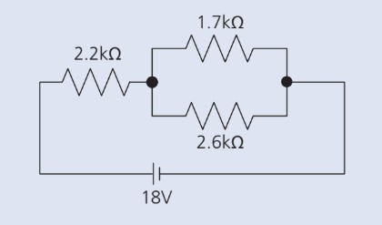

---
title: Ohms Law
...

### Introduction

During the nineteenth century so many advances were made in understanding the electrical nature of matter that it has been called the “age of electricity.” One such advance was made by an investigator named Georg Simon Ohm. Ohm was interested in examining the relationship between an applied voltage and the resulting current in a conducting material. He found that for a given conductor the current in the wire was directly proportional to the voltage across it. When current (dependent axis) is plotted against the voltage (independent axis) in a given conductor, the data forms a straight line. The reciprocal of the slope is the resistance of the conductor. This result was published in 1826. In recognition of Ohm’s work, this empirical relationship bears his name.

## PART 1: EMPIRICALLY DETERMINING RESISTANCE

::: Exercise
a) Wire the circuit shown in Figure 1.

b) **Hint:** Wire the circuit as a loop. Start from the negative terminal of the power supply, continue
to the next circuit element, then to the next, and so on and so forth until you arrive back at
the positive terminal of the power supply.
**Hint:** Current must flow through an ammeter. It must be part of the circuit loop.
**Hint:** Voltage is measured across circuit elements. Voltmeters are not part of the circuit loop,
but must instead be placed with one terminal on each side of the element you wish to
measure.
**Note:** The gray box is a power supply protection device. If the red light is on, everything is ok.
If it is off, it has broken the circuit for safety. Too much current was being drawn.
**Note:** This will reduce the voltage somewhat, always trust the yellow meters, not the read out on
the blue power supply. Otherwise, you may treat the output of the gray box as though it
was the output of the power supply.
c) The volt meter measures the voltage across the 2200Ω resistor. Treat this as your independent (x) axis in this
experiment.
d) The ammeter measures the amount of current flowing through the series circuit. Treat this as your dependent (y) axis in this experiment.
e) Adjust the voltage applied to the circuit with the large right-most knob on the power supply, also be sure that the mode switch is in the “tracking” position. You will measure the voltage and corresponding current for 10 data points. Your first current measurement is taken with the voltmeter reading 2V. Increment the voltage by 2 volts until you’ve reached 20 volts. Take a current reading for each voltage.
f) Neatly tabulate your data, then plot your data with voltage as the X-axis and current as your Y-axis.
:::

::: Question
a) Describe this plot. Is it linear or almost linear? Is there a section of the plot which is linear?
b) What is the slope of this line? Use units.
c) What is the reciprocal of this line? Use units. Note the equivalency volts/amperes = ohms.
:::

### Theory - Ohm's Law

Ohm’s law is most simply expressed as the equation:

$$V = I \cdot R$$

where

**V** represents the voltage across the resistor measured in volts, **I** the current in the resistor measured in amperes, and **R** the resistance of the resistor measured in units called “ohms” symbolized the upper-case Greek omega $(\Omega).$

In words, Ohm’s law states that “the voltage V across the ends of a resistor R and the current I flowing through this resistor
are proportional.” If the potential difference across a resistor is set at 1 volt, and if a current of 1 amp is measured in the
resistor, then its resistance is determined to be 1 ohm.

$$1A = 1000mA$$
$$1k \Omega = 1000\Omega$$

Algebraic rearrangement gives the current in terms of the voltage and resistance:

$$I = V/R$$

This is exactly what you just saw in the previous experiment. From this equation, it should be clear why the reciprocal of the slope is the resistance. Further algebraically rearrangement yields the proportionality constant R, which is the electrical resistance of the device.

$$R = V/I$$

::: Question
a) A $10.2K\Omega$ resistor passes a current of 2mA. What is the voltage across this resistor?
b) What is the current through this resistor when 9V are dropped across it?
:::

## PART 2: SERIES CIRCUIT ELEMENTS

::: Exercise
a) Wire the circuit shown in Figure 2.

b) The voltmeter is placed across two 2.2K resistors chained end to end. The quantity measured by this device is the
voltage across both resistors. Treat this as your independent (x) axis in this experiment.
c) Again, the ammeter measures the amount of current flowing through the series circuit. Treat this as your dependent (y)axis in this experiment.
d) Adjust the voltage applied to the circuit with the large right-most knob on the power supply, also be sure that the
mode switch is in the “tracking” position (see Figure 2). You will measure the voltage and corresponding current for
10 data points. Your first current measurement is taken with the voltmeter reading 2V. Increment the voltage by 2 volts
until you’ve reached 20 volts. Take a current reading for each voltage.
e) Neatly tabulate your data, then plot your data with voltage as the X-axis and current as your Y-axis.
:::

::: Question
a) What is the slope of this line? Use units. What is the reciprocal of this line?
b) Qualitatively compare this plot to what you found in the first procedure. How do the slopes compare? What can you say about resistances in series?
:::

### Theory - Series Circuits

In order for current to move through a circuit, there must be a complete path leading away from and back to the source voltage. In a simple series circuit there is only one such path. It is important to note that the same amount of current flows through all points of a series circuit. If this were not the case, there would be points where current was either created or destroyed. Top minds in physics maintain that this does not happen. *The current through each element is the same*, however the total circuit voltage is divided among the individual resistors. For this reason, the circuit in the previous experiment is commonly known as a voltage divider. Individual series resistors add to form a total resistance. Individual voltages in series circuits add to form the total circuit voltage. The entire source voltage will be dropped across the combination of two resistors. The voltage across each individual resistor is proportional to its individual resistance. The circuit has a simple and useful ratio equivalence:

$$\frac{Individual Resistance Value}{Total Resistance Value} = \frac{Individual Voltage Dropped}{Total Voltage Dropped}$$

Algebraic manipulation shows us:

$$Individual Voltage Dropped = Source Voltage \cdot \frac{Individual Resistance}{Total Resistance}$$

Thus the name voltage divider refers to the fact that the voltage will divide according to the ratio of the two resistances.

::: Question
a)A series circuit has a source voltage of 20V and two resistances of 1.7K and 2.6K, respectively. What is the total circuit current? What are the voltages across each resistor? Show that Ohm’s Law holds for each element individually.
:::

## PART 3: PARALLEL CIRCUITS

::: Exercise
a) Wire the circuit shown in Figure 3a. Use the 5 volt supply for this part.

:::

::: Question
a) Measure the voltage and current. Calculate the resistance and compare it to the labeled value.
:::

::: Exercise
a) Wire the circuit shown in Figure 3b. In a series configuration the resistors are hooked end to end with just one path for the current to flow. In Figure 3b, we put the resistors next to each other with common points at each end. The result is two separate paths for current to flow. For obvious reasons, this arrangement is referred to as parallel.

:::

::: Question
a) The source voltage has stayed the same. What has happened to the current?
b) What does this imply of the resistance?
:::

::: Exercise
a) Wire the circuit shown in Figure 3c. There are now three paths for the current to take.

:::

::: Question
a) Again, the source voltage has stayed the same. What has happened to the current? This is easier if you compare it to the original current amount.
b) What does this imply of the resistance?
:::

### Theory - Parallel Circuits

You’ve now been familiarized with the relationship between current, voltage and resistance for a single resistor. In circuits, any point connected by a wire is considered to be the same point. Thus when we connect two or three resistors in parallel they all have the same voltage across them. In this scenario, Ohm’s law applies to each resistor individually. If the resistance values are different, the current through that branch will also be different. In a parallel arrangement the current can divide at the top junction and recombine at the bottom junction. Because there are multiple paths on which current can flow, more current can flow for a given voltage value. Thus, the equivalent resistance will be less than any one of the individual paths. The equation to determine the equivalent resistance of a network of parallel resistors is:

$$1/R_{equivalent} = 1/R_{1} + 1/R_{2} + 1/R_{3}$$

in the above experiment, all of the resistances were equal.

::: Question
a) What is the equivalent resistance of a parallel network of 2.2kΩ, 3.1kΩ and 6.7kΩ?
b) A 2.2kΩ resistor is placed in series with 1.7kΩ and 2.6kΩ resistors in parallel. The entire circuit is driven by 18V. What is the voltage across each element? What is the current through each element?

:::
