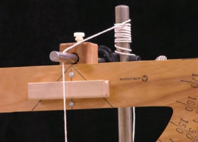

---
title: Pendulum
...

## INTRODUCTION
We will put a video here. 

## PART 1: SETUP

The objective of this lab is to determine the physical quantities which influence the period of a pendulum. The period is how long it takes to make one complete cycle of motion. The relevant features are the mass of the bob, the length of the pendulum, and the initial angular displacement.

::: Exercise
a) Cut a reasonably long length of string, around 2m. Thread the string through the hole at the front of the horizontal rod, then tie it to the back of the top post. To adjust the length of the line, wrap it around the vertical post as shown in Picture 1.2. (Your lab may have a different setup. The TA will explain how to use the setup.)

:::GVideo
108sTERiCeJOJ92uHeAm9B-exfOxGMwhf
:::

b) Set the length to **about** 1 meter and use an initial displacement of 20 degrees. This angle starts from the string, now resting at 90 degrees, and is repositioned 20 degrees to the right or the left of the 90 degree mark. The 90-degree mark is actually zero degrees, the start of the angular measurement of the swing angle. See Picture 1.1. Try three different masses (bobs) keeping length and angular displacement fixed (constant). Perform two trials and calculate an average. Each trial consists of five complete periods for each mass.

c) Use small angles (5 to 20 degrees) and record the time for five complete periods. A complete period is the time it takes for the pendulum to swing back and forth. Then divide this number by five to obtain an average for one period. Record this data.
:::

::: Question
a) Create a data table showing each of the masses, the period for each trial, and the average period.
b) Does the period depend on mass?
:::

::: Exercise
a) Keep the length consistent, and choose one of the bobs you just used. Experiment with different initial angular displacements. Try 5 degrees, then 10 degrees, then 15 degrees. Do two trials for each angle and calculate an average.
:::

::: Question
a) Create another data table to include all data for each angle.
b) Does period depend upon the initial angular displacement?
:::

Conventional analysis of the pendulum is done for small angles, where the restoring force experienced by the bob is approximately linear with the displacement angle. Linear restoring force is one of the criteria for simple harmonic motion. When the displacement angles become large, the restoring force is no longer linear. The motion is still periodic, but it is not sinusoidal, and the mathematical analysis becomes far more involved.

::: Exercise

:::GVideo
1-y1xU4Ni7auDfHyal3nsA65eIg6-nbeK
:::

a) Again choose a small initial displacement of 10 degrees, and choose a single mass. Vary the length of the pendulum, use values of approximately 40cm, 60cm, and 80cm. Do two trials for each case and average their values.
:::

::: Question
a) Does the period depend upon the length?
b) Does the period depend upon the length?
:::

## PART 2: DETERMINING THE MATHEMATICAL DEPENDENCE

We will restrict our analysis to small angles. You should have found that the most significant factor influencing the period was the length of the pendulum. We would now like to figure out what the mathematical relationship is.

::: Exercise
a) Design an experiment to investigate the relationship between length and period. Start at about
20cm, go to about 160cm, and use eight lengths in between. **If you use the same mass as in AVOCADO step 4) above you may include those measurements.** Choose the same initial displacement of 10 degrees for all trials. You only need to do one trial for each measurement. Neatly tabulate your data.

b) Graph Length as the independent variable, Period as the dependent variable.
:::

::: Question
a) Describe the relationship between length and period.
b) What type of trendline both fits the data and makes sense?
:::

## PART 3: LOG-LOG GRAPHING TUTORIAL

::: Exercise
a) Consider the simple linear relationship $y = 3x$. Make a table of x and y values for values of $x = 1,2,3,4,5$. Leave room in the table for more calculations.

b) Next to this, make another table, this time record the $log_{10}(x)$, and the $log_{10}(y)$. Plot the value of $log_{10}(x)$ on the independent axis. Plot the value of $log_{10}(y)$ on the dependent axis.
:::

::: Question
a) What is the slope of this line, and why is it significant?
b) What is the y-intercept? What is the inverse $log(10^{x})$ of this value, and why is it significant?
:::

::: Exercise
a) Consider the non-linear relationship $y = 4x^{3}$. Again make a table of x and y values for values of $x = 1,2,3,4,5$. Next to this, make another table, this time record the $log_{10(x)}$, and the $log_{10}(y)$. Plot the value of $log_{10}(x)$ on the independent axis. Plot the value of $log_{10}(y)$ on the dependent axis.
:::

::: Question
a) What is the slope of this line and what does it represent?
b) What is the y-intercept? What is the antilog of this value and why is it important?
:::

Taking the logarithm of both sides changes $$y = 4x^{3}$$ into $$Log_{10}(y) = Log_{10}(4x^{3})$$

::: Question
a) Use the logarithm property
$Log_{10}(ab) = Log_{10}(a) + Log_{10}(b)$ to reduce the right hand side of this relationship. Explain how this relates to the y-intercept on your graph.
:::

::: Exercise
a) Now use the logarithm property $Log_{10}(a^{b}) = bLog_{10}(a)$ to further reduce the right hand side.
:::

::: Question
a) Show this math. Explain how this relates to the slope of your graph. Hint: Your graph has an independent variable of "$Log_{10}(x)$", not "$x$".
b) Consider the relationship $y = x^{1/3}$ If you made a log-log plot of this, what would the slope be?
:::

## PART 4: ANALYZING NON-LINEAR DATA

::: Exercise
a) Using the data from Part 2 make a table of the $Log_{10}(Length)$ and the $Log_{10}(Period.)$ Plot $Log_{10}(Length)$ on the independent axis, $Log_{10}(Period)$ on the dependent axis. **Hint: Convert length measurements to meters.**
:::

::: Question
a) What is the slope of this line?
b) What is the y-intercept of this line?
c) Knowing what you know now, does this agree with your response to **AVOCADO**Question 2.1? Why?
:::

The relationship between the period and length can be expressed:

$$period = 2𝜋 (Length /a)^b$$

where a and b are unknown values.

::: Exercise
a) Start with the equation given above. Take the logarithm of both sides, and reduce this equation using the logarithmic properties listed above. SHOW THIS WORK.
:::

In your final reduction, you should recognize that some values are constant, while one term is dependent upon Length (specifically the $Log_{10}(Length)$).

::: Exercise
a) Using the slope and y-intercept of your Log-Log graph, determine the quantities a and b.
:::

::: Question
a) What is the value of b and how what does it tell you about the relationship between period and length?
b) What is the value of a and what does it suggest? **Hint: Think of quantities which are physically relevant to the experiment.**
c) Using dimensional analysis, show that this interpretation of a makes sense.
d) What is the explicit mathematical relationship between Period and Length?
:::

## PART 5: POST LAB

::: Question
a) Consider two bobs of equal mass, but different shape, both tied to the same length of string. The first is a sphere, similar to those used in this experiment. The second is a lengthy rod, tied at one end. Which pendulum has a longer period? **Hint: Think about the center of mass and what that means for the effective length.**
:::

For the next few questions, use the AVOCADO PhET simulation for a pendulum:

::: Question
a) Spend some time recreating the experiment using the PhET simulation. Do you find similar results? What are some notable differences, if any? **Hint: consider the friction setting!**
b) Using the PhET simulation for a pendulum, consider a pendulum on Planet X. How could you determine what the acceleration due to gravity, gx, on Planet X is?
c) How would you expect the time period of the pendulum to change as you increase and decrease the friction? Also would you expect friction to arise in a natural setting?
d) What are the two possible sources of friction in the experiment? **(Hint: Points of contact and the medium in which the experiment is set up.)**
:::
