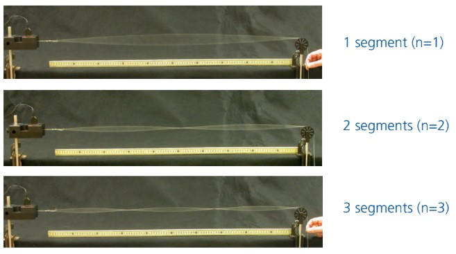

---
title: Waves on a String
...

## INTRODUCTION

:::GVideo
1an1ZCDO0onq_-mtUjBbJnqIjgI0eIQAp
:::

## PART 1: PULSES

***Theory***

::: Question
For a given tension, will a more dense string have greater or lesser propagation velocity? Justify your reasoning.
:::

***Simulations***

::: Exercise

Below, in Simulation 1, you will see what appears to be many beads linked together on a string. This is simulating the description in Figure 1 to an extreme. Each bead has mass and interacts with its neighboring beads through the string. So when one bead gets pulled on, it pulls on its neighboring bead. The green beads behave exactly as the red beads do; they are just there as positional references.

In Simulation 1 you can move the end of the string of beads in three different ways, which you can choose from the panel in the upper left corner of the simulation. "Manual" allows you to move the wrench up and down by clicking and dragging it. "Oscillate" drives the end of the string up and down periodically. You can change the frequency and amplitude of the oscillation in the lower control panel. Last, "Pulse" allows you send a triangle-shaped pulse down the string. You can change the pulse's amplitude and width in the bottom control panel.

There are a few more things to note. In the upper right is a control panel that allows you to change what is happening on the right end of the string. The lower control panel will change slightly, depending on your selection of how to drive the string. The things that stay constant are the tension and the damping. The tension slider allows you to change how taut the string is, while the damping slider adds a bit of reality to the simulation. *For the most part, when you use the simulation you will want to set damping to "None."* Finally, there is a set of tools you can use in the right side of the bottom control panel. You will need these from time to time to make measurements.

For this exercise you will investigate how the velocity of a pulse on a taut string varies with the tension. You will send a pulse down the string, and time how long it takes to travel 5 round trips. You will use the time and distance you measured to determine the velocity.

{width=100% height=600px}

1) First set up the settings on Simulation 1 as follows.

{width=75%}

<!-- 2) Make a table as shown in [sample table doc](https://docs.google.com/spreadsheets/d/1xZ7Nz3IUxpD715pPghY0djhcSn_bZ_FZs1SoGMgkw8k/edit?usp=sharing){target=_blank} with columns for Tension, Length, total time, time and velocity. -->
2) Measure the total length of the string and record that value.

3) Create a data table with columns for Tension, Total Time. The first entry in the Tension column should be "High."

<!-- 3) Use the ruler to measure the length of the string and record it in the table. -->

<!-- 4) Send a pulse and simultaneously start the timer, and record how long it takes the pulse to travel 5 full cycles. Add this time to your table under the "Total time (s)" column. -->
5) Send a pulse down the line. Wait for the pulse to get to one of the ends, and start the timer. Record the total time it takes for the pulse to make 5 round trips (travel the length of the string 10 times).

6) You now have all the information you need to calculate the velocity of the pulse. Add whatever columns you need to your table to make the velocity calculation. The last column, however, should be velocity.

:::Question
Explain each column in your table. Provide a description of how you obtained each value in every column.
:::

7) Repeat part 4. with the tension set to Medium and Low, and fill out the table accordingly. Note that the length you measured in step 2 does not change.

<!-- 8) Calculate the time for one pulse's round trip by taking the total time and dividing it by 5. Divide the length of one round trip (twice the length of the string) by the time for a single round trip. -->

::: Question
a) How is the speed of a wave on a rope related to tension?
:::

:::
<!-- End of Exercise -->

Two waves can travel on a string - in opposite directions - and pass through each other and retain their individual properties. This is called the principle of superposition. Consider two pulses of identical shape and amplitude traveling toward each other. If they are both positive (above figure, left side) they will cross each other and build in amplitude. The maximum height is the sum of both individual amplitudes. If one is positive and the other negative (above figure, right side), they will sum to zero amplitude when they are exactly over each other. In either case, the two pulses retain their original shape and amplitude after they have passed each other.

::: Exercise

In this exercise you will explore how two disturbances on a string combine when they overlap on the same part of the string. You will use the same simulation as Simulation 1, but this time you will set it up so that the end of the string is loose.

This is mainly just an exercise to gain intuition. You won't be taking data, making a table, or plotting. 

<!-- There is one question for you to answer, but you don't need to spend much time on it. -->

{width=100% height=600px}

1) First set up the settings on Simulation 2 as follows.

{width=100%}

2) Send two pulses with a gap in between them, and observe how they constructively and destructively interfere. Note that this will be easier to view with the speed set to Slow Motion or with reduced tension, to make the waves travel more slowly. You may also play with this in Manual mode.

<!-- :::Question
Could you observe constructive interference if you instead set the end to fixed?
::: -->

:::
<!-- End of Exercise -->

## PART 2: OSCILLATORY MOTION

If the string is instead driven by a source that moves up and down in a sinusoidal fashion, then a sine wave will propagate down the line instead of a pulse. The length of this waveform is determined by the frequency of oscillation and the velocity of the wave. Note that every point on the string vibrates with the same frequency.

A wave propagating on a string is described by the equation:

$$\textbf{(Equation 1)}$$
$$velocity = v = wavelength \cdot frequency = \lambda \cdot f \label{eq:vel}$$

Velocity, $v$, is the speed at which any disturbance propagates down the string. Wavelength, $\lambda$, is the distance that one sinusoidal oscillation covers on the string. Frequency, $f$, is the rate of periodic oscillation. For our purposes, we will use units of cycles per second, or hertz.

::: Question
a) Consider a very long string driven by a sinusoidal oscillator. The string is so long that there are no reflections. A wave travels at 3 m/s on this string, and the oscillator is set to 10 Hz. You can view the wavelength as how far a wave travels in one period of oscillation. What is the wavelength in this case?
b) If the velocity were instead 12 m/s, what would the wavelength be? Keep in mind that the frequency is the same as in part a. Is the sinusoidal pattern on the string longer or shorter with a greater propagation velocity?
c) If the frequency of the oscillator were changed to 16 Hz, how far would one cycle travel? The velocity is still 12 m/s.
:::

**NOTE:** For a given frequency the wavelength is determined entirely by the velocity of the wave on the string. The velocity of a wave on a string is given by:

$$\bf{(Equation\ 2)}$$
$$velocity = v = \sqrt{\frac{Force\, due\, to\, Tension}{String\, Density}} = \sqrt{\frac{F_T}{\mu}}$$

<!-- AVOCADO What is the equation for wavelength in terms of force? -->

### Standing Waves

<!--PhET Formatting {width=100% height=600px} -->

When a string is fixed between two rigid terminations we get an interesting phenomenon. A wave traveling on this string is continually reflected back and forth between the two boundaries. At each boundary, the wave experiences a negative reflection. The left-moving and right-moving traveling waves superimpose at all points. What results are sinusoidal standing wave patterns called the natural modes of the string. This is the phenomenon that occurs on guitar, piano and violin strings. Any vibration on a doubly fixed string can be modeled as a linear combination of the sinusoidal natural modes. This is called Fourier Analysis; you will learn more about this in your advanced coursework.

If we drive one side of a string with a sinusoidal mechanical oscillator of arbitrary frequency, we get a lot of random motion with no discernible pattern.

However, for the mathematical condition:

$$\bf{(Equation\ 3)}$$
$$Wavelength = 2L/n$$

where n is a positive integer and L is the Length of the string in meters, 

we get the phenomenon of standing waves. In this case, the left-moving and right-moving waves line up such that there are areas of large motion called antinodes, and areas that don’t move at all called nodes. This pattern of vibration is fixed on the string.

Algebraic manipulation shows:

$$\bf{(Equation\ 4)}$$
$$L = n \cdot (wavelength/2)$$

Which is slightly easier to interpret: any integer number of half wavelengths can fit on the string. Why does this happen? Because only an integer number of half wavelengths will put a node at each end. This condition is necessitated by the fact that the ends are fixed and cannot move up and down.

::: Question
a) What wavelength is required to get 5 standing wave segments on a doubly fixed string of length 0.75m? If the velocity v is 50 m/s, what will be the frequency of this wave?
b) Instead drive one end of the string with a sinusoidal oscillator of frequency 100 Hz. What velocity is required to set up a standing wave with 5 segments?
:::

::: Exercise

Using the same simulation, you will see standing waves and gain an intuition for how to produce them.

In this exercise you will calculate the wavelength needed to produce a standing wave with two segments. Then you'll use the velocity you measured in Exercise 1 to get the frequency at which you need to drive the string in order to make the standing wave. Then, you will adjust the frequency to something random and see what happens.

{width=100% height=600px}

1. First set up the settings on Simulation 3 as follows.

{width=80%}

2. Click the pause button followed by the "Restart" button in the upper left corner.

3. Using equation 3, determine the wavelength you need to create a standing wave with two segments. Show your work.

4. Using the wavelength you just calculated, equation 1, and the velocity you measured for the high tension setting in Exercise 1, determine the frequency needed to create a standing wave with two segments. Show your work.

5. In the simulation set your frequency to what you just calculated, and hit play.

<!-- 2) Use equation 3 and your measurement of the length of the string from Exercise 1 to determine the wavelength needed to generate a standing wave with $n$ segments.

3) Use equation 1 and your calculated velocity from Exercise 1 for tension set to high to calculate the frequency as a function of $n$ needed to produce a standing wave with $n$ segments.  -->

<!-- 4. Set your frequency to fit the wavelength to get $n = 2$ with tension set to high. 

5. Repeat part d. with the tension set to Medium and Low for n = 3 and n = 4. Make a table similar to [sample table doc](https://docs.google.com/spreadsheets/d/1xZ7Nz3IUxpD715pPghY0djhcSn_bZ_FZs1SoGMgkw8k/edit?usp=sharing){target=_blank} and fill the table accordingly. Note that the length does not change.  -->

::: Question
Describe what you are seeing on the screen. What is moving? What is stationary?
:::

6. Now reduce or increase the frequency by 0.2 Hz and hit restart.

:::Question
a. Describe what you see now. Compare and contrast it to what you saw before.
b. Explain the difference between the two setups. Why do they behave so differently?
:::

:::

## PART 3: MEASUREMENT

<!-- Sample PhET for Waves on a String -->
<!-- {width=100% height=600px} -->

<!-- The objective of this lab is to analyze the characteristics of waves on a string. You will do this by examining 3 systems with varying characteristics. -->
In the rest of the lab you will watch videos of different versions of the same setup. You can see a basic setup in Figure 8 below. We have an oscillator attached to string, similar to the simulations above. The string is then strung over a pulley with a mass $m$ hanging off the end to create tension in the string. We can vary the frequency at which the oscillator vibrates, the length of the string (the spacing between the oscillator and the pulley), and the amount of mass hanging off the end.

We will start by setting up a system, System 1, and measure the physical characteristics of that system -- length, tension (determined by the mass), and density of the string. Then we will perform the experiment making some initial **baseline** measurements. We will then repeat the same measurements with two additional systems. System 2 will have half the length of System 1, but the same tension (mass) as System 1. System 3 will have the same length as System 1 but half the tension (mass) as System 1.

The goal of the experiment for each system is to understand and see the relationship between frequency and when standing waves occur. Then we will compare and contrast our three runs to see how changing the tension and length affect this.

For each system we will keep the mass and length constant throughout the experiment, but we will slowly sweep through a range of frequencies. The current frequency will be displayed on a large monitor in the video. You will notice that at particular frequencies, standing waves will form on the string. At other frequencies you might notice nothing on the string, and sometimes chaos.

**Important:** You may also notice two sets of standing waves that form at frequencies close together. This happens because the metal tongue that is oscillating can become part of the vibrating system. You don't want this. The standing waves you will want to take note of are the ones that form when it looks as if the tongue is almost still. The string should have something like a node near the end of the metal tongue. See the video below.

:::GVideo
1vOgx2JbLxskVyYBM4yBIKA0Zpxlp_cx6
:::

**Important:** If your internet quality is giving you trouble, you should be able to download any of the these videos and play it on your own computer. If you click the "Pop-out" button in the upper right, it will open the video in a google drive link. You can download it from there. Additionally, all of these videos are sped up to play at 2X speed. Since this is the YouTube video player you can slow the video down to 0.5X of real life speed and up to 4X real life speed. Just click the cog in the lower right corner and adjust "Playback speed."

You will be expected to turn in all plots and tables you are asked to make in the exercises, as well as all answers to questions.

### Setup

::: Exercise

In this exercise we will build a table where we can record the things that stay constant for each of the three systems. Then we will fill it out for the first system. To do this, we will use the system shown in Figure 9 and used in Video 3, 4, and 5. This setup can be called System 1.

1. The linear density, $\mu$ (mass/length) is given in grams/meter. For the string we are using, the linear mass density is 0.266 g/m.
2. The length of the string is about 0.985 m.
3. The mass for the baseline measurement will be 50 g.
4. Record these data in a table labeled, "Constant Values." This table should have column headers: $L$, $m$, $\mu$, $F_T$, and $v_{F\mu}$; and row headers: System 1, System 2, and System 3. Record your systems' values here as you proceed with part two of this lab. Be sure to use the correct units when recording your data. You should include your units in your headers.

You will be creating additional, separate, tables for each of the 3 systems in the upcoming exercises.

::: Question
a) What is the tension in the string? Use the formula $\text{Tension} = F_T = mg$. Show your work.
b) What is the speed of the wave as calculated from your observed values of tension ($F_T$) and linear density ($\mu$)? Record this value in the $v_{Fμ}$ column. Show your work.
:::
<!-- 
<!--Image 1 {width=100% height=600px}

*Image 1 placeholder* -->
:::

### Experiments

::: Exercise

In this exercise we will establish our baseline system, System 1. Above, in your Constant Values table, you characterized the system, but now we will perform our experiment. We will drive the oscillator with a sine wave and slowly sweep through a few hundred hertz. You can pause the video and scrub through it as slowly as you'd like.

Do your best to identify a standing wave. You might notice something looking like a standing wave over a range of frequencies. You want the frequency where the amplitude of the string looks the largest, **the tongue of the oscillator is relatively stable,** and the whole wave looks fairly stable.

**It is fine if you don't measure the exact frequency of the wave.** We won't grade you on how good you are at watching a video to make a challenging measurement. Just do your best to identify the standing wave and measure the frequency. What is interesting isn't the exact frequency at which a standing wave occurs. It is the *relationship* between frequency and the different standing waves that form. As long as you are close you should see the *relationship*.

Now we will begin taking data points with System 1. Since this is the System 1 setup, we will be using the string length and mass given above in Exercise 4.

<!--Video 3 Baseline {width=100% height=600px} -->
:::GVideo
1g36ZdXNY7PA1P5SjsvOUi92QjRKrpPfu
:::

1. Create a table for System 1 with column headers for number of segments ($n$), frequency ($f$), $v_{λf}$, and % Difference of $v$. Your first entry in number of segments should be 1.

2. Video 3 sweeps through frequencies using System 1. Watch the video and determine the frequency at which you see 1 standing wave segment. Record the frequency for your standing wave with one segment in your table.

::: Question
a. Now calculate the speed from the wavelength ($\lambda$) and frequency ($f$). Denote this $v_{\lambda f}$. Use the equation $v_{\lambda f} = f \lambda$. Use Equation 3 to calculate the wavelength. Record this in the System 1 table you just made. Show your work.
b. Compare the two values of speed. Use the $v_{F\mu}$ from your Constants Table and the $v_{\lambda f}$ that you just calculated. What is the percent difference between these two values? Record this in the System 1 table you just made. Show your work.
:::

3. Continue watching Video 3 and repeat Exercise 2 for standing waves of two, three, four, and five segments.

:::
<!-- End Exercise -->

::: Exercise

This exercise uses a new set up called System 2. This will have the same L as System 1, but will have half the mass.

1. The mass for System 2 is 25 g.
<!-- 1) Measure the mass for System 2 using Image 2 below.

<!-- Image 2 {width=100% height=600px}

*Image 2 placeholder* --> 

2. Add the values of $L$, $m$, and $\mu$ to your Constant Values table in the System 2 row. Calculate the tension and the velocity, and include those in your table as well.

3. Create a new table labeled System 2, just like the one you made for System 1.

<!--Video 4 Lighter Mass {width=100% height=600px} -->
:::GVideo
1nz51ZGXjDyq28iRyb6SUkrjKc3ioko_O
:::

4. Just as you did for System 1, go through Video 4 and find the frequencies for each number of standing wave segments. Fill out your System 2 table accordingly. You should be able to go up to at least five segments.
:::
<!-- End of Exercise -->

::: Exercise

This exercise uses a new setup called System 3. This will have the same mass as System 1, but will have half the length.

1. The length of the string in System 3 is 0.4925 m.

<!-- 1) Measure the length for System 3 using Image 3 below.

<!--Image 3 {width=100% height=600px}

*Image 3 placeholder* -->

2. Add the values of $L$, $m$, and $\mu$ to your Constant Values table in the System 3 row. Calculate the tension and the velocity, and include those in your table as well.

<!--Video 5 Baseline {width=100% height=600px} -->
:::GVideo
1DeLhDlN5magKGvzTYqaaOrCRr_qvPazT
:::

3. Create a new table labeled System 3, just like the one you made for System 1.

4. Just as you did for Systems 1 and 2, go through Video 5 and find the frequencies for each number of standing wave segments. Fill out your System 3 table accordingly. You should just barely be able to get three segments. 
:::

### Analysis

::: Exercise

In this exercise we will now analyze the three systems and compare and contrast them together.

1) Our goal is now to study the relationship between the frequency and the number of segments of the wave. Make sure your tables for Systems 1, 2 and 3 are completely filled out.

2) Make a graph of $f$ versus $n$ (the number of segments) for each system. You should have the three curves on one graph in different colors.

All standing waves are referred to as **harmonics**. A standing wave with one segment is called the **fundamental** or the the first harmonic. The **fundamental** is the natural frequency at which the system wants to oscillate. If instead of driving the system with an oscillator you were to pluck the string as you would on a guitar, it would oscillate at the **fundamental** frequency.

:::Question
What do you notice about the fundamental frequency of the three systems? How does halving the length change the fundamental? How does halving the mass change the fundamental?
:::

:::Question
a. For these systems, how are the frequencies of the upper harmonics related to the frequency of the fundamental?
b. Does halving the length or halving the tension (mass) change the relationships you noted in part a. of this question?
:::

::: Question
a) What is the shape of each of the curves on the graph?
b) Does each system yield a curve of the same shape?
c) From system to system, how does this curve vary?
d) What are the slopes of the best fit lines through these curves?
:::

3) Combine equations 1, 2, and 3 (from the Theory section), and show that the frequency can be written as: 

$$(\textbf{Equation 5})$$
$$f = \left (\frac{1}{2L}\sqrt{\frac{F_T}{\mu}} \right )n$$

::: Question
a. From Equation 5, what is slope of your $f$ vs $n$ graph in terms of $F$, $\mu$, and $L$?
b. What are the units of the slope, and what physical meaning does it have?
c. Compare the value of the slope of your plots to the measured fundamental frequency for each system.
:::

We have previously given you the value of the linear mass density ($\mu$), but you can check our value using the slope from Equation 5.

:::Question
Use the slopes from your graph, and the tension and length for each system, to calculate the density, $\mu$, of the string.  Compare these measured values of density to the accepted value. What is the percent difference for each?
:::

:::

## Conclusion

:::Exercise
Write a brief conclusion summarizing the important points of this lab.
:::

<!-- Example Functions -->

<!--PhET Formatting {width=100% height=600px} -->

<!-- Sample Table Sheet https://docs.google.com/spreadsheets/d/1xZ7Nz3IUxpD715pPghY0djhcSn_bZ_FZs1SoGMgkw8k/edit?usp=sharing -->