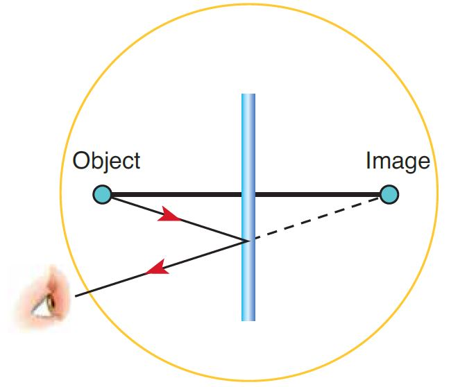

# Reflection and Refraction

:::Note
You will be expected to turn in all plots and tables you are asked to make in the exercises, as well as all answers to questions
:::
# Introduction

:::Video
<iframe style='width:100%;' src="https://www.youtube.com/embed/CWOkuhY8Szo" title="YouTube video player" frameborder="0" allow="accelerometer; autoplay; clipboard-write; encrypted-media; gyroscope; picture-in-picture" allowfullscreen></iframe>
:::

# Refraction
## Index of refraction and speed of light
Light travels in a vacuum at a speed $c=3.00 \times 10^8 m/s$, and more slowly within any other medium or material. We define the **index of refraction**  of a material, denoted by $n$, to be the ratio of the speed of light in a vacuum to the speed of light in that medium.

:::Equation
$$
n = c/v
$$
:::
where $n$ is the index of refraction, $c$ is the speed of light in a vacuum and $v$ is the speed of light in the medium. If you know the medium’s index of refraction, you know the speed of light in that medium.

When a light ray encounters a boundary between two materials, it experiences a change in direction, which we call *refraction*. The bending of the light at the interface is due to fact that light travels at different speeds in the two materials, so it's a result of the the difference in the materials’ indexes of refraction. 

:::Figure

:::
The figure above shows beams of light being emitted from the blue semicircle at the bottom left. The rays travel through a medium having an index of refraction of $n_1$, towards the interface of that medium with a second medium having an index of refraction of $n_2$. The beams in the lower region are the *incident* beams. The beams in the upper region are the *refracted* beams. When light reaches the interface, some of it is reflected back into the first medium, but most of it is refracted into the second medium. Note that two of the exiting beams, B and C, are bent (*refracted*) away from the normal. This figure could represent light coming from water and going into air. When a beam is perpendicular to the interface boundary, as is beam A, it is said to be *normal* to the interface. Normal rays are undeflected. 

## Snell's Law
The refraction of light at interfaced between two media with indexes of refraction $n_1$ and $n_2$ is described by Snell’s Law:

:::Equation
$$
n_1\sin(\theta_1) = n_2\sin(\theta_2),
$$
:::
where $\theta_1$ is the angle of incidence and $\theta_2$ is the angle of refraction.

:::Note
All angles are measured from the *perpendicular to the interface* to the ray. Thus a small angle means the ray is nearly perpendicular to the boundary and a large angle means the ray is nearly tangent to the interface. Note that all angles are less than 90 ̊. 
:::

:::Note
The indexes of refraction are properties of the two mediums.
:::

<!-- Q1 -->
:::Question
Look at Figure 1 to answer the following:

a. Light ray A is normal to the interface.  What is the angle of incidence $\theta_1$ for this ray? Using Snell's law, what is the angle of refraction $\theta_2$? 

b. Is the angle of the refracted light beam B larger or smaller than the angle of incidence o? What about light beam C? Using Snell's Law, what does the relative magnitude of the angles (i.e. $\theta_2/\theta_1$) tell us about the relative magnitude of the indexes $n_1$ and $n_2$?

:::
## Critical angle and total internal reflection
When the angle of incidence reaches a certain value (ray D in Figure 1), light no longer gets refracted into the second medium, instead it is fully reflected back. The **critical angle** is the incident angle at which light does not get transmitted, but all the light is reflected back into the first medium.
The critical angle is the angle of incidence that corresponds to an angle of refraction of 90°. For any angle greater than the critical angle, *total internal reflection* will occur. A necessary condition for the critical angle to exist is that the index $n_1$ of the first medium has to be greater than the index $n_2$ of the second medium.

## Simulation of Reflection
Let's start by looking at a simulation of what happens when light interacts with a boundary.

::::::Exercise

In this exercise you will use a computer program to simulate what happens to light at a boundary.

:::Simulation
<iframe src="https://phet.colorado.edu/sims/html/bending-light/latest/bending-light_en.html?screens=1" width="100%" height="600" allowfullscreen="" frameborder="0"></iframe>
:::

1. The top material should already be set to "Air." Leave it as that. Change the bottom material to "Mystery B."

2. Turn on the laser by clicking the large red button. Click on the grey housing of the laser, and move it to a new angle.

3. Use the protractor tool to measure the new incident angle and refracted angle.

:::Question
a. What is the index of refraction for the material "Mystery B?" Show your work.

b. What is the speed of light in the "Mystery B" material.
:::

::::::

## Experiment
 We will use the optical bench in this experiment and a semi-circular acrylic block with an unknown index of refraction. Our objective is to find its index of refraction.

::::::Exercise

In the video below, you will be shown light passing through a semi-cylindrical prism (D-block). The light is coming from the bottom of the video and hitting the curved surface of the D-block first, then passing through the material and exiting the flat surface. (See Figure 2.)

You will use this video to make some measurements and answer the questions below.

<!-- 1. Adjust the ray box to provide one beam of light. Place the semi-circular plastic block in the middle of the ray tracing table. Align it with the table’s axis, this will make it easy to measure the incident and refracted angles. *You can then rotate the table, not the block. It’s easy! Measure and record four different angles of incidence and their respective angles of refraction. Be sure your choices of the incident angles produce a reasonable span of values. A selection of values, ranging from 5° to 8°, would be “not a reasonable span.”* -->

:::Figure

:::

<!-- Ray Table -->
:::Video
<iframe style='width:100%;' src="https://www.youtube.com/embed/TdWsScRNHuI" title="YouTube video player" frameborder="0" allow="accelerometer; autoplay; clipboard-write; encrypted-media; gyroscope; picture-in-picture" allowfullscreen></iframe>
:::
:::Note
We neglect the first boundary between air and the acrylic block because the incident beam is perpendicular to the cylinder’s surface, so it is undeflected.
:::

1. Start by making a data table to record the incident and refracted angles.

2. Starting about about 2:20 in the video, the ray tracing table starts to be rotated. This goes on until about 3:50. Within this window, make the video pause at four different angles, and use the ray tracing table to record the incident and refracted angles. The video stops for a moment to highlight which angles you should be measuring. Feel free to use this as one of your measurements. Finally, be sure your choices of the incident angles produce a reasonable span of values. A selection of values ranging from $5^{\circ}$ to $8^{\circ}$, would not be “a reasonable span." **You should NOT spend more than 5 minutes making these measurements. If you do, you are working too hard.**

 
3. In our case, $n_1$ in Snell's law corresponds to the plastic block, and $n_2$ corresponds to the air. The index of refraction for air is $n_2 = 1.00$, so after measuring the incident and refracted angles, we are left with only one unknown, the index of refraction for the plastic, $n_1$.  Use your measurements from the video, and add a new column to your table in which you calculate the corresponding $n_1$ for each measurement.
 

:::Question
What is average index of refraction for the acrylic D-block? We will denote it $n_{avg}$.
:::

4. The *critical angle* is the incident angle at which light does not get transmitted, but is completely reflected back. Find this angle in the video.

:::Question
1. Based on the video, what is the critical angle for an acrylic-air boundary? We will denote it $\theta_c$.

2. At the critical angle, the refracted light travels along the surface of the plastic block. Thus, $\sin(\theta_2) = 1.0$, or $\theta_2 = 90$ ̊. Plug this into Snell’s law and compute $n_c$.
:::

:::Note
Recall that the equation for percent difference is the following:

:::Equation

$$
\text{percent difference} = \frac{| \text{value 1} - \text{value 2}|}{average} \\
$$
:::

Where the average is given by:

$$
\text{average} = \frac{\text{value 1} + \text{value 2}}{2}
$$

:::

:::Question
Compare your calculated $n_c$ to $n_{avg}$. What is the percent difference? 
:::

:::Question
What is the speed of light in the acrylic block (use either $n_c$ or $n_{avg}$)?
:::

::::::

# Prisms & Frequency-Dependent Refraction
## Theory
::::::RFigure freqdep m

*Frequency-dependent index of refraction for glass, quartz, and diamond*

::::::
The index of refraction for a medium is dependent upon the frequency of the light; blue light has a different index of refraction from that of red light for a given medium.

1. The angle at which a beam of light is refracted when traveling between two mediums is dependent upon their indexes of refraction.

2. The indexes of refraction are typically frequency dependent for a given medium. A medium will refract one color more than another color.

3. White light is made of many constituent colors.

Piecing these statements together, we have a tidy explanation for the phenomenon of a rainbow. At each boundary, some colors are refracted more than others, which results in white light being spread out into its constituent spectrum. This spreading is called dispersion. The second boundary of the prism – plastic to air – is at such an angle as to increase this dispersion. The difference between the index of refraction for the lowest frequency and the highest frequency determines how wide a rainbow you can see. A material with a larger spread in indexes will give a wider rainbow.

:::Question
A beam of white light traveling in air is incident on a glass block at an angle of 17 degrees. Use Snell’s Law to compute the refracted angle for purple, green and orange light.
:::

## Experiment
::::::Exercise

In this video you will see what happens when we refract white light. Recall that white light is composed of many different frequencies (colors) of light.

<!-- Dispersion -->
:::Video

<iframe style='width:100%;' src="https://www.youtube.com/embed/RXb3OZu0NRM" title="YouTube video player" frameborder="0" allow="accelerometer; autoplay; clipboard-write; encrypted-media; gyroscope; picture-in-picture" allowfullscreen></iframe>
:::

:::Question
In the video the most clear rainbow is observed when the light is close to the critical angle. Why is the critical angle ideal for observing the rainbow? 

Hints: How does dispersion change with increasing the incident angle? What happens to refracted light past teh critical angle?

:::

::::::

# Reflection from Plane Mirrors

We regularly encounter flat mirrors, as well as glass surfaces that act like mirrors. Intuitively you know that your image is standing directly across from you. When we speak in terms of ray tracing, we are the *object* and our reflection is the *image*. It is easy to convince yourself that this image is formed straight back – that is, normal to the plane of the mirror – and that it is also an equal distance behind the mirror.

The image of any point object in a plane mirror is simply the point straight across at an equal distance. This is the case for any viewing angle; you will see the image “behind” the mirror at an equal distance. The line between the object and image is always normal to the plane of the mirror.

:::Figure

:::

Now let's consider why ray tracing works. The law of reflection tells us that the angle of incidence is always equal to the angle of reflection. We also know that the image is formed by the light ray that emanates from the object, reflects off the mirror, and finally reaches our eye. The ray that reaches our eye must obey the law of reflection; its path is shown in Figure 4. It is important to note that this would work equally well for any set of angles. We see an image behind the mirror because of the law of reflection; if you extended the reflected light ray behind the mirror, it would arrive precisely at the image point as in Figure 4. The phenomenon of reflection fools us into thinking that the light rays originate from the image point.

::::::Exercise

Here we will show you how to set up a ray tracing for a plane mirror. In the video we are looking down onto the top edge of a flat mirror that is oriented perpendicular to the plane of your screen. The red pin that is placed will be the object. We will use yellow pins to mark the reflected rays. 

The goal of this exercise is to trace the path that light takes from the object pin, off the mirror, and to your eye, on the paper on the left side of the screen. Then we will remove the mirror, and trace those rays to the right side of the screen, behind the mirror, to find the location of the image that we are seeing.

<!-- Plane Mirror Ray Trace -->
:::Video
<iframe style='width:100%;' src="https://www.youtube.com/embed/xQlytH6o7DU" title="YouTube video player" frameborder="0" allow="accelerometer; autoplay; clipboard-write; encrypted-media; gyroscope; picture-in-picture" allowfullscreen></iframe>
:::

Now you have seen a video of the all of the rays being marked. What's left to do is to trace the points into a diagram. Depending on what materials you have available, you can choose from one of the following two methods:

## Method 1: Using Geogebra
Below is a link to an image paper that was created in the video. You will take that image and perform a ray trace.

1. Take [this image](imgs/Lab1/geogebra.png) and go to the website [GeoGebra (click this link to go to the started ray trace)](https://www.geogebra.org/geometry/n6jx7jug)

2. For a guide on how to use the tools in GeoGebra and perform the ray trace, watch the video below.

<!-- GeoGebra Introduction -->
:::Video
<iframe style='width:100%;' src="https://www.youtube.com/embed/2o2RKRxyILY" title="YouTube video player" frameborder="0" allow="accelerometer; autoplay; clipboard-write; encrypted-media; gyroscope; picture-in-picture" allowfullscreen></iframe>
:::

3. Make sure to measure the incident and reflected angles for both rays.

4. Also include the distance from the object to the mirror and the image to the mirror.

5. Take a screenshot of your ray tracing and include it in your lab report.

## Method 2: Printing/Tracing and using a protractor
In this version, you will either print or trace the image and use a protractor to measure the ray tracing angles
1. Either print or trace [this image](imgs/Lab1/geogebra.png) onto a sheet of paper. If tracing, hold a sheet of paper over your screen and gently trace the markings with a pencil. DO NOT APPLY PRESSURE to your screen. If needed, go over the markings a second time on your table.
2. Complete the ray tracing by hand using a ruler
3. Measure the angles with a protractor. Make sure to measure the incident and reflected angles for both rays. If you do not own a protractor you may print or trace [this one](imgs/Lab1/protractor.gif). Alternatively, you can hold the paper with your ray tracing up to the screen, over the protractor image, to measure the angles.

4. Also include the distance from the object to the mirror and the image to the mirror, which you  may find using a ruler.

5. Take a picture/scan of your ray tracing and include it in your lab report.

:::Question
How does the object distance compare to the image distance? In ideal conditions, how should they compare?
:::

:::Question
What are the angles of incidence and reflection for each of the rays? How should they be related?
:::

:::Question
What could be the reasons for errors in the two questions above?
:::

::::::

# Conclusion

:::Exercise
Write a brief conclusion summarizing the important points of this lab.
:::

