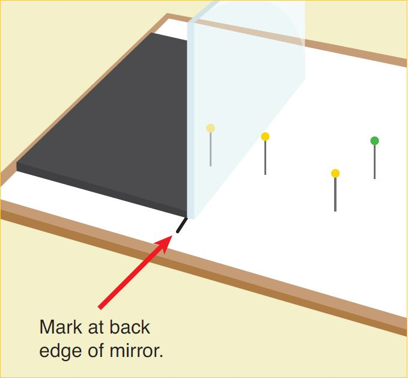

---
title: Reflection and Refraction
...

## INTRODUCTION

:::GVideo
1VKsYcK8Phlzv-hjRfzhuQKw71KD6KqFm
:::

**You will be expected to turn in all plots and tables you are asked to make in the exercises, as well as all answers to questions.**

## PART 1: REFRACTION

The beam in the lower region is the incident beam. The beam in the upper region is the *refracted beam*. Note that the exiting beams, A through C, bend (refract) away from the normal. This indicates that the refractive index of $n_1 > n_2$. This figure could represent light coming from water and going into air. The beam (A) is *normal* when it is perpendicular to the interface boundary. An interface is the layer or region where dissimilar transparent materials meet each other.

<!-- Q1 -->
:::Question
a.) Is there any change in the path of the normal light beam (A) as it goes from the lower region to the upper?

b.) Is the angle of the refracted light beam (look at beam B or C) more or less than the angle of the respective incident beam? What happens as the angle of the incidence increases? (Goes form B to C)

c.) Is there a particular angle that the rays do not behave like rays B or C?

d.) Does light transmit into the upper region when the incident angle is larger than L?
:::

**Theory:** When a light ray encounters a boundary between two materials it experiences a change in direction due to the difference in materials’ indexes of refraction, typically denoted as $n_1$ and $n_2$. The particular physics of this is beyond the scope of this lab, however the empirical results are neatly summarized by Snell’s Law:

$$n_1\sin(\theta_1) = n_2\sin(\theta_2)$$

**Note:** All angle measurements are from the *nearest perpendicular* to the ray. Thus a small angle is almost perpendicular to the surface and a large angle is nearly tangent. Note that all angles are less than 90 ̊. As visible light passes through an interface (transparent), some light reflects obeying the laws of electromagnetic propagation and Snell’s Law of reflection.

**Note 2:** $n_1$ typically refers to the material the light beam comes from, $n_2$ refers to the material the light beam goes into. The speed of light depends on the medium in which it is traveling. Light travels at $3.00 \times 10^8 m/s$ in a vacuum and slower within a medium. It is this change in velocity which gives rise to the index of refraction. They are explicitly related by:

$$n = c/v$$

where $n$ is the index of refraction, $c$ is the speed of light in a vacuum and $v$ is the speed of light in the medium. If you know the medium’s index, you know the speed of light in that medium.

**Simulation** Let's start by looking at a simulation of what happens when light interacts with a boundary.

:::Exercise

{width=100% height=600px}

1. The top material should already be set to "Air". Leave it as that. Change the bottom material to "Mystery B".

2. Turn on the laser by clicking the large red button and click on teh grey housing of the laser and move it a new angle.

3. Use the protractor tool to measure the new incident angle and refracted angle

:::Question
What is the index of refraction for the material "Mystery B". Show your work.
:::

4. Now make the top material "Mystery A" and move your laser to a new angle.

:::Question
What is the index of refraction for the material "Mystery A". Show your work.
:::

:::Question
What is the speed of light in materials "Mystery A" and "Mystery B". Show your work.
:::

:::

**Experiment:** You will use the optical bench in this experiment. Treat the semi-circular acrylic block as an unknown. Our objective is to find its index of refraction. $n_1$ corresponds to the plastic block, $n_2$ corresponds to the air. Measuring both the incident and refracted angles and assuming the index of refraction for air to be $n_2 = 1.00$ we are left with only one unknown, the index of refraction for the plastic, $n_1$. *We neglect the first boundary between air and the acrylic block because the incident beam is perpendicular to the cylinder’s surface.*

In each of the following cases record the incident and refracted angles.

:::Exercise

:::row

:::column
In the video below you will be shown light passing through a semi-cylindrical prism (D-block). The light is coming from the bottom of the video and hitting the curved surface of the D-block first then passing through the material and exiting the flat surface. See Figure 2. You will use this video to make some measurements and answer the questions below.

<!-- 1. Adjust the ray box to provide one beam of light. Place the semi-circular plastic block in the middle of the ray tracing table. Align it with the table’s axis, this will make it easy to measure the incident and refracted angles. *You can then rotate the table, not the block. It’s easy! Measure and record four different angles of incidence and their respective angles of refraction. Be sure your choices of the incident angles produce a reasonable span of values. A selection of values, ranging from 5° to 8°, would be “not a reasonable span.”* -->
:::

:::column

:::

:::

:::GVideo
1h-8WdeqtuEpyadrCHB3RbF0kA0Qb5gjC
:::

1. Start by making a data table to record the incident and refracted angles.

2. Starting about about 2:20 in the video, the angle ray tracing table starts to be rotated. This goes on until about 3:50. Within this window pause the video at four different angles and use the ray tracing table to record the incident and reflected angles. The video stops for a moment to highlight which angles you should be measuring. Feel free to use this as one of your measurements. Finally, be sure your choices of the incident angles produce a reasonable span of values. A selection of values, ranging from $5^{\circ}$ to $8\^{circ}$, would be “not a reasonable span."

:::Question
The light is passing through 2 boundaries. The curved surface, and the flat surface. At which, or both, of these surfaces is refraction occurring? Why or why not?
:::

:::Question
What is average index of refraction for the acrylic D-block, we will denote it $n_{avg}$.
:::

3. The *critical angle* is the breaking point between refraction and *total internal reflection* (where no light is refracted, it is all reflected. Find this angle in the video.

:::Question
a. Based on the video, what is the critical angle for an acrylic-air boundary, we will denote it $\theta_c$?
b. At the critical angle the refracted light travels along the surface of the plastic block. Thus, $\sin(\theta_2) = 1.0$, or $\theta_2 = 90$ ̊. Plug this into Snell’s law and compute $n_c$.
:::

:::Question
Compare your calculated $n_c$ to $n_{avg}$. What is the percent difference? Which is more accurate and why?
:::

:::Question
What is the speed of light in the acrylic block?
:::

:::Question
Pretend instead of air, the incident medium is “mystery B” from the PhET and the refracted medium is the acrylic block used in the videos, comment on how the light will bend. Justify your answer.
:::

:::

## PART 2: PRISMS & FREQUENCY DEPENDENT REFRACTION

***Simulation***

:::Exercise

{width=100% height=600px}

1. Start by selecting the white light source instead of the laser. You can find this on the right side of the simulation, is the second row, third option on the right. You will know you have found it because the background will turn black.

2. Press the red button to turn on the light source and drag the D-block prism in front of the incident beam, hitting the curved side first.

3. Do you best to align the prism so that the incident beam passes through the center of the prism.

4. Now you can use the knob at the bottom of the prism to rotate it about the center. Rotate it and watch what happens.

:::Question
a. Sketch the orientation of the block when the rainbow is most observable. Does this remind you of a particular angle? Why do you think this is?
b. Why do you think when white light is going into the prism, a rainbow is coming out?
:::

5. Replace the D-block prism with the square prism.

6. Rotate the square prism so that the rotation knob is pointing straight down.

7. Align the square prism so that beam enters one side of the square prism, and exits on the side directly opposite. 

:::Question
a. In this orientation, how are the incoming and exiting beams related to one another?

b. Why is there an offset between the incoming and exiting beams? In a sentence or two, explain what is happening?
:::

:::

***Experiment***

:::Exercise

Now we will show you dispersion actually happening in a prism. 

:::GVideo
1mqAYATS5ocTZns5FhTbPkzQXqO5aNCTX
:::

:::

<!--  -->

<!-- Adjust the light source’s grating to emit just one light beam and attach the ray tracing table to the optical bench. You are provided with an oddly shaped block, use the triangular end of the block as a prism.

Shine the beam of white light through one side of the prism (yellow arrow) and observe the light output on the opposite side. Begin with the angle of incidence close to normal and then sweep to a grazing angle.

Try to get the light to pass directly through the prism with no change in direction or offset.

:::Question
Is it possible to get light directly through a prism? Why do you think this is?
:::

Now use the square end of the block. Shine the beam of white light at an angle other than normal and such that the beam is able to leave through the opposite side (see green arrow in figure above).

:::Question
a. What do you observe about the beam on the opposite side of the block? Is the beam able to pass straight through or is there an offset? Is it parallel to the original beam? Why?

b. When the incident beam is normal to the surface are you able to observe the same phenomenon? 
:::

At steep angles you will observe total internal reflection just as you did with the acrylic block. Mess around with the block and prism to see the many possible geometric paths. -->

***Theory:***

The index of refraction for a medium is dependent upon the frequency of the light – blue light has a different index of refraction than red light for a given medium.

1. The angle at which a beam of light is refracted when traveling between two mediums is dependent upon the index of refraction.

2. The indexes of refraction are typically frequency dependent for a given medium. A medium will refract one color 
more than another color.

3. White light is made of many constituent colors.

Piecing these statements together we have a tidy explanation for the phenomenon of a rainbow. At each boundary some colors are refracted more than others which results in white light being spread out into its constituent spectrum. This spreading is called dispersion. The second boundary of the prism – plastic to air – is at such an angle as to increase this dispersion. The difference between the Index of Refraction for the lowest frequency and the highest frequency determines how wide of a rainbow you can see. A material with a larger difference in indexes will have a larger maximum width.

:::row

:::column

:::

:::column

:::

:::

:::Question
A beam of white light traveling in air is incident on a glass block at an angle of 17 degrees. Use Snell’s Law to compute the refractive angle for purple, green and orange light.
:::

## PART 3: FLAT MIRRORS

::: row

::: column
***SINGLE PLANAR MIRROR:*** We regularly encounter flat mirrors as well as glass surfaces which act like mirrors. Intuitively you know that your image is standing directly across from you, when speaking in terms of ray tracing we are the *object* and our reflection is the *image*. It is easy to convince yourself that this image is formed straight back – that is, normal to the plane of the mirror – and that it is also an equal distance behind the mirror.

The image of any point object in a planar mirror is simply the point straight across at an equal distance. This is the case for any viewing angle, you will see the image “behind” the mirror at an equal distance. The line between the object and image is always normal to the plane of the mirror.

Now lets consider why ray tracing works. The law of reflection tells us that the angle of incidence is always equal to the angle of reflection. We also know that the image is formed by the light ray that emanates from the object, reflects off the mirror, and finally reaches our eye. The ray which reaches our eye must obey the law of reflection, its path is shown in Figure 3.1. It is important to note that this would work equally as well for any set of angles. We see an image behind the mirror because of the law of reflection - if you instead extend the reflected light ray behind the mirror it would arrive precisely at the image point as in Figure 3.1. The phenomenon of reflection fools us into thinking the light rays originate from the image point.
:::

:::column

:::

:::

:::Exercise
This simulation explains what is happening when you see an object in the mirror. It is an interactive version of Figure 3.1. The mirror lies at the center of the screen $x=0$. The object and person are on the right. You can drag the yellow object to any positive $(x,y)$ position. Then you can move the eye to any positive $(x,y)$ position to view the object in the mirror.

The pink arrow coming off the object indicates a ray of light emitted form the object. When it hits the mirror it reflects off, and this is the blue arrow. That beam will reflect into the viewers eye.

From the viewers perspective the ray gets traced back behind the mirror. It's position is the dashed yellow image on the negative side of the plane.

{width=100% height=800px frameborder=0}

To mimic the exercise you will be doing shortly, you need to do the following in the simulation. 

1. In the drop down selector in the top left, choose the following three things:
    - Show Angles
    - Show Distance
    - Show Custom Ray

The first selection shows the law of reflection, the second shows the object's and the image's distance from the mirror, and the final selection and another green ray to the system.

2. Move the green arrow to another location.

3. Try to understand what is happening in the simulation. This is just a tool to help gain intuition. There is nothing to turn in for this exercise.

:::

## PART 4: REFLECTIONS FROM A PLANE MIRROR

:::Exercise

Here we will show you how to set up a ray tracing for a planar mirror. In the video we are looking down from onto a flat mirror that comes in an out of your screen. The red pin that is placed will be the object. We will use yellow pins to mark the reflected rays. That is, we will align the yellow pins on the blue line in the simulation above. 

The goal of this exercise is to trace the path that light takes from the object pin, off of the mirror, and to your eye on the paper on the left side of the screen. Then we will remove the mirror, and trace those rays behind the screen to find the location of the image that we are seeing.

:::GVideo
1bkxJrUWmsom6FLG0LiaMVsmSBHMlbZci
:::

Now you have seen a video of the all of the rays being marked. Now what's left to do is trace the points in to a diagram similar to what was in Simulation 3. Below is a link to and image paper that was created in the video. You will take that image and perform a ray trace.

***Recipe for Planar Mirror Ray Tracing:***

*Note: Read this. You'll need the information in a moment*

i. Select an object and viewer location

ii. Reflect the object over the plane of the mirror.

iii. Draw a line from the viewer to the image

iv. Draw another line from the rays intersection point back to the object.

1. Take [this image](https://drive.google.com/a/ucsb.edu/file/d/1GzSUSF4hoYAaT_hoSxRW_6ryHqxU8JVd/view?usp=sharing){target="_blank"} and go to the website [GeoGebra](https://www.geogebra.org/){target="_blank"}

2. Follow the recipe above for creating a ray trace diagram. For a guide on how to use the tools in GeoGebra watch the video below.

:::GVideo
19k_9gylZ9MTTFQrM7cFUAWS362DpqWWS
:::

3. Make sure to measure the incident and reflected angles for both of rays.

4. Also include the distance from the object to the mirror and the image to the mirror.

5. Take a screenshot of your ray tracing and include it in your lab report.

:::Question
How does the object distance compare to the image distance? In ideal conditions, how should they compare.
:::

:::Question
What are the angles of incidence and reflection for each of the rays? How should they be related?
:::

:::Question
What could be the reasons for errors in the two questions above?
:::

:::

## Conclusion

:::Exercise
Write a brief conclusion summarizing the important points of this lab.
:::

<!-- 1. Set a clean piece of paper on the cork side of the of the corkboard. Place the mirror assembly onto the corkboard as shown in Figure 4.1.

2. The mirror is a second surface mirror, the light actually reflects from the surface behind the clear protective plastic. Place a mark on the paper to locate the reflective surface. Do this at both corners of the mirror (see Figure 4.1). Remove the mirror and draw a solid line connecting the two marks.

3. Replace the mirror to its previous position making sure that the line is still located at the reflective surface.

4. Place a non-yellow pin 6-10 cm from the surface of the mirror, slightly off to one side. This will be the object pin. ***Place the pin as vertical as possible.*** Mark this location with an “O.”

5. Heads up: ***Place pins as vertical as possible.*** Select two yellow pins. Place one of those pins anywhere, approximately 1–2 cm in front of the mirror on either side of the object (non-yellow) pin. Do not worry about this yellow pin’s reflection. Closing one eye, find the position where the head of the one physical yellow pin and the head of the one “virtual” object pin (non-yellow) overlap (coincide). Place the remaining yellow pin in a location such that its head coincides with the other heads. That is, it is in the same line with the first physical pin and the virtual object pin image. See Figure 4.2 The two yellow pins you just inserted now define the reflected light ray. Precisely mark the location of the ray pins (yellows), each with an “A.” Then remove the yellow pins. 

6. Repeat step 5 one more time from a different viewing angle. Mark the location of these pins each with a “B.” 

7. Once you have marked the locations of reflected rays, remove the mirror. For each pair of marks draw a solid line through the two pin holes to the surface of the mirror. Draw another line from the location of the object pin to the intersection of the mirror surface and the line you just drew. Mark the direction of light—from the object pin, to the mirror, and finally to your eye —with arrows on these lines (see Figure 3.1). Extend the line created with the original two pins behind the mirror, making it a dashed line. Repeat this process for the other sets of pins. -->

<!-- :::Question
Where do the dashed lines meet?
:::

8. Now construct a line from the object to the image. Measure the distance from the mirror surface to the object and 
then from the mirror surface to the image location.

:::row

:::column

:::

:::column

:::

:::

:::Question
How does the perpendicular distance from the object pin to the line marking the reflective surface (Figure 4.1) compare with the distance from the image to that line?
:::

9. Construct a perpendicular line at the point where each of the rays intersects the mirror surface (the line at the back edge of the mirror). Measure the angle of incidence and angle of reflection. Neatly tabulate your results for each ray. 

:::Question
What can you say about the angle of incidence and angle of reflection for each of the rays?
::: -->

