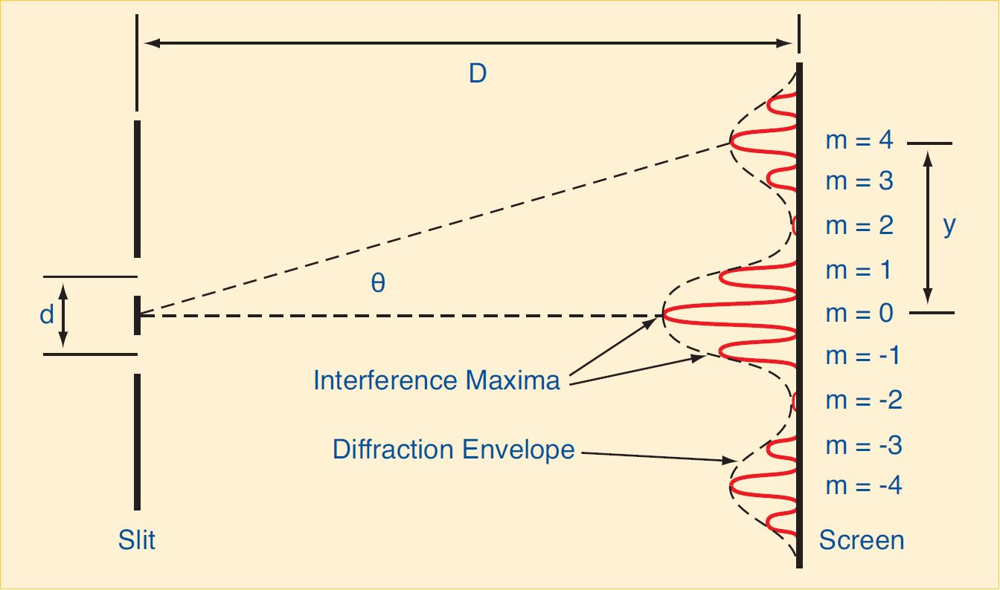
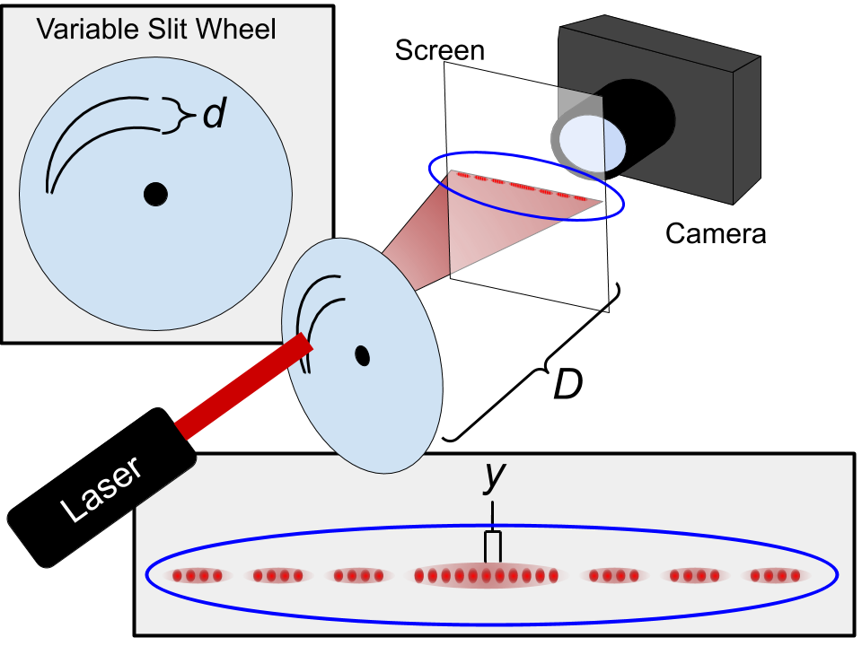
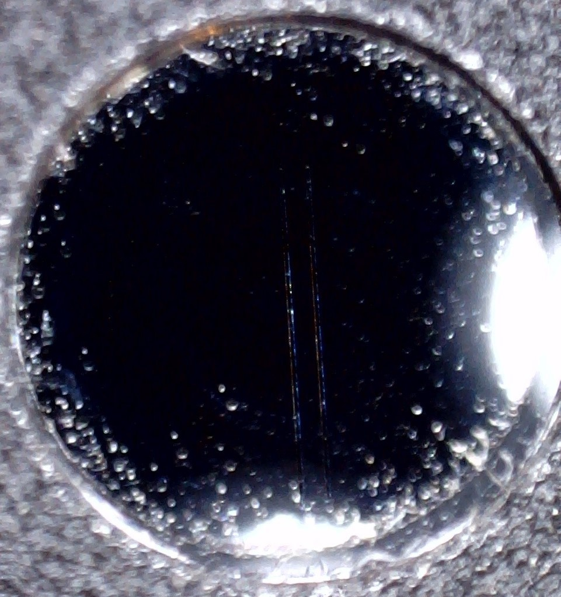
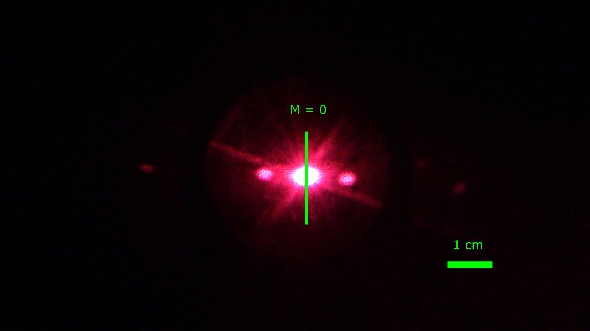

# Wave Optics
---

## INTRODUCTION

::: Figure#Video
!(https://drive.google.com/open?id=1Aq_ZLiDO8b__OuCeLWL08DkIxxy7fcwS)
:::

When you are calculating image locations relative to the objects that produce them, and learning about simple optical devices, it is useful to treat light as groups of rays that travel in straight lines until they are reflected or refracted. This is referred to as *Geometrical Optics*. Unfortunately, light doesn’t behave in quite such an ordinary manner when it interacts with things at smaller scales. This is because light is an electromagnetic wave, and as such it exhibits all of the behaviors that other waves exhibit, like diffraction and interference. 

In this lab we will look at both of these phenomena. They are very closely related, but also different in some key ways. 

### Theory

***Interference***

When light passes through two closely separated slits, the rays travel slightly different distances before reaching the screen. These slight discrepancies in distance cause the waves to interfere with one another as shown in Figure 1.

:::Figure#Figure

:::

The top of Figure 1 demonstrates constructive interference. The two waves are in phase with one another and add together, forming a bright spot, referred to as a maximum. The bottom of Figure 1 shows destructive interference. The waves are exactly out of phase at the screen, and produce a dark spot, referred to as a minimum. You can see that constructive interference happens whenever the path lengths are the same, or if they differ by a whole number of wavelengths. Similarly, destructive interference occurs when the path lengths differ by a half integer (1/2, 3/2, 5/2, etc.).

The resulting maxima (bright spots) can be described mathematically by the formula for constructive interference:

::: Figure#Equation
$$
d\sin(\theta) = m\lambda
$$
:::

where $d$ is the slit separation, $\theta$ is the angle to the screen, $m$ is an integer (0, 1, 2, 3, . . .), and $\lambda$ is the wavelength of the light source (see Figure 1.2). The angles are usually very small (the distance from the slits to the screen is much larger than the separation of the resulting pattern), so we can assume that $\sin(\theta)\approx\tan(\theta) = y/D$, where y is the distance from the central maximum, and D is the distance from the slits to the screen. The interference equation can now be rewritten:

::: Figure#Equation
$$
\lambda = \frac{dy}{mD}
$$
:::

Let's quickly determine how good this approximation is.

::: Question
### This question is extra credit. You are not required to do it.
a. For about what angle is $\sin(\theta) \approx \tan(\theta)$ good to 1%? That is, when does the percent error betweeen $\sin(\theta)$ and $\tan(\theta)$ (where $\sin(\theta)$ is the "theortical" value and $\tan(\theta)$ is the "measured") just become *1%*. **Hint2: Don't bother solving this algebraically. Go to [GeoGebra](https://www.geogebra.org/graphing) and plot the percent error.** *Give your answer in degrees*

b. Now let's check the next part of the approximation, $\tan(\theta) = \frac{y}{D}$. Using the $\theta$ you found in part a and assuming $D$= 1 m, what is the furthest $y$ distance you can measure while keeping the approximation from part a good to 1%? 
:::

***Diffraction***

Diffraction can happen with only a single slit. Thus, when we shine light through two slits we see not only the interference phenomenon, but also mixed with it, diffraction. It is important to note that the interference fringes are created by the two slits, but there is also a diffraction effect occurring from each individual slit, as demonstrated in Figure 2. The diffraction envelope causes a fading and brightening of the interference maxima.

::: Figure#Figure

:::

## PART 1: GAINING INTUITION

In this part of the lab we will try to get some intuition about what we expect to see when we shine light through some slits onto a screen. The other goal is to help you identify the difference between diffraction and interference on the screen.

:::Exercise

In this exercise we will look at a simulation that shows pure interference. It does this by shining two lights at the same time at a screen. If you'd like, it will let you explore the similarities of different types of waves, mainly water, sound, and light. We will focus on the light portion of the simulation.

::: Figure#Simulation
!(https://phet.colorado.edu/sims/html/wave-interference/latest/wave-interference_en.html?screens=2)
:::

1. Start by selecting the light in the control panel on the right. It is the right-most button in the row of buttons at the bottom. You will know you've found it, because a large portion of the screen will turn black.

2. Next check the "Screen" and "Intensity" selections. The "Intensity" button will become selectable after you check "Screen."

3. Turn on both of the light sources by clicking the green buttons.

4. On the screen you should see some colored bands start to appear once the light reaches the far end of the black space, where the screen is located. The intensity plot shows you how bright the light is on the screen. 

::: Question
How does the separation between the two laser sources affect the space of the maxima on the on screen/in the intensity plot?
:::

::: Question
Looking at the intensity plot, how does the max amplitude of each peak vary in the vertical direction?
:::

::: Question
For a set amplitude and separation, how does changing the frequency affect the interference pattern?
:::

:::
<!-- End Interference Exercise -->

<!--
::: Exercise

In this exercise we will start by trying to look at diffraction separately from interference. We will do this by shining light through a single slit. Then we will add in interference by making it a double slit. One goal is to look at the pattern on the screen and distinguish what part of the pattern is caused by interference, and what part is caused by diffraction. The second goal is to determine how the slit width and slit separation affect these phenomena.

When you open the simulation you will be greeted by two black screens; the one on the left has a white circle in the center. This white circle represents a hole in the screen. If you look above the two screens you will see what the experimental setup is. On the left is a light source. Then, in the middle is a small screen with a white dot on it. This screen is the same as the big one below on the left. Then at top right is larger black screen. This is the large screen on the right. 

Light shines from the source, and travels toward the screen with a hole in it. Most of the light is blocked by the screen, but some light passes through the hole. This light goes on to land on the second screen, where we see a pattern.

Below the light source, you can change the color of the light by moving the slider or clicking the arrows. Below that, to the left of the screen with the hole in it, you will see five boxes with different shapes. These let you select which hole you are going to use. Finally, at the very bottom is a control panel to adjust the size and shape of the hole.

{width=100% height=600px}

1. First adjust the wavelength to 655 nm. This is similar to the wavelengh of the light that we will use in the videos.

2. Then select the hole that is the black square. It is the second from the top.

3. You will start with one slit, so adjust the separation to 0.00 mm. This will make the two slits overlap.

4. Adjust the height to 1.50 mm. This will turn the square into a slit.

5. Turn on the light by clicking the big red button on the light source. 

You should see some thin horizontal red lines on the screen. This is caused by the light diffracting through the slit in the horizontal direction. You may also notice duller red areas in the vertical direction where each of the thin red lines is. These are caused by diffraction in the vertical direction. We won't concern ourselves with that too much; let's focus on the horizontal direction.

6. Make the slit width smaller by using the arrows. Pay attention to the size of the lines on the screen and the size of the lines with respect to each other. What do you notice happening as the slit width decreases?

7. Now slowly make the slit width larger. What do you notice?

Now let's take a look at two slits. In this setup we will have both interference and diffraction happening at the same time. 

8. Turn the slit width all the way down to 0.01 mm.

9. Now use the arrows to increase the separation. You should notice two slits just barely appear on the left screen.

10. Slowly increase the separation and pay attention to the size of the lines and the spacing. Compare this to what you saw in the single-slit setup.

11. Now try setting the slit width to 0.06 mm and the slit separation to 0.08 mm.

12. Again slowly increase the separation. Notice the positions of the dark spots. Some should stay stationary, and others should change.

AVOCADO I am not sure about the best way to use the exercise. And I feel like it could use some improvements.
:::
-->
<!-- End Diffraction Exercise --> 

:::Exercise

In this exercise you will see a video of  light shining through a pair of slits. This is not your standard pair of slits however. They are are attached to a wheel and designed to that as the wheel rotates the *slit **separation** will change* but the *slit **width** remains constant*. 

:::Figure#Figure

:::

Figure 3 shows the setup. A laser is shone at a variable slit wheel. The wheel rotates around the black dot at the center. As it does so, the slit separation changes. The light diffracts through the slits and is cast on a translucent screen. A camera is set up directly behind the screen, so you can look straight at it. The video is shot from the point of view of the camera.

$D$ is the spacing between the slits and the screen. $y$ is the distance between the *central interference maximum* and **any other** interference maximum. $d$ is the slit separation. 

:::Figure#Video

!(https://drive.google.com/open?id=1Q1Vufhq6df7_7eOGH4zhnCjunzVYYj-z)

:::

:::Question
What do you observe on the screen? Make a sketch of this in your notebook.
:::

::: Question
How does the pattern on the screen change when you decrease the slit separation?
:::

::: Question
If light only behaved like a particle, what would the pattern on the screen look like for two slits?
:::

:::
<!-- End of Variable Slit Exercise -->

## PART 2: MEASURING THE LASER'S WAVELENGTH

In this part of the lab we want to be more quantitative. We will not concern ourselves the diffraction envelope, and will focus only on *interference*. We will use the interference theory developed in Part 1, namely Equation 2, to measure the wavelength of the laser.

You will do it once in a simulation for yourself, and once from the video.

::: Exercise

In this exercise you will use the PhET simulation to determine the wavelength of light you are using in the PhET.

:::Figure#Simulation
!(https://phet.colorado.edu/sims/html/wave-interference/latest/wave-interference_en.html?screens=3)
:::
1. Start by selecting the light source just as you did in Simulation 1.

2. Pick any color of light you want to work with, and put it in your lab report so that we know which color you are using, e.g., dark red, red, orange, yellow, green, cyan, blue, purple, violet. Some colors might be better for getting multiple peaks to appear on the screen than others.

3. Check the boxes for "Screen" and "Intensity." (These appear after you select the light. "Intensity" becomes active after you select "Screen.")

4. Switch the setup from one slit to two slits.

5. You should select a slit width and slit separation that allow you to see around five peaks on the intensity plot. You can also adjust the location of the slits, but **note: the slit separation needs to be smaller than the distance between the slits and the screen.**

6. Once you have it all set up, make a table with a column for the $m$ values, and a column for the distance between $m$ values.

7. Fill out the table by measuring the distances between symmetric maxima about the central maximum. For instance, measure the distance between the $m=-1$ and $m=1$ peaks and put that value in the table. To measure distances in the lab, you have access to a tape measure. Simply put the red crosses on the points between which you want to measure.

:::Question
Why not directly measure each maximum from the center maximum?
:::

8. Now add a column to your table. In that column put your calculated values for $y$, the distance from the central maximum to another maximum. You do this by dividing the distance between symmetric maxima in half.

9. Now measure $D$, the distance between the slits and the screen.

10. Finally make a column for the wavelength, and calculate $\lambda$ by using Equation 2.

::: Question
Average your values for the wavelength. What is the average wavelength of the light? What color did you use?
:::

<!-- 1. The laser, slit disk, and screen should be setup as in Part 1, be sure to cover the screen with a piece of paper before continuing.

##### Hint: Place the laser, together with the slit disk, on the opposite end of the track from the screen so that you maximize the distance between the slit disk and screen. Why is this a good idea?

2. Set the slit disk to the double slit with $0.25mm$ slit separation and $0.08mm$ slit width. Adjust the laser so that it shines directly on the slit. You should see an interference pattern similar to the one observed in Part 1

3. Turn off the room lights and locate and mark the center maxima ($m = 0$) of the diffraction pattern on the paper covered screen. If you cannot easily identify the center maxima, you can remove the slit disk and mark the location of the laser beam; this will be the same location as the center maxima. -->

<!-- 4. With the slit disk reinstalled, record the distance from the slit disk to the screen.

5. Mark the center of each maxima ($m = -3$ through $m = 3$) on the paper covered screen.

6. Remove the paper. Measure and record in a table the distance between maxima of similar order (the distance between $m = -1$ and $m = 1$ and so on). Divide these numbers in half to obtain $y$, the distance from the center maxima.

:::Question
a. Does the distance between maxima change when you change the slit width?
:::

<!-- End Exercise Simulation Wavelength Measurement -->
:::

::: Exercise

In this exercise you will watch a video of the experiment being set up, and some of the data being collected. We will then have some images of the data here for you to analyze. The analysis of the data is similar to that for Simulation 3. 

The setup is exactly like that in Exercise 3, except that we won't be using a variable slit. We will instead use sets of double slits, one pair at a time. Each pair has a different slit separation and/or slit width. Below in Figure 4, you can see an image of a pair of slits.

:::Figure#Figure

:::

You will make you're measurements in GeoGebra. Video 3 below walks you through how you will import an image, calibrate the images, and  make a measurement.

:::Figure#Video

!(https://drive.google.com/open?id=12b7qBiQEvYgppWfcusFWJt4yfY8AtMqa)

:::

Download each of the images, and go to [GeoGebra](https://www.geogebra.org/geometry)

:::Figure#Table
|Configuration| Slit Width [mm] | Slit Separation (d) [mm] | Screen to Slit Distance  (D) [cm] | Link |
| -------- | -------- | -------- | - | - |
| 1    | 0.04     |  0.25     | 104  | [Config_1](https://drive.google.com/open?id=1TcPVlZxFAjOmJlrIeNI9uQSP-TeA5Jev) |
| 2   | 0.08     | 0.25     | 105 | [Config_2](https://drive.google.com/open?id=1oGCqZR6Uvb5Nk7IvzQf601SaHpUx4FHe) |
| 3    | 0.04     |  0.50    | 100  | [Config_3](https://drive.google.com/open?id=1iB1p0viaVGAX0FzWnQpSdFfmlsAiKStV) | 

:::
1. Now make a similar table and measurements you made in Exercise 3.  This one should include a column for the GeoGebra units, as well as the converted $y$ distance in centimeters.

:::Question
a. What is your average computed value for the wavelength of the laser? How does this compare to the value printed on the laser?

b. Does the distance between maxima change when you change the slit width?

c. How does the distance to the first maximum of the *diffraction envelope* change with slit width?

d. What do you think would happen if we used white light (light composed of all wavelengths) instead of just a monochromatic (one wavelength) light source?
:::

:::

## PART 3: DIFFRACTION GRATINGS AND TRACK SPACING ON A COMPACT DISC

An array of many slits, instead of just two, is referred to as a diffraction grating. Diffraction gratings are made by scribing evenly-spaced grooves on a plastic substrate. These grooves act as slits, and the condition for maximum intensity in the interference pattern is the same as for the double slit: $d\sin(\theta) = m\lambda$. Because the spacing between adjacent slits is so small, often around $0.001 mm$, the interference maxima are far apart from one another. ***This means that we cannot use the small angle approximation, and must compute $\theta$ by using trigonometry.***

::: Exercise

In this exercise we will investigate a diffraction grating. A compact disc (CD) is composed of tracks of pits scribed around a disc. The data tracks are close enough together to form a diffraction grating. Therefore, you can use the interference equation to measure the track spacing on a CD.

The setup is again similar to Figure 3, but this time we are using a CD instead of the variable slit wheel, and the distance $D$ is much smaller.

::: Question
Assume $D$ = 5 cm and $y$ = 5 cm. How bad is the small angle approximation?
:::

<!-- 1. With the laser and screen oriented as before, remove the slit disk, and place the holder containing a piece of a compact disc about $4cm$ from the screen. This is a normal CD, but the reflective coating has been removed to allow light to pass through.

2. You should see at least the first order maxima, and possibly the second order maxima if you move the CD close enough to the screen. Measure and record the distance between maxima of similar orders.

3. Using the correct wavelength of laser light (printed on the laser) calculate the track spacing of a CD for each of your measured distances. -->

:::Figure#Figure

:::

1. Here is [the image in Figure 5](https://drive.google.com/open?id=1oksFGXuHv1-eJvg1HT36e_5ceXwN-Ri2), this time for light passing through the CD. Again, import it in GeoGebra and make the same measurements as before.  **Note:** in this case you should see five diffraction maxima. The center, $m=0$ maximum, as well as two on either side of the center.  The outer two a fairly faint, but you should be able to pick out their centers.

2. This time, use the wavelength you measured in Exercise 4 and Equation 1 to calculate what $d$, the track spacing, is. $D$ for this setup is 4cm.

:::Question
a.) What is your average computed value of the track spacing for a CD? Calculate the percent difference between your measured value and the value specified in the Compact Disc Standard: $3.2 μm.$

b.) Does your average value of the CD track spacing fall within the tolerance of $\pm 0.1$ $\mu$m given in the Compact Disc Specification?
:::

:::

## Conclusion

:::Exercise
Write a brief conclusion summarizing the important points of this lab.
:::