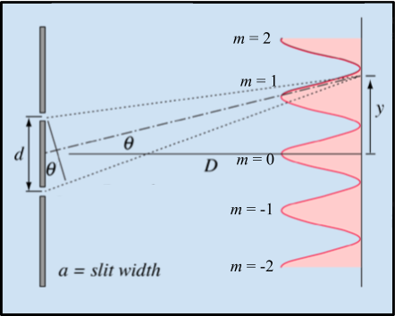
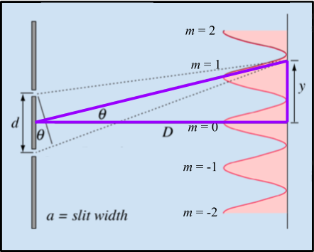

# Wave Optics
---

## INTRODUCTION

::: Figure:Video
!(https://drive.google.com/open?id=1Aq_ZLiDO8b__OuCeLWL08DkIxxy7fcwS)
:::

When you are calculating image locations relative to the objects that produce them, and learning about simple optical devices, it is useful to treat light as groups of rays that travel in straight lines until they are reflected or refracted. This is referred to as *Geometrical Optics*. Unfortunately, light doesn’t behave in quite such an ordinary manner when it interacts with things at smaller scales. This is because light is an electromagnetic wave, and as such it exhibits all of the behaviors that other waves exhibit, like diffraction and interference. 

In this lab we will look at both of these phenomena. They are very closely related, but also different in some key ways. 

### Theory

##### Interference

When light passes through two closely separated slits, the rays travel slightly different distances before reaching the screen. These slight discrepancies in distance cause the waves to interfere with one another as shown in Figure 1.

:::Figure:Figure

:::

The top of Figure 1 demonstrates constructive interference. The two waves are in phase with one another and add together, forming a bright spot, referred to as a maximum. The bottom of Figure 1 shows destructive interference. The waves are exactly out of phase at the screen, and produce a dark spot, referred to as a minimum. You can see that constructive interference happens whenever the path lengths are the same, or if they differ by a whole number of wavelengths. Similarly, destructive interference occurs when the path lengths differ by a half integer (1/2, 3/2, 5/2, etc.).

Let's make this a bit more quantitative.

:::Figure:Figure

:::row

:::column

A
:::

:::column

B
:::
:::

Image from  [HyperPhysics](http://hyperphysics.phy-astr.gsu.edu/hbase/phyopt/slits.html#c1)

:::

Figure 2A shows us all the meaningful variables. $y$ is the position on screen as measured from the center, $D$ is the distance between the slits and the screen, $\theta$ is the angle at which the light leaves the screen to get to position $y$, $d$ is the separation between the two slits, and $a$ is the slit width. We label which intensity maxima (bright spots) we are talking about with the letter $m$. We call the one in the middle of the two slits $0$. Then to one side of $0$ we label the maxima positions with positive numbers in increasing order away from $0$ (1,2,3 etc.) and the other side negative numbers in decreasing order away from the $0$ (-1, -2, -3, etc). Which side we pick for which is arbitrary. 

Figure 1 tells us the condition for maxima occur and Figure 2A give the variables to mathematically describe Figure 1. The only thing we need is the wavelength of the light which we will denote with $\lambda$. Thus the resulting maxima can be described mathematically by the formula for constructive interference:

::: Figure:Equation
$$
d\sin(\theta) = m\lambda
$$
:::

It would be nice if we could replace $\sin (\theta)$ with something a bit easier to work with.

The center point between the slits, this center of the screen, and any position on the screen are three points that form a triangle. An example of one such triangle is drawn in purple in Figure 2.B. The bottom of the triangle has side length $D$ and the far side has length $y$.  We could determine the hypotenuse by using the pythagorean theorem, but we won't need to do that here.

**For small angles**, we can make the approximation $\sin(\theta)\approx\tan(\theta)$. Then we can use trigonometry and our triangle to get $\tan(\theta) = \frac{y}{D}$. This is summarized in the following equation:

:::Figure:Equation
$$
sin(\theta) \approx \tan(\theta ) = \frac{y}{D}
$$
:::

Thus we can use Equation 2 to replace $\sin(\theta)$ in Equation 1 to get a more simplified interference equation.

::: Figure:Equation
$$
d \frac{y}{D} = m \lambda
$$
:::

:::Note
Equation 2, and thus Equation 3, relies on $\theta$ being small. $\theta$ is determined by $D$ and $Y$. When $D$ is 1 meter (the length of your arm) and $y$ is 8 cm (the length of your palm) the difference between $\sin(\theta)$ and $\tan(\$theta)$ is less than 100%. In this lab, we will be working on scales about that size. 
:::

:::Note
Equation 3 only describes interference phenomena but ignores diffraction.
:::

##### Diffraction

Another phenomena that comes into play is called diffraction. Diffraction can happen with only a single slit. Thus, when we shine light through two slits we see not only the interference phenomenon, but also mixed with it, diffraction. It is important to note that the interference fringes are created by the two slits, but there is also a diffraction effect occurring from each individual slit, as demonstrated in Figure 3. The diffraction envelope causes a fading and brightening of the interference maxima.

::: Figure:Figure

:::

## PART 1: GAINING INTUITION

In this part of the lab we will try to get some intuition about what we expect to see when we shine light through some slits onto a screen. The other goal is to help you identify the difference between diffraction and interference on the screen.

:::Exercise

In this exercise we will use a simulation to help us gain some intuition. Simulation one is simulating shining light through two or one slit and then onto a screen. At the very top of the of the simulation is graph plotting the intensity (think brightness) vs position on the screen. It is basically showing you how bright any particular point on the middle of the screen is.

Below the plot is the screen. This is simulating what you would see on a real screen (think piece of paper) if you wear to shine a laser through some slits. Lastly it is showing you the slits. This part of simulation is not drawn to scale but you can image that this is what the slits would look like under a microscope.

You are able to adjust the slit width ($a$), the slit separation ($d$), and the wavelength of the light ($\lambda)$. At the bottom you can turn on and off diffraction by checking the box. **Turning off diffraction is not something you can do in real life.**

::: Figure:Simulation
SIM1
:::

### Interference

Let's start by focusing only on interference. 

1. Click the diffraction checkbox to uncheck the box and turn off an diffraction effects.

An important thing to notice is that the when there is no diffraction all maxima are **equally bright and equally spaced**.  

::: Question
a. Use Equation 3 to write a prediction for what will happen to the location of the maxima on the screen ($y$), when you adjust the slit separation ($d$).

b. Use Equation 3 to write a prediction for what will happen to the location of the maxima on the screen ($y$), when you adjust the slit width ($a$).

c. Use Equation 3 to write a prediction for what will happen to the location of the maxima on the screen ($y$), when you adjust the wavelength ($\lambda$).
:::

2. Adjust the separation while leaving everything else the same. Pay attention to what happens on the screen and the intensity plot.

:::Question
a. How does adjusting the separation affect the pattern on the screen (or the intensity plot)? Things to consider might include the position of the maxima, the brightness of the maxima, the separation between the maxima, or anything else you find notable.
:::

3. Now adjust width while keeping all other values constant.

:::Question
How does adjusting the width affect the pattern on the screen (or the intensity plot)? Things to consider might include the position of the maxima, the brightness of the maxima, the separation between the maxima, or anything else you find notable.
:::

4.  Make sure the slit separation is somewhere in the near the middle of the range. Adjust the wavelength while keeping the other parameters constant.

:::Question
How does adjusting the wavelength affect the pattern on the screen (or the intensity plot)? Things to consider might include the position of the maxima, the brightness of the maxima, the separation between the maxima, or anything else you find notable.
:::

### Diffraction

Now we will consider  diffraction only. Like mentioned in the intro, diffraction occurs with only one slit, while interference takes at least two. 

1. Start by sliding the separation to $0 \mu m$. This will turn our two slits into one.
2. Now turn on diffraction by checking the box. 

Notice how now we now have one large peak in the center and many much smaller peaks to the sides. This is the **diffraction envelope** shown in Figure 3. 

:::Question
a. How does adjusting the slit width change the diffraction envelope?

b. How does adjusting the wavelength change the diffraction envelope?
:::

### Interference and Diffraction

Now we will look at interference and diffraction happening at the same time. This is much more like what you would see in real life.

1. Adjust the separation slider until there are two slits again. Somewhere around $200\mu m$. 
2. Adjust the width to about $25 \mu m$.

Notice the outline of the diffraction envelope and the interference pattern inside of it. Also notice that where the diffraction envelope goes to zero, there is not a maximum even if the interference equation says there should be one.

3. To help see this try turning on and off diffraction and paying close attention to where there diffraction envelope goes to zero.

:::Note
This is important because if we are labeling the interference maxima (-2, -1, 0, 1, 2, 3, etc) we want make sure we still label the interference maxima that are at the zero point of the diffraction envelope.
:::

4. Make sure that diffraction is check to see diffraction phenomena.

:::Question
Based on the interference only and diffraction only part of the exercise, make a prediction about what will happen if you adjust the following parameters independently:

a. The slit width.

b. The slit separation.

c. The wavelength.
:::

::: Question
If you increase the slit separation, why do more peaks appear in the central diffraction envelope?
:::

::: Question
If you decrease the width separation, why do more peaks appear in the central diffraction envelope?
:::
:::

:::Exercise

In this exercise you will see a video of  light shining through a pair of slits. This is not your standard pair of slits however. They are are attached to a wheel and designed to that as the wheel rotates the *slit **separation** will change* but the *slit **width** remains constant*. 

:::Figure:Figure

:::

Figure 4 shows the setup. A laser is shone at a variable slit wheel. The wheel rotates around the black dot at the center. As it does so, the slit separation changes. The light diffracts through the slits and is cast on a translucent screen. A camera is set up directly behind the screen, so you can look straight at it. The video is shot from the point of view of the camera.

$D$ is the spacing between the slits and the screen. $y$ is the distance between the *central interference maximum* and **any other** interference maximum. $d$ is the slit separation. 

:::Figure:Video

!(https://drive.google.com/open?id=1Q1Vufhq6df7_7eOGH4zhnCjunzVYYj-z)

:::

:::Question
What do you observe on the screen? Make a sketch of this in your notebook.
:::

::: Question
How does the pattern on the screen change when you decrease the slit separation?
:::

::: Question
If light only behaved like a particle, what would the pattern on the screen look like for two slits?
:::

:::
<!-- End of Variable Slit Exercise -->

## PART 2: MEASURING THE LASER'S WAVELENGTH

In this part of the lab we want to be more quantitative. We will not concern ourselves the diffraction envelope, and will focus only on *interference*. We will use the interference theory developed in Part 1, namely Equation 3, to measure the wavelength of the laser.

::: Exercise

In this exercise you will be given some data collected by shining a laser through different pairs of slits with various slit separations and slit widths. The data are pictures of the screen. You will measure the distances between opposite interference maxima (-1 & 1, -2 & 2, etc) and use this information to measure the wavelength of the laser.

The setup is similar to that drawn in Figure 4, except that we won't be using a variable slit. We will instead use sets of double slits, one pair at a time. Each pair has a different slit separation and/or slit width.

You will make you're measurements in GeoGebra. Video 3 below walks you through how you will import an image, calibrate the images, and  make a measurement.

:::Figure:Video

!(https://drive.google.com/open?id=12b7qBiQEvYgppWfcusFWJt4yfY8AtMqa)

:::

Download each of the images, and go to [GeoGebra](https://www.geogebra.org/geometry)

:::Figure:Table
|Configuration| Slit Width [mm] | Slit Separation (d) [mm] | Screen to Slit Distance  (D) [cm] | Link |
| -------- | -------- | -------- | - | - |
| 1    | 0.04     |  0.25     | 104  | [Config_1](https://drive.google.com/open?id=1TcPVlZxFAjOmJlrIeNI9uQSP-TeA5Jev) |
| 2   | 0.08     | 0.25     | 105 | [Config_2](https://drive.google.com/open?id=1oGCqZR6Uvb5Nk7IvzQf601SaHpUx4FHe) |
| 3    | 0.04     |  0.50    | 100  | [Config_3](https://drive.google.com/open?id=1iB1p0viaVGAX0FzWnQpSdFfmlsAiKStV) | 

:::
1. Now make a similar table and measurements you made in Exercise 3.  This one should include a column for the GeoGebra units, as well as the converted $y$ distance in centimeters.

:::Question
a. What is your average computed value for the wavelength of the laser? How does this compare to the value printed on the laser?

b. Does the distance between maxima change when you change the slit width?

c. How does the distance to the first maximum of the *diffraction envelope* change with slit width?

d. What do you think would happen if we used white light (light composed of all wavelengths) instead of just a monochromatic (one wavelength) light source?
:::

:::

<!--
## PART 3: DIFFRACTION GRATINGS AND TRACK SPACING ON A COMPACT DISC

An array of many slits, instead of just two, is referred to as a diffraction grating. Diffraction gratings are made by scribing evenly-spaced grooves on a plastic substrate. These grooves act as slits, and the condition for maximum intensity in the interference pattern is the same as for the double slit: $d\sin(\theta) = m\lambda$. Because the spacing between adjacent slits is so small, often around $0.001 mm$, the interference maxima are far apart from one another. ***This means that we cannot use the small angle approximation, and must compute $\theta$ by using trigonometry.***

::: Exercise

In this exercise we will investigate a diffraction grating. A compact disc (CD) is composed of tracks of pits scribed around a disc. The data tracks are close enough together to form a diffraction grating. Therefore, you can use the interference equation to measure the track spacing on a CD.

The setup is again similar to Figure 3, but this time we are using a CD instead of the variable slit wheel, and the distance $D$ is much smaller.

::: Question
Assume $D$ = 5 cm and $y$ = 5 cm. How bad is the small angle approximation?
:::

:::Figure:Figure

:::

1. Here is [the image in Figure 5](https://drive.google.com/open?id=1oksFGXuHv1-eJvg1HT36e_5ceXwN-Ri2), this time for light passing through the CD. Again, import it in GeoGebra and make the same measurements as before.  **Note:** in this case you should see five diffraction maxima. The center, $m=0$ maximum, as well as two on either side of the center.  The outer two a fairly faint, but you should be able to pick out their centers.

2. This time, use the wavelength you measured in Exercise 4 and Equation 1 to calculate what $d$, the track spacing, is. $D$ for this setup is 4cm.

:::Question
a.) What is your average computed value of the track spacing for a CD? Calculate the percent difference between your measured value and the value specified in the Compact Disc Standard: $3.2 μm.$

b.) Does your average value of the CD track spacing fall within the tolerance of $\pm 0.1$ $\mu$m given in the Compact Disc Specification?
:::

:::

-->
## Conclusion

:::Exercise
Write a brief conclusion summarizing the important points of this lab.
:::