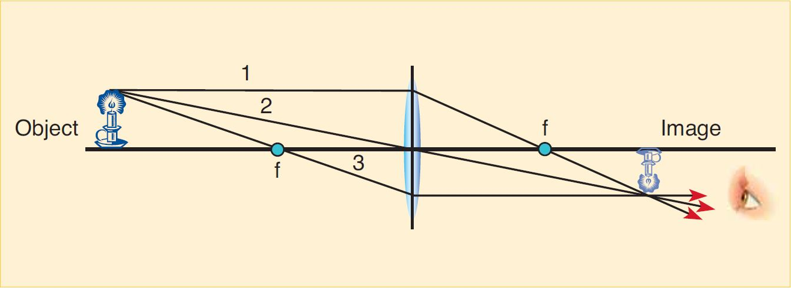
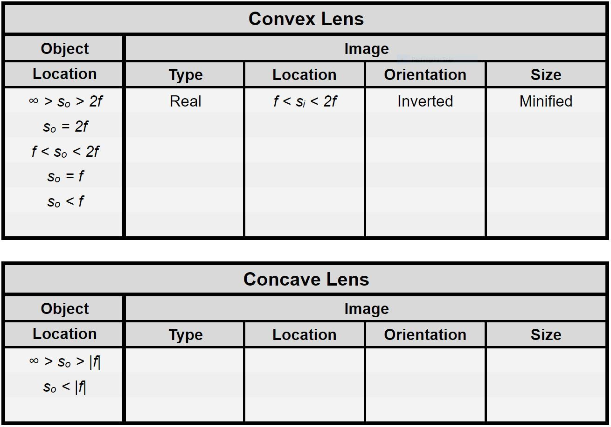

# Lenses, Ray Tracing, and Simple Optical Devices

---

:::Card Intro This week

In the last lab you studied the bending of a single ray of light at a boundary between two materials, a process known as refraction. The important aspects of refraction are the indices of refraction of the materials and the incident angle the light makes with the boundary.  

In this lab we will study the refraction of multiple rays of light emitted from a single point source as they reach the boundary at the front surface of a lens, then exit through the boundary at the rear surface.

:::

---

# Gaining Intuition

<!-- Paula's Intro Video -->
::: Video
<iframe style='width:100%;' src="https://www.youtube.com/embed/3nhaqN1jPvc" title="YouTube video player" frameborder="0" allow="accelerometer; autoplay; clipboard-write; encrypted-media; gyroscope; picture-in-picture" allowfullscreen></iframe>
:::

A lens is an object that consists of a material of index of refraction $n$ and two spherical boundaries. The shapes of the boundaries are designed such that when multiple rays of light emitted by a single point source pass through the lens, they converge to a unique point, known as the image point. The lens thus creates an image of the point source.

We will consider two common types of lenses, **convex** and **concave lenses.** Convex lenses are those that bulge outward in the center, with the edge being the most narrow part. Because light passing through such lenses converges to a point on the other side as described above, these are known as *converging* lenses. 

:::Card Definition Convex Lens
A **convex lens** is a lens that posses at least one surface that curves outwards. Functionally, it converges rays of light that are traveling parallel to its principal axis. 
:::

Concave lenses are those that are thicker on the outside and thinner towards the center. Later in this lab, we will examine the behavior of concave lenses, which is different from that of convex lenses.

<!-- 
:::Card Definition Concave Lens
A **concave lens** is a lens that possesses at least one surface that curves inwards. Functionally, it diverges &mdash; or spreads put &mdash; rays of light that are traveling parallel to its principal axis. 
::: -->

## Curvature and Focal Length

In [Ex](#Ex-candfl) you will explore the relationship between the curvature of a lens and its focal length. In the experiment video, you will be shown three different lenses. They will appear first in profile so that you can see their curvatures: the thicker a lens is at its center, the greater the curvature. Next you will see the light source &mdash; in this case a ceiling light. This is the object that will be focused by the lens to the paper below. The lenses will be moved up and down until the light is focused. 

::::::Exercise candfl
While watching [Vi](#Vi-lenses) below, note the distance between the lens and the paper when the image is focused. Think about the relationship between this distance and the lens's curvature. 

::: Video lenses
<iframe style='width:100%;' src="https://www.youtube.com/embed/RQXOXlDV0s4" title="YouTube video player" frameborder="0" allow="accelerometer; autoplay; clipboard-write; encrypted-media; gyroscope; picture-in-picture" allowfullscreen></iframe>
:::

When a source is very far away, the image appears at the focal point of the lens. Let's consider the ceiling light to be very far from the lenses. Thus the light from the ceiling is converging at the focal point of the lenses. The distance between the lens and the focal point is the **focal length**. Because for a convex lens the focal length is positive, this type of lens is also sometimes called a *positive* lens.

:::Question
Is there a relationship between the curvature of a lens and its focal length? 
:::

***Note:** A concave lens does not focus parallel light to a point.

[Si](#Si-InfiniteSourceTest) shows how lenses act in two dimensions. Play with the system by dragging the focal point along the optical axis. Moving the focal point to the left of the lens converts the blue convex lens to a red concave one. Use the simulation to explore your answer to question 1.

:::Simulation InfiniteSourceTest

<a href="https://www.geogebra.org/material/iframe/id/v69nxnqu" target="_blank" rel="noopener noreferrer"> Open in New Tab</a> 
<iframe title="InfiniteSourceTest" src="https://www.geogebra.org/material/iframe/id/v69nxnqu" style="border:0px;height:550px;width:100%;"> </iframe>
:::

::::::
<!-- End of Exercise 1 -->

In [Ex](#Ex-Focal) we will be more quantitative about the focal lengths. We will show you a video of five parallel rays passing through a concave and a convex lens over graph paper. The graph paper will allow you to measure the focal length of these lenses

:::::: Exercise Focal

While watching [Vi](#Vi-5rays), complete the steps listed below to collect your data:

<!-- Jeremy's: 5 rays of light going to two lenses -->
::: Video 5rays
<iframe style='width:100%;' src="https://www.youtube.com/embed/-Hg40ICmr6I" title="YouTube video player" frameborder="0" allow="accelerometer; autoplay; clipboard-write; encrypted-media; gyroscope; picture-in-picture" allowfullscreen></iframe>
:::

**Note:** The graph paper used is 4 boxes per inch.

1. Pause the video when the convex lens is in place.

2. Measure the focal length in units of boxes.

3. Notice that for the concave lens the light does not converge. For this reason we must trace the light backwards. Make the video pause when the concave lens is in place and the traced lines have appeared.

4. Measure this distance in units of boxes.

5. Convert both of your measurements to mm.

::: Question
What focal lengths did you measure?
:::
::::::
<!-- End of Exercise 2 -->

## Real Lenses and Aberrations

Real lenses do not exactly follow physics equations. In this exercise we will look at a lens that deviates from the thin lens approximation, specifically one that does not focus all parallel light to a single point. Lenses like this are said to have aberrations. In [Ex](#Ex-abb), you will watch a video of five parallel rays passing through a thick, D-shaped lens and study the properties of the refracted rays. 

::::::Exercise abb

<!-- Jeremy's: 5 rays of light going through hemispherical lenses -->

::: Video
<iframe style='width:100%;' src="https://www.youtube.com/embed/tTfI_W1jF60" title="YouTube video player" frameborder="0" allow="accelerometer; autoplay; clipboard-write; encrypted-media; gyroscope; picture-in-picture" allowfullscreen></iframe>
:::

1. Pause the video when the D-block is in place.

2. You will notice that the rays do not converge to one point. Measure the focal lengths for the inner and outer pairs of rays from the flat side of the lens.

:::Question
What are the focal lengths of the lens for these two pairs of rays?
:::

:::Simulation geo1
<a href="https://www.geogebra.org/material/iframe/id/X8RuneVy" target="_blank" rel="noopener noreferrer"> Open in New Tab</a> 
<iframe src="https://www.geogebra.org/material/iframe/id/X8RuneVy"  style="border:0px;height:483px;width:100%;"> </iframe>
:::

1. Use [Si](#Si-geo1) to examine the behavior of a thick block lens. Set the radius of curvature of the left side to $100$ and the radius of curvature of the right side to $4$. This closely approximates the shape of the D-block shown above. The index of refraction of the lens is 1.5.  Observe the refracted rays from the pair of rays closest to the optical axis and the pair of rays second closest to the optical axis. 

:::Question
Measured from the flat surface, at what distances do the rays converge? What is the difference between the two distances (let's call this the focal length spread)?
:::

2. Now set the the radius of curvature of the right side to $100$ and the radius of curvature of the left side to $4$. Observe the refracted rays from the same pairs of rays as before.

:::Question
1. Measured from the flat surface, at what distances do the rays converge? What is the difference between the two distances (the focal length spread)?

2. Does the D-block lens have symmetrical behavior?  That is to say, is  the focal length spread in the two scenarios the same?

3. Which scenario has a smaller focal length spread and thus less spherical aberrations?  How should you place the D-block in order to minimize spherical aberrations?
:::

::::::

# Ray Tracing with a Lens of Known Focal Length

::: Video
<iframe style='width:100%;' src="https://www.youtube.com/embed/PMUqmcHdlUU" title="YouTube video player" frameborder="0" allow="accelerometer; autoplay; clipboard-write; encrypted-media; gyroscope; picture-in-picture" allowfullscreen></iframe>
:::
 
An object is some physical entity that either produces light rays of its own (like a light bulb) or reflects them from some other light source (like this text, or your pencil). The image is a version of the object as it appears after light coming from it has gone through some optical device, in this case a lens. In the remainder of this lab we will explore how lenses form images, and how the placement of a lens relative to an object determines the location and relative size of the image, and whether it is upright (erect) or inverted.

## Three Principles of Ray Diagrams

We use ray tracing methods to predict the behavior of a lens. We begin with convex lenses, though the same methods apply equally well to concave lenses. There are only three essential premises needed to analyze lenses:

1. A light ray entering a lens parallel to the optical axis passes through the focal point on the other side.

:::Figure ray1 xl

A light ray parallel to the principal axis entering a convex lens from infinity.
:::

2. A light ray passing through the center of a lens passes through unchanged. *Note that this is true only for thin lenses.*

:::Figure ray2 xl

A light ray passing through the center of a lens from any angle in the principal plane remains unchanged.
:::

3. A light ray passing through the focal point and then through the lens emerges parallel to the optical axis.

:::Figure ray3 xl

A light ray that passes through the focal point of a lens always ends up parallel to the principal axis.
:::

## Ray Tracing Method

1. Pick a point as the object.

2. Draw one line from the point, parallel to the optical axis. From where it hits the lens, draw a line down through the focal point. Be sure to extend it beyond the focal point.

3. Draw one line from the point to the center of the lens, and extend it until it intersects the first line

4. Draw one last line from the point through the near-side focal point and then to the lens. From there, draw a line parallel to the optical axis. This line will intersect the other two at the point where they intersect each other.

:::Figure raytrace1 xl

Example of a Ray Trace Diagram
:::

There are two other important cases to consider. When an object is placed within the focal length of a convex lens, the image point becomes negative. A virtual image is formed at the point that the image *appears* to come from. The ray tracing method is consistent, but note that you draw the line in reverse:

:::Figure raytrace2 xl

:::

*Note:* As a convention, we always draw from the top-most point on the object. Any other point would work equally well. The top is generally most useful.

A concave lens has a negative focal length, and the line from the object to the focal length actually crosses the lens:

:::Figure raytrace3 xl

:::

Concave lenses do not cause light to converge upon a single point, but instead cause it to spread out. Because of this they are referred to as *diverging* lenses. The focal length of a concave lens is negative. Hence they are also sometimes called *negative* lenses. If we incorporate this detail into our ray tracing, we can analyze them by using the same method that we use for convex lenses. 

:::Figure raytrace4 xl

:::

:::Card Definition Real Image
For a **Real Image:**
- Light rays actually pass through the image point.
- The image is on the opposite side from the incident light.
- The image can be projected onto a screen.
- The image is inverted with respect to the object.
:::

:::Card Definition Virtual Image

For a **Virtual Image:**
- Light only appears to pass through the image point.
- The image is on the same side as the incident light.
- The image cannot be projected onto a screen.
- The image is in the same orientation as the object; we say that it is erect.
:::

Image formation through a lens is exemplified in the dynamic [Si](#Si-Concave). You can change the location of the object as well as the focal length of the lens. You can do the latter can by dragging the point labeled "Focus." You can switch between convex and concave by dragging the "Focus" point to the right of the lens. You will be using this simulation in both exercises that follow.

:::Simulation Concave
<a href="https://www.geogebra.org/material/iframe/id/thejwqzw" target="_blank" rel="noopener noreferrer"> Open in New Tab</a> 
<iframe scrolling="no" title="Copy of Concave and Convex Lenses" src="https://www.geogebra.org/material/iframe/id/thejwqzw" width="1033px" height="482px" style="border:0px;width:100%; height:500px;"> </iframe
:::

In [Ex](#Ex-rayt) you will practice ray tracing on a piece of paper. You are expected to photograph and attach your work.
::::::Exercise rayt

### Convex Lens - Object Outside Focal Length 
1. Get a sheet of paper and draw a horizontal optical axis. Next, draw a vertical line near the center of the optical axis to represent your lens, then measure out and draw the focal points. Assume the focal length to be 2 cm. Pick an object point 6 cm to the left of the lens, with a  height of 2cm above the optical axis. Draw the three simple case rays – parallel, through the center of the lens, and through the focal point – and locate the image formed on the other side of the lens.
:::Note
Make sure to indicate on your drawing the image distance and image height. You can use SIM3 to check these two numbers.
:::

Note that the image is inverted, at a different distance from the lens than the object, and is a different size than the object. Also note that the light rays converge at a given point. For this reason, convex lenses are frequently referred to as *converging lenses.*

### Convex Lens - Object Inside Focal Length 

2. Get another sheet of paper and repeat step 1, but instead draw the object point inside the focal length, 1 cm away from the lens. Again draw the three simple case rays. Note that this is one of the special cases mentioned above; see Figure 5.

:::Question
Do the lines converge at a given point? What does this imply about the type of image formed?
:::

3. Now trace the rays backwards as shown in Figure 5. You will find that they all intersect at a point on the same side as the object. 
:::Note
Make sure to indicate on your drawing the image distance and image height. You can use SIM3 to check these two numbers.
:::

When an object is inside the focal length of a convex lens, the lens no longer converges the light rays to a single point. The image is bigger. Such a setup is called a *magnifier.* Since light does not actually pass through the point where the image is formed, we call the image a *virtual image.*

### Concave Lens - Object Outside Focal Length 

4. Get a third sheet of paper and repeat the ray tracing procedure for a concave lens with focal length -2 cm. Place the object outside of the focal length, 4 cm to the left of the lens. Note that this is the second special case mentioned above; see Figure 6.

:::Question
Do the rays converge at a given point? What does this imply about the type of image formed?
:::

5. Trace the rays backwards as shown in Figure 6.

:::Note
Make sure to indicate on your drawing the image distance and image height. You can use SIM3 to check these two numbers.
:::

:::Question
For object distances outside the focal length, do concave lenses make things bigger or smaller?
:::

::::::
<!-- End of Exercise: Ray Tracing -->

In [Ex](#Ex-rayt2) you will fill out a table to describe image placements in single-lens optical systems. You will explore all possible scenarios to fill out the table below and fully characterize the behavior of convex and concave lenses.

::::::Exercise rayt2

 Use [Si](#Si-Concave) to explore the conditions in the tables below. Fill out the table by using the [Table Templates](https://docs.google.com/spreadsheets/d/1Cvw8Ov_A9N4cCR9wG04k_4OWk2SzO5Wo7_48GxVOHCQ/edit?usp=sharing). Notice that the first case is filled out for you as an example.

::: Question
For the convex lens, describe with words what the conditions are such that the image is larger than the object, smaller than the object, and the same size as the object.
:::

::::::

# Conclusion

:::Exercise
Write a brief conclusion summarizing the important points of this lab.
:::  

:::Summary
Make sure to include all tables, plots, pictures, drawings, screenshots or anything else asked of you in the exercises in your report, as well as answers to all the questions.

All responses and answers should contain the correct number of sig figs and should include units when needed.
:::

<!-- Example Functions -->
<!--PhET Formatting {width=100% height=600px} -->

<!-- Simulations

Sim 1

<iframe scrolling="no" title="InfiniteSourceTest" src="https://www.geogebra.org/material/iframe/id/v69nxnqu/width/700/height/444/border/888888/sfsb/true/smb/false/stb/false/stbh/false/ai/false/asb/false/sri/true/rc/false/ld/false/sdz/true/ctl/false" width="1100px" height="600px" style="border:0px;"> </iframe>

Sim 2

<iframe scrolling="no" title="" src="https://www.geogebra.org/material/iframe/id/X8RuneVy/width/1033/height/482/border/888888/sfsb/true/smb/false/stb/false/stbh/false/ai/false/asb/false/sri/false/rc/false/ld/false/sdz/false/ctl/false" width="1100px" height="600px" style="border:0px;"> </iframe>

Sim 3

<iframe scrolling="no" title="" src="https://www.geogebra.org/material/iframe/id/a2rNFfHA/width/1100/height/600/border/888888/sfsb/true/smb/false/stb/false/stbh/false/ai/false/asb/false/sri/false/rc/false/ld/false/sdz/false/ctl/false" width="1100px" height="600px" style="border:0px;"> </iframe>
 -->

<!-- Sim 1 Old -->

<!-- [Simulation 1 Old](https://ricktu288.github.io/ray-optics/simulator/){width=100% height=600px} -->
<!-- No Longer Wanted -->
<!-- I cannot get this sim to stay in a window, Setting it up as an image does not work. Setting it up as a link forces you to another page. I have a saved file for it but I do not know how to get it to that, 6CL_Lab2_P1_Test.json. -->

<!-- Sim 1 Text
Simulation 1 shows how lenses act in two dimentions. There are 4 lenses already made with a light source similar to that of the lights in your laboratory. The three on the left are convex and the one on the right is concave. Move the convex lenses around to see how the light passing through them acts. Select a lens and measure the height at which this occurs using the ruler tool, then do the same for two other unlabeled convex lenses. -->

<!-- Sim 2 Old -->
<!-- {width=100% height=600px} -->

<!-- Simulation 3 -->
<!-- <figure> -->
<!-- 
 -->
<!-- <iframe scrolling="no" title="" src="https://www.geogebra.org/material/iframe/id/X8RuneVy/width/1033/height/482/border/888888/sfsb/true/smb/false/stb/false/stbh/false/ai/false/asb/false/sri/false/rc/false/ld/false/sdz/false/ctl/false" width=100% height="600px" style="border:0px;" allowfullscreen> </iframe> -->
