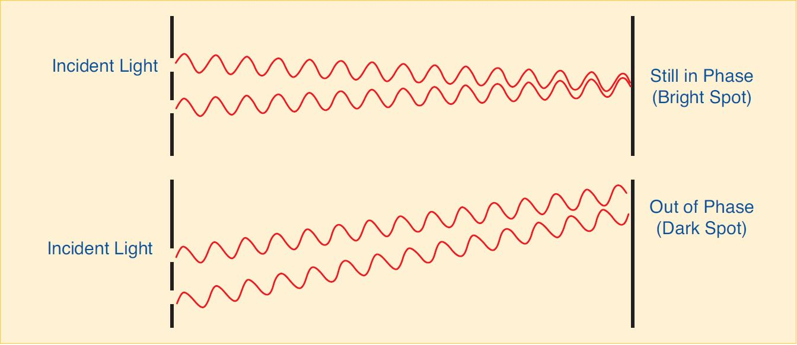
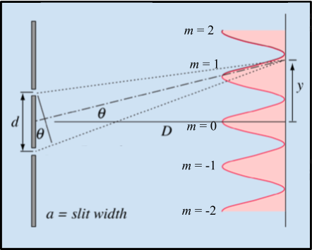
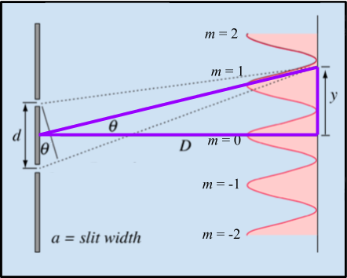
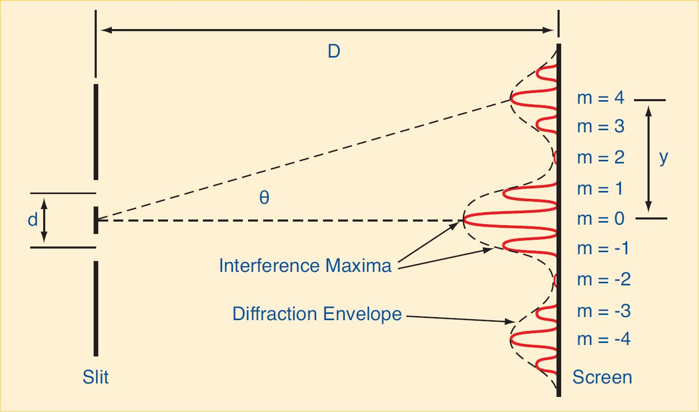
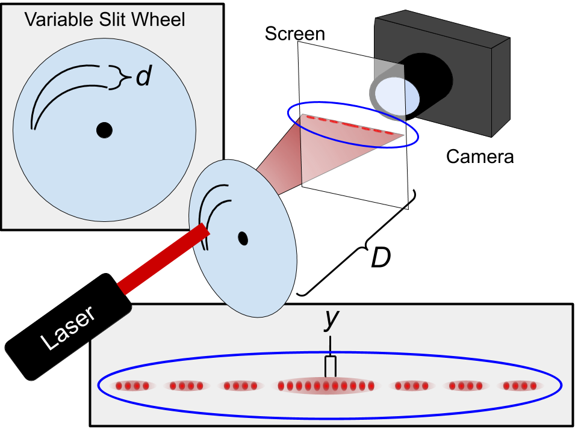

# Lab 3: Wave Optics

---

:::Card Intro In this Lab
Now that we are familiar with the principles of *ray optics*, we will move on to talk about **wave optics**. As the name suggests, wave optics considers the wave-like properties of light, and the phenomena that emerge from this description &mdash; in particular, **diffraction** and **interference**. The phenomena occur on very small length scales compared to the domain of ray optics.
:::

---

# Introduction

:::Video
<iframe style='width:100%;' src="https://www.youtube.com/embed/PgqcerR-3no" title="YouTube video player" frameborder="0" allow="accelerometer; autoplay; clipboard-write; encrypted-media; gyroscope; picture-in-picture" allowfullscreen></iframe>
:::

When you are calculating image locations relative to the objects that produce them, and learning about simple optical devices, it is useful to treat light as groups of rays that travel in straight lines until they are reflected or refracted. This is referred to as *Geometrical Optics*. Unfortunately, light doesn’t behave in quite such an ordinary manner when it interacts with things at smaller scales. This is because light is an electromagnetic wave, and as such it exhibits all of the behaviors that other waves exhibit, like diffraction and interference. 

In this lab we will look at both of these phenomena. They are very closely related, but also different in some key ways. 

## Interference

When light passes through two closely separated slits, the rays travel slightly different distances before reaching an observation screen. This slight difference in the distances traveled causes the waves to interfere with one another as shown in  [Fi](#Fi-interference1)

:::Figure interference1 xl

:::
The top of [Fi](#Fi-interference2)<u>a</u>  demonstrates constructive interference. The two waves are in phase with one another and add together, forming a bright spot, referred to as a maximum. [Fi](#Fi-interference2)<u>b</u>  shows destructive interference. The waves are exactly out of phase at the screen, and produce a dark spot, referred to as a minimum. 
::::::RFigure interference2 m

a) Constructive Interference

b) Destructive interference 

:::row
:::
Images from  [HyperPhysics](http://hyperphysics.phy-astr.gsu.edu/hbase/phyopt/slits.html#c1)

::::::

You can see that constructive interference happens whenever the distances traveled by the two waves to the observation screen are the same, or if they differ by a whole number of wavelengths. Similarly, destructive interference occurs when the difference in the traveled distances is equal  to half-integer wavelengths  (1/2, 3/2, 5/2, etc.).

Let's make this a bit more quantitative.

[Fi](#Fi-interference2)<u>a</u>  shows us all the meaningful variables: 
- $y$ is the position on the screen as measured from its center 
- $D$ is the distance between the slits and the screen 
- $\theta$ is the angle at which the light leaves the slits to get to position $y$ on the screen 
- $d$ is the separation between the two slits
- $a$ is the slit width. 

We label which intensity maxima (bright spots) we are talking about with the letter $m$. We call the one in the center of the screen $0$. Then to one side of $0$ we label the positions of the maxima with positive numbers in increasing order away from $0$ (1, 2, 3, etc.), and on the other side with negative numbers in decreasing order away from $0$ (-1, -2, -3, etc). Which side we pick for which is arbitrary. 

[Fi](#Fi-interference1) tells us the condition for maxima to occur, and [Fi](#Fi-interference2)<u>a</u> gives the variables to  describe [Fi](#Fi-interference1) mathematically. **We also need to know the wavelength of the light, which we will denote with $\lambda$**. Thus we can describe the resulting maxima mathematically by the formula for constructive interference:

::: Equation cons
$$
d\sin(\theta) = m\lambda
$$
:::

### Small Angle Approximation
It would be nice if we could replace $\sin (\theta)$ with something a bit easier to work with. Let's look back at our diagrams and consider the geometry again.

Note the following: The center point between the slits, the center of the screen, and any other position on the screen, are three points that form a triangle. An example of one such triangle is drawn in purple in [Fi](#Fi-interference2)<u>b</u>. The bottom of the triangle has side length $D$ and the far side has length $y$.  We could determine the hypotenuse by using the Pythagorean theorem, but we won't need to do that here.

**For small angles**, we can make the approximation $\sin(\theta)\approx\tan(\theta)$. Then we can use trigonometry and our triangle to get $\tan(\theta) = \frac{y}{D}$. This is summarized in the following equation:

:::Equation saa
$$
\sin(\theta) \approx \tan(\theta ) = \frac{y}{D}
$$
:::

Thus we can use [Eq](#Eq-saa) to replace $\sin(\theta)$ in [Eq](#Eq-cons) to get a simplified interference equation. We will use the subscript $m$ to indicate the position on the screen of the $m^{th}$ maximum, $y_m$:

:::Equation max
$$
y_m = m \lambda \frac{D}{d}
$$
:::

:::Note
[Eq](#Eq-saa), and thus [Eq](#Eq-max), relies on $\theta$ being small. The angle $\theta$ is determined by $D$ and $y_m$. When $D$ is 1 meter (the length of your arm) and $y_m$ is 8 cm (the length of your palm) the difference between $\sin(\theta)$ and $\tan(\theta)$ is less than 1%. In this lab, we will be working on scales about that size. 
:::

:::Note
[Eq](#Eq-max) describes only interference phenomena but ignores diffraction. The assumption is that the two slits have infinitesimal width (so we can ignore it)
:::

## Diffraction

In our discussion of interference we have ignored the effect of the slit width $a$ on the patterns observed on the screen. *Diffraction* arises when a slit has a width comparable to the wavelength of light. If we consider light passing through a single slit of width $a$, we observe only diffraction effects. If we consider light passing through two slits of width $a$. we observe both interference and diffraction effects.** It is important to note that the interference results from using *two* slits, and diffraction results from the slits having a certain *width*.**  When both diffraction and interference are present, such as in the case of the two slits of width $a$ shown in [Fi](#Fi-dai), the diffraction will modulate the interference pattern. The *diffraction envelope* causes a fading and brightening of the interference maxima.

:::Figure dai xl

Diffraction and interference
:::

# Gaining Intuition

In this part of the lab we will get some intuition about what we observe on a screen when we shine light through one or two slits. The other goal is to help you identify the difference between diffraction and interference effects.

To accomplish these tasks, in [Ex](#Ex-ind) we will use [Si](#SI-ID) to observe the light intensity (think brightness) on a screen. 

## Diffraction v.s. Interference
::: Simulation ID

<iframe src="https://kapawlak.github.io/PhDemoJS/Apps/Intf_Dif/Page.html" width='100%' height='1100px' style='border:0px;'></iframe>
<a href="https://kapawlak.github.io/PhDemoJS/Apps/Intf_Dif/Page.html" target="_blank" rel="noopener noreferrer"> Open in New Tab</a> 

:::

At the very top of the simulation is a graph of the intensity vs. position on the screen. It shows you how bright any particular point on the screen is. Below the graph is the screen. This simulates what you would see on a real screen (think piece of paper) if you were to shine a laser through some slits. Below that, it shows you the slits. This part of the simulation is not drawn to scale, but you can imagine that this is what the slits would look like under a microscope.

You are able to adjust the slit width ($a$), the slit separation ($d$), and the wavelength of the light ($\lambda)$. At the bottom you can turn diffraction on and off by checking the box. **Turning off diffraction is not something you can do in real life.**

::::::Exercise ind

**Interference**

Let's start by focusing only on interference. 

1. Click the diffraction checkbox to uncheck the box and turn off diffraction effects.  This will ignore any effects the width of the slits has on the intensity, so that slider is not active anymore.

An important thing to notice is that that when there is no diffraction, all maxima are **equally bright and equally spaced**.  

::: Question
1. Use Equation 3 to predict what will happen to the location of the maxima on the screen ($y_m$) when you adjust the slit separation $d$  (i.e. what happens when we increase and decrease the slit separation).

2. Use Equation 3 to predict what will happen to the location of the maxima on the screen ($y_m$) when you adjust the wavelength ($\lambda$).
:::

2. Adjust the slit separation while leaving everything else the same. Pay attention to what happens on the screen and in the intensity plot.

:::Question
How does adjusting the slit separation affect the pattern on the screen (or the intensity plot)? Things to consider might include the position of the maxima, the brightness of the maxima, the separation between the maxima, or anything else you find notable.
:::

3.  Make sure the slit separation is somewhere in the near the middle of the range. Adjust the wavelength while keeping the other parameters constant.

:::Question
How does adjusting the wavelength affect the pattern on the screen or the intensity plot (besides color; remember your prediction based on Equation 3)? Things to consider might include the position of the maxima, the brightness of the maxima, the separation between the maxima, or anything else you find notable .
:::

**Diffraction**

Now we will consider only diffraction effects. As mentioned in the introduction, diffraction can occur with only one slit, while interference takes at least two. 

1. Start by sliding the slit separation to $0\:\mu m$. This will turn our two slits into one.
2. Now turn on diffraction by checking the box. 

Notice that now we have one large peak in the center and many much smaller peaks to the sides. This is the **diffraction envelope** shown in Figure 3. 

:::Question
1. How does adjusting the slit width change the diffraction envelope?

2. How does adjusting the wavelength change the diffraction envelope?
:::

**Interference and Diffraction**

Now we will look at interference and diffraction happening at the same time. This is much more like what you would see in real life.

1. Adjust the separation slider until there are two slits again, somewhere around $200\:\mu m$. 
2. Adjust the width to about $25\:\mu m$.
3. Make sure the diffraction checkbox is still on.

Notice the outline of the diffraction envelope and the interference pattern inside of it. Also notice that where the diffraction envelope goes to zero, there is not a maximum, even if the interference equation says there should be one.

3. To help see this, try turning diffraction on and off, and pay close attention to where the diffraction envelope goes to zero.

:::Note
This is important, because if we are labeling the interference maxima (-2, -1, 0, 1, 2, 3, etc.), we want to make sure that we still label the interference maxima that are at the zero points of the diffraction envelope.
:::

4. Make sure that diffraction is checked in order to see the diffraction effects.

:::Question
Based on the interference only and diffraction only part of the exercise, predict what will happen if you adjust the following parameters independently:

1. The slit width.

2. The slit separation.

3. The wavelength (besides a change in color).
:::

::: Question
1. If you decrease the slit width, why do more peaks appear in the central diffraction envelope?

2. If you increase the slit separation, why do more peaks appear in the central diffraction envelope?

3. If you increase or decrease the wavelength, why does the number of peaks within the central diffraction envelope remain the same?
:::
 
 
 
::::::

## Variable Ranged Slit

In [Ex](#Ex-variable) you will see a video of  light shining through a pair of slits. This is not your standard pair of slits, however. They are attached to a wheel and designed so that as the wheel rotates the *slit **separation** changes* but the *slit **width** remains constant*. 

:::Figure variable xl

Variable slit setup
:::

[Fi](#Fi-variable) shows the setup. A laser is shone at a variable slit wheel. The wheel rotates around the black dot at the center. As it does so, the slit separation changes. The light diffracts through the slits and is cast on a translucent screen. A camera is set up directly behind the screen, so you can look straight at it. The video is shot from the point of view of the camera. Note that

- $D$ is the distance between the slits and the screen
- $y$ is the distance between the *central interference maximum* and **any other** interference maximum
- $d$ is the slit separation. 

::::::Exercise variable

 Watch the video below. Pay attention to how the diffraction envelope does or does not change, and the number of interference maxima in the central lobe of the diffraction envelope. 
:::Video
<iframe style='width:100%;' src="https://www.youtube.com/embed/_gN71PmL020" title="YouTube video player" frameborder="0" allow="accelerometer; autoplay; clipboard-write; encrypted-media; gyroscope; picture-in-picture" allowfullscreen></iframe>

:::

::: Question
How does the pattern on the screen change when you increase the slit separation? 

Note: The pattern may look tilted due to the experimental artifacts. Ignore this effect and just focus on the size of the central lobe and the number of intensity maxima inside it.
:::

::: Question
If light behaved only as a particle, what would the pattern on the screen look like for two slits?
:::

::::::
<!-- End of Variable Slit Exercise -->

---

# Measuring the Laser's Wavelength

In this part of the lab we want to be more quantitative. We will not concern ourselves with the diffraction envelope, and will focus only on *interference*. We will use the interference theory developed in Part I, namely [Eq](#Eq-max), to measure the wavelength of the laser.

In [Ex](#Ex-geog2) you will be given data collected by shining a laser through different pairs of slits with various slit separations and slit widths, and recording the patterns that appeared on a screen.  You will measure the distances between opposite interference maxima (-1 & 1, -2 & 2, etc.), and use this information to measure the wavelength of the laser.

The setup is similar to that drawn in [Fi](#Fi-variable), except that we won't be using a variable slit. We will instead use sets of double slits, one pair at a time. Each pair has a different slit separation and/or slit width.

:::::: Exercise geog2

You will make your measurements in GeoGebra. [Vi](#Vi-geog) below walks you through how you will import an image, calibrate the image, and  make a measurement.

:::Video geog
<iframe style='width:100%;' src="https://www.youtube.com/embed/Wt5gBQqZT3Q" title="YouTube video player" frameborder="0" allow="accelerometer; autoplay; clipboard-write; encrypted-media; gyroscope; picture-in-picture" allowfullscreen></iframe>
:::

Download each of the images, and go to [GeoGebra](https://www.geogebra.org/geometry). 

:::Note
To open the images you need to right-click and open in a new tab or window.
:::

:::Table
|Configuration| Slit Width (a) [mm] | Slit Separation (d) [mm] | Screen-to-Slit Distance  (D) [cm] | Link |
| -------- | -------- | -------- | - | - |
| 1    | 0.04     |  0.25     | 100  | [Config_1](https://drive.google.com/file/d/13zkt5If1vXRhg_8jqxvyZUeXnvYInnmd/view?usp=sharing) |
| 2   | 0.08     | 0.25     | 100 | [Config_2](https://drive.google.com/file/d/1sebsIsRI68ek_7jZ_xqU_cLQlMc2QG15/view?usp=sharing) |
| 3    | 0.04     |  0.50    | 100  | [Config_3](https://drive.google.com/file/d/1D6qKXQunnEHtFx1HD_7DauRZ8zi32YAP/view?usp=sharing) | 

:::

1. Make a table that has a column for which interference maxima you will be measuring ($m$), one for distance between two maxima in GeoGebra Units, one for distance between two maxima in millimeters, one for the average distance of the interference maxima (divide previous column by 2), and one for the wavelength (manipulate Equation 3 to determine wavelength).
2. Use the three images above and Video 3 to measure the distance between 2 pairs of maxima. **HINT:** Make sure not to skip where the diffraction envelope goes to zero when labeling interference maxima (use Equation 3). 

:::Question
1. What is your average computed value for the wavelength of the laser in nanometers? How does this compare to the value printed on the laser (650 nm)?

2. Does the distance between maxima change when the slit width changes?

3. How does the distance to the first maximum of the *diffraction envelope* change with slit width?
:::

:::Question
What do you think would happen if we used white light (light composed of all wavelengths) instead of just a monochromatic (one wavelength) light source?
:::

::::::

# Conclusion

:::Exercise
Write a brief conclusion summarizing the important points of this lab.
:::

:::Summary
Make sure to include all tables, plots, pictures, drawings, screenshots or anything else asked of you in the exercises in your report, as well as answers to all the questions.

All responses and answers should contain the correct number of sig figs and should include units when needed
:::
