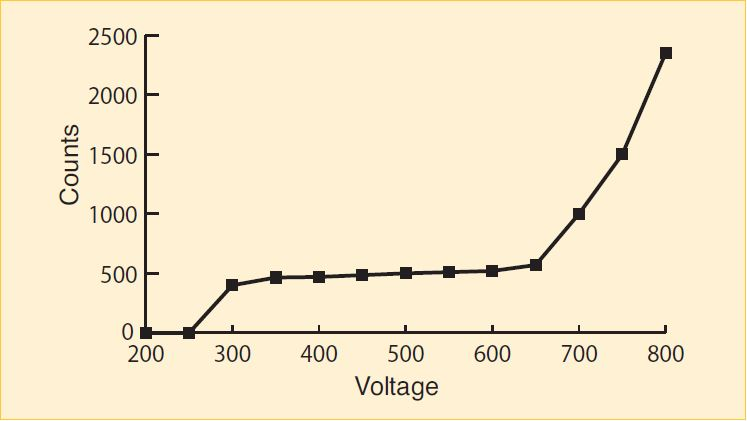
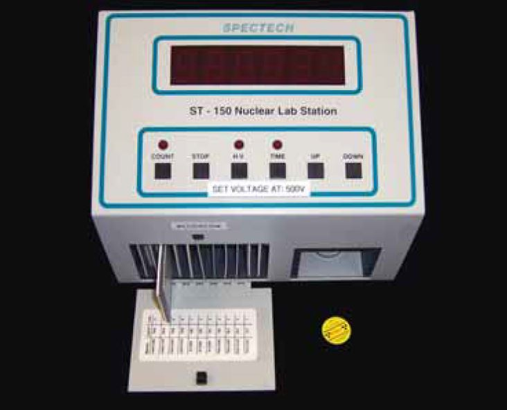
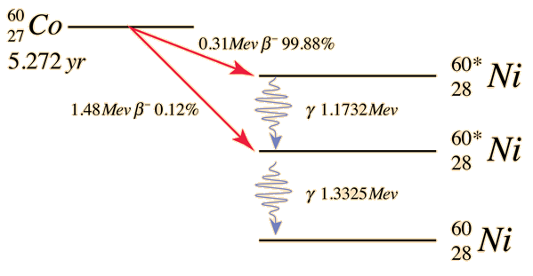

# Lab 4: Nuclear Physics
---
:::Card Intro You&rsquo;ve made it to the final lab!
You&rsquo;ve learned a lot about optics this quarter, and we are finally ready to move on! In this lab we will be focusing on the final subject of this course: **Nuclear Physics** and the characteristics of its radiation.
:::
---
# Introduction

:::Video
<iframe style='width:100%;' src="https://www.youtube.com/embed/VeXpMijpazE" title="YouTube video player" frameborder="0" allow="accelerometer; autoplay; clipboard-write; encrypted-media; gyroscope; picture-in-picture" allowfullscreen></iframe>
:::

The nuclei of some atoms are unstable. In the process of becoming stable, they emit various particles. This phenomenon is known as radioactive decay. The most common types of emission are alpha and beta particles, and gamma rays. 

Alpha particles are fast moving helium nuclei. They contain two protons and two neutrons, and do not have the surrounding valence electrons. They have high energy, typically in the MeV range (mega electron-volts), but because of their large mass (and their double positive charge), they are stopped by just a few inches of air, or a piece of paper.

The beta particle is identical to the electron, except for its origin; beta particles are emitted from the breakdown of nuclei. Beta particles are emitted with a wide range of energies from near zero to on the order of an MeV. Since electrons are much lighter than helium atoms (and only singly charged), they are able to penetrate farther, through several feet of air, or several millimeters of plastic or light metals. 

Gamma radiation, unlike alpha or beta radiation, is an electromagnetic wave. Most electromagnetic waves, such as x-rays, light waves, and radio waves, are generated outside the nucleus by electron transitions (between energy levels in an atom or molecule), oscillation of electrons under the influence of an oscillating voltage (as in the antenna of a radio transmitter), or electron decelerations in the case of x-rays. Gamma rays, on the other hand, are produced by energy transitions within the nucleus. Depending on their energy, they can be stopped by a thin piece of aluminum foil, or they can penetrate several inches of lead.

The energies of all three of these types of radiation greatly exceed the ionization potential of atoms and molecules &ndash; that is, the energy necessary to remove an electron from an atom or molecule. Hence, they ionize atoms and molecules of the matter with which they interact. For this reason they are known as *ionizing radiation*.

## Geiger-Müller Tube

:::Video
<iframe style='width:100%;' src="https://www.youtube.com/embed/qtvz8lH5zhk" title="YouTube video player" frameborder="0" allow="accelerometer; autoplay; clipboard-write; encrypted-media; gyroscope; picture-in-picture" allowfullscreen></iframe>
:::

A device called a Geiger counter can be used to detect alpha, beta and gamma radiation. The Geiger-Müller tube (or GM tube) is the sensing element of a Geiger counter. It can detect a single particle of ionizing radiation, and is typically connected to electronic circuitry that produces an audible click for each event. It was named for Hans Geiger, who invented the device in 1908, and Walther Müller, who collaborated with Geiger in developing it further in 1928.

The Geiger-Müller tube consists of a tube filled with an inert gas such as helium, neon or argon, and an organic vapor or a halogen. The tube contains electrodes, between which there is a voltage of several hundred volts, but no current flowing. The walls of the tube are metal (or have the inside coated with metal) to form the cathode. The anode is a wire that passes through the center of the tube and is insulated from the cathode. An opening in the tube wall, covered with a thin sheet of mica, provides a window through which alpha and beta particles can enter the tube. (Entry of gamma rays into the tube would not be hindered by the tube wall.) Because alpha particles interact so strongly with matter, this mica window must be very thin in order for them to be able to enter the tube. The minimum energy that an alpha particle must have in order to enter the Geiger-Müller tube depends on the thickness of this window.  (The thicker the window, the greater the minimum energy necessary for an alpha particle to enter.) In some Geiger-Müller tubes, this window is not thin enough to allow alpha particles to pass through it. Such tubes can detect only beta particles and gamma rays.

:::LFigure gmtube xl

Geiger-Müller Tube Plateau
:::
When ionizing radiation passes through the tube, it ionizes some of the gas molecules inside it. This creates positively charged ions and free electrons. The electric field between the tube’s electrodes accelerates these charged particles. The ions are pulled to the cathode, and the electrons are drawn to the anode. On their way to the electrodes, they gain sufficient energy to ionize other molecules. This creates an avalanche of charged particles and results in a short, intense pulse of current from the negative electrode to the positive electrode.

The Geiger-Müller counter has applications in the fields of nuclear physics, geophysics (mining) and medical therapy that involves radioisotopes and x-rays.

The sensitivity of a GM tube depends on how much voltage is placed between the anode and cathode. If the voltage is too small, ionizing events will not cause a discharge, and radioactive events will not be counted. If the voltage is too great, the tube will break down, resulting in discharges when no radioactive events have occurred. This results in an artificially high count. A properly functioning GM tube exhibits a “plateau” effect, where for a given level of radiation, the count rate remains nearly constant over a range of applied voltage. One can determine the correct operating voltage for the Geiger-Müller tube experimentally, by using a small radioactive source and observing the count rate while varying the voltage. [Fi](#Fi-gmtube) displays a typical plateau curve.

## Operational Overview
:::RFigure labstation m

Spectech ST - 150 Nuclear Lab Station
:::

In this lab we will use the ST-150 Nuclear Lab Station to make radiation measurements with a Co-60 gamma source. We will place it in the device at a set distance from the detector, and then we will insert various absorbers between it and the detector.

 <b>The quantities of radiation in this lab are safe and will not hurt you. </b>

The basic operation of the ST-150 is straightforward; it does the counting for you over the time interval that you specify. The sample holder provides six positions with 1 cm separation between them. Each position can hold either a radioactive source or an absorber.

:::Note 
To improve sensitivity to alpha and beta particle radiation, many GM tubes have an extremely thin entrance window. If broken, it cannot be repaired. ***Never*** allow objects to touch the window.
:::

# Background Counts

::::::Exercise

In this exercise we will introduce our instrument, the ST - 150, and measure the level of the radiation around us by observing the count rate with no source installed in the instrument.

:::Video
<iframe style='width:100%;' src="https://www.youtube.com/embed/ye4EiLZWXQA" title="YouTube video player" frameborder="0" allow="accelerometer; autoplay; clipboard-write; encrypted-media; gyroscope; picture-in-picture" allowfullscreen></iframe>
:::

:::Question
What is the average rate of background radiation in the physics lab? Answer in units of counts per minute.
:::
::::::

Background radiation is usually caused by high-energy cosmic rays from sources outside the earth. 

## Cobalt-60

Cobalt-60 is a radioactive isotope of Cobalt. It has a half-life of 5.27 years. It eventually decays into the stable element Nickel-60. The decay scheme for Co-60 is shown in [Fi](#Fi-co60). You can see in [Fi](#Fi-co60) that Co-60 emits two different-energy beta particles. This transmutes the nucleus into that of Ni-60, but the Ni-60 is in an excited state. To get to the most stable (ground) state, the excited nucleus emits gamma rays, each time lowering its energy, finally becoming stable Ni-60.

:::Figure co60 xl

From [HyperPhysics.com](http://hyperphysics.phy-astr.gsu.edu/hbase/Nuclear/betaex.html)
:::

:::::: Exercise
In this exercise we will measure the activity of a Co-60 source with the beta particles being blocked. 

:::Video
<iframe style='width:100%;' src="https://www.youtube.com/embed/w23dvGLi54c" title="YouTube video player" frameborder="0" allow="accelerometer; autoplay; clipboard-write; encrypted-media; gyroscope; picture-in-picture" allowfullscreen></iframe>
:::

::: Question
What is the (gamma) activity of the C0-60 in units of counts per minute? **Remember to subtract the background counts! We want to count the radiation coming only from the C0-60 and not from elsewhere in the environment.**
:::

::::::

# Absorption of Gamma Rays

## Absorption of Radiation

In this lab we will measure the mass attenuation coefficient of Cobalt-60 in lead. The mass attenuation coefficient is a measure of how much radiation a given material will absorb or scatter.

There are two types of absorbers in this lab:  aluminum and lead. They come in various thicknesses, and each material has a characteristic density. The likelihood that a radioactive particle is absorbed depends primarily upon the amount of mass it encounters. 

Regardless of the materials’ different densities, we employ a method that allows us treat them all similarly. If we measure the amount of material traversed in $\rm mg/cm^2$ rather than the linear thickness traveled by the particle, we get a more useful quantity, which we call &ldquo;density thickness.&rdquo; It is a measure of the amount of material behind each corresponding amount of area, or the amount of mass a particle must travel through before exiting the absorber.

Mathematically we see that:

:::Equation
$$
\text{density thickness} = \rho x = \text{density} \times \text{linear thickness}
$$
:::

Alternatively:

:::Equation
$$ 
\rho x = \frac {\text{mass of the absorber}}{\text{surface area}} 
$$
:::
Density thickness has dimensions of mass/area; we will use $\rm mg/cm^2$.

:::Note
The nice thing about density thickness is that it combines linearly. That means if you had a material with density thickness 300 $\rm mg/cm^2$, and another with 100 $\rm mg/cm^2$, and you stacked them on top of each other, the total density thickness would be 400 $\rm mg/cm^2$. 
:::

Gamma radiation is part of the electromagnetic spectrum, and of all known forms of energy in the universe, it is of the highest energy. Because of this high energy, gamma ray absorption by matter is significantly lower than for beta or alpha particles. **In this lab you will subtract the background count from each run.** This is because there is not enough lead to stop all of the gamma rays from the Co-60 source and thereby reduce the count rate to the background level.

# Procedure

::::::Exercise

In this exercise we measure the number of gamma rays leaving the Co-60 source, passing through a number of lead sheets, and entering the detector. You will make a table of measurements, which you will then use in the next exercise to determine the mass attenuation coefficient of lead. 

Make a table like the following. Remember that for each run you should subtract the background number of counts that you measured in Exercise 1. The result is what we will call &ldquo;Net Counts&rdquo; in the table.

:::Table
|Density Thickness [$mg/cm^2$]| Counts | Net Counts | Activity [cpm] |
| -------- | -------- | -------- | ------ |
|     |      |     |_|
:::

:::Video
<iframe style='width:100%;' src="https://www.youtube.com/embed/6mW-X-0OxxE" title="YouTube video player" frameborder="0" allow="accelerometer; autoplay; clipboard-write; encrypted-media; gyroscope; picture-in-picture" allowfullscreen></iframe>
:::

1. Watch Video 4 and fill out the table accordingly. The density thickness of absorber 8 is $1,230 \rm\ mg/cm^2$.

:::Video
<iframe style='width:100%;' src="https://www.youtube.com/embed/pBp3f3ruSBo" title="YouTube video player" frameborder="0" allow="accelerometer; autoplay; clipboard-write; encrypted-media; gyroscope; picture-in-picture" allowfullscreen></iframe>
:::

2. Watch Video 5 and fill out the table accordingly.  Recall that density thickness combines linearly. Since the previous lead sheet is still in place, you need to add its density thickness to that of absorber 9. The density thickness of absorber 9 is $1,890 \rm\ mg/cm^2$.

:::Video
<iframe style='width:100%;' src="https://www.youtube.com/embed/yJRLIPIsUwo" title="YouTube video player" frameborder="0" allow="accelerometer; autoplay; clipboard-write; encrypted-media; gyroscope; picture-in-picture" allowfullscreen></iframe>
:::

3. Watch Video 6 and fill out the table accordingly.  Recall that density thickness combines linearly. Since the previous lead sheets are still in place, you need to add their density thickness values together, and then to that of absorber 10. The density thickness of absorber 10 is $3,632 \rm\ mg/cm^2$.

:::Video
<iframe style='width:100%;' src="https://www.youtube.com/embed/VKZmvOzoxnI" title="YouTube video player" frameborder="0" allow="accelerometer; autoplay; clipboard-write; encrypted-media; gyroscope; picture-in-picture" allowfullscreen></iframe>

:::

4. Watch Video 7 and fill out the table accordingly.  Recall that density thickness combines linearly. Since the previous lead sheets are still in place, you need to add their density thickness values together, and then to that of absorber 11.  The density thickness of absorber 11 is $7,435 \rm\ mg/cm^2$.
::::::

:::::: Exercise
1. Create a new column in your table. Compute the natural logarithm for each of your activity values. Plot these data against your $\rho x$ values, with ln(activity) on the vertical axis and absorber density thickness $\rho x$ on the horizontal axis.

:::Question
What kind of curve do your data follow (straight-line, exponential, parabolic, etc)?
:::
::::::

# Determining the Mass Attenuation Coefficient $\mu/\rho$

The mass attenuation coefficient for a specific material, defined as $\mu/\rho$, tells us how well a material absorbs or scatters radiation. The behavior of radiation as it passes through matter is given by the formula:

:::Equation n
$$
N = N\rm_0 \it{e}^{-(\mu/\rho)(\rho x)}
$$
:::

where N is the number of counts per unit time (activity) after the radiation has passed through an absorber of thickness $x$, $N\rm_0$ is the number of counts incident on the absorber per unit time, the quantity $(\mu/\rho)$ is the mass attenuation coefficient, $\rho x$ is the linear density in $mg/cm^2$ and $\rho$ is the density of the absorber material in $mg/cm^3$. If we take the natural logarithm of both sides we obtain:

:::Equation log
$$
ln(N) = ln(N\rm_0) - (\mu/\rho)(\rho \it{x})
$$
:::
 
[Eq](#Eq-log) follows the form $y = mx + b$, with $m = -(\mu/\rho)$ and $b = ln(N_o)$

::::::Exercise

1. Make a best-fit line on the plot you made in Exercise 4. 
2. From the best-fit line, determine $\mu/\rho$.

:::Question
1. What is your computed value for the mass attenuation coefficient of lead?

2. How does this compare to the accepted value of $5.9 \times 10^{-5} \rm\ cm^2/mg$? Your error may be $±50$%.

3. What density thickness would you need to reduce the intensity of radiation by 1⁄2? Use the accepted value of the mass attenuation coefficient in your calculation.

4. How much lead is this? Estimate the number of the thickest lead absorbers  (absorber 11) you would need to add up in order to achieve the requirement calculated in part c.
:::
::::::

# Conclusion
::: Exercise
Write a brief conclusion summarizing the important points of this lab.
:::
:::Summary
You will expected to turn in every plot and table you make for this lab, as well as justify the reasoning behind your answers.
:::

