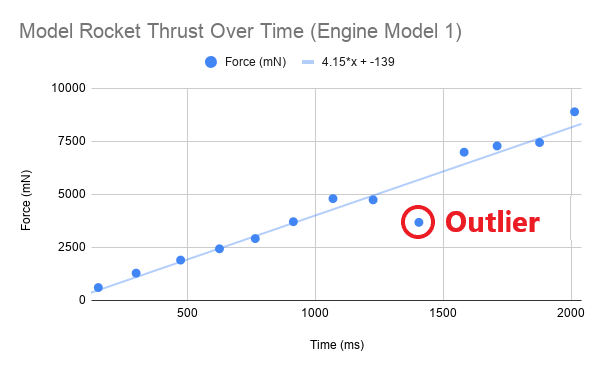
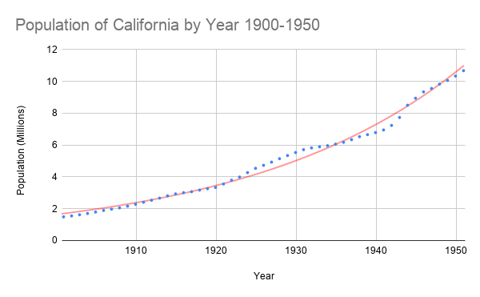

# Good Laboratory Practices (Reference)
---
::: Note
There are two videos in this lab. Sometimes the Safari browser has issues playing them. Try switching to Chrome or Firefox. Additionally, sometimes if you click the pop-out button it will play for you when it wouldn't play on the page.
:::
___

## Introduction
The goal of this assignment is to prepare you for the rest of the quarter, and even the next two quarters of the Physics 6 Lab series. We are going to walk you through some concepts that you will need to succeed in these classes. The things that we will highlight are the following:
- The structure of the lab manuals and what is required of you.
- Uncertainty in measurement.
- What are significant figures, and how to work with them.
- How to make a table of your data.
---

## PART 0: GETTING FAMILIAR WITH THE FORMAT
In all of the lab manuals you will notice some common environments. Each environment will have different tasks that you need to do in order to get full credit.

### Exercises

::: Exercise
This is an exercise. An exercise is an encapsulated task to cover one idea or concept. Inside of an exercise, you might be asked to do different subtasks. Each of these subtasks should be included in your report. **If they are not, you will lose points.**

Typical subtasks might include:

- Making a table.
- Making a plot.
- Taking a screenshot of something you did on your computer.
- Making a hand drawing, and including a picture of it.

This is not an exhaustive list, but includes the most common subtasks you will need to do.
___
As practice, for this exercise, create a list of the following three things:

- Your name.
- What major you want to graduate with.
- The person who has won the largest share of the 2019 Nobel Prize in physics.

When writing your lab report, make it as clear as possible as to which exercise you are responding. 
:::

### Question

::: Question
This is a question. Make sure that these are answered with complete sentences. Do your best to justify your responses with logic and data.
:::

### Notes

::: Note
This is a note. Notes don't require you to put anything in your report.

The main point of a note is just to highlight some critical information for you. Please make sure to read every note.
:::

### Conclusion

Each lab report will ask you to write a conclusion statement about the main point of the lab. This should be a 1-3 sentence statement highlighting most important point(s) of the lab. It should not describe how you feel about the lab, or reexplain what you did. A good example would be:

>In this lab we showed that falling objects in air do not fall with constant acceleration. The major factors affecting air resistance are mass and cross sectional area.

A bad example would be:
>In this lab I dropped a ball and timed how long it took to hit the ground. This was really cool and showed that things have air resistance. I really liked how some balls fell faster than others. This demonstrated to me that air can really affect things.

___
## PART 1: COLLECTING DATA

Physics is the study of the laws of nature through observation and experiment. In an experiment, we perform measurements and collect data, then we interpret the data and derive trends and relationships between our variables.

## Uncertainty in measurement

When we measure a quantity, say the length of a pencil, we will never be able to measure the **true value** of the length. Instead, if we are careful and thoughtful in our measurement, we will get a length close to the true length, our **best estimate**. The most honest way to report our measurement to others is to provide our best estimate and a window of values in which the true length might fall. This window is called our **uncertainty**. We would typically write down the length of the pencil in the following format.

$$
62.33 \pm 0.05 \text{ cm}
$$

The 62.33 cm is our best estimate, and the 0.05 cm is our estimate of the uncertainty. We are saying that our best guess at the true length of the rod is 62.33cm but the true length is most likely between 62.28cm and 62.38cm.

::: Note
**UNCERTANTY IS UNAVOIDABLE IN EVERY MEASUREMENT.**
:::

## Sources of Error

Error in a measurement is any deviation from the true value that is being measured. Error does not mean that you made a mistake.

There are two main types of errors: **systematic** and **random**.

**Systematic errors** arise from improper use of the measurement equipment and improper experimental techniques. Systematic uncertainties are consistent between measurements: if you repeat the experiment, you'll get the same error.

For example, when we measure the length of the pencil, if the ruler is made out of metal and the temperature of the room is very low, the ruler might be contracted. That implies that the ruler is actually shorter than it should be, and our best estimate for the length of the pencil will always be larger than its true value.

Another systematic error would be introduced if we didn't keep the line of sight perpendicular to the ruler when measuring the pencil length.

We can completely prevent systematic errors by calibrating and checking the equipment and using proper measurement techniques.

**Random error**

If we repeat a measurement, the values of the measured quantity will be different from each other and will be randomly distributed around a mean value, which we will take to be our best estimate.

We can't eliminate random errors, but we can minimize them by using precise instruments and by collecting a large data set for calculating the average of our measurements. Thus, we need to perform multiple trials by repeating the experiment several times to average out the random errors.

***Random error leads to uncertainty in our measurement.***

This random error is what we quote in the above example as 0.05 cm. 

::: Note
Systematic error should be eliminated as a source of error from our experiment.

Random error is unavoidable and leads to uncertainty in our measurement.
:::

::: Exercise
An example of a random error is your reaction time. If you time how fast a friend runs a mile, you may start or stop the stopwatch a little too early or a little too late.
1. Measure your reaction time by going to the following website: https://humanbenchmark.com/dashboard/reactiontime
2. Record your reaction time 10 times in a table. Your table should look like Table 1:
::: Figure:Table
|Trial| Reaction Time (ms) |
| -------- | -------- |
|1|
|2|
|...|
|10|
:::

3. Watch the video below. It demonstrates how to make a nice table with Google Sheets.
::: Figure:Video
!(https://www.youtube.com/watch?v=pnvFYFyK7zs)
:::

::: Note 
Make sure to include the table in your lab report.
:::

:::

### Accuracy and Precision

Systematic errors will cause bias in one direction, causing your measurements to be consistently higher or lower than the accepted value. These errors will determine the **accuracy** of your measurement.

Random errors are unbiased, so some of your measurements will be higher and some will be lower than the accepted value. Random errors will determine the **precision** of your measurement.

- **Accuracy** = how close the measured values are to the **true value**
- **Precision** = how close the measured values are to **each other**

::: Figure:Figure

:::

### Measures of Precision and Accuracy

To determine if a value is accurate, we compare it to the accepted one. A qualitative measure of accuracy is the **percent discrepancy**

::: Figure:Equation
$$\text{pecent discrepancy} = |\frac{\text{accepted - experimental}} { \text{accepted}}| \times 100%$$
:::

Sometimes there is no accepted value to our measurement. In this case, to measure the precision of two measurements that are determined experimentally, we look at how different the two values are as a percentage of their average. This is known as the **percent difference**.

:::Figure:Equation
$$
\text{pecent difference} = \frac{\text{value1 - value2}} {\text{average}} \times 100%
$$
$$
\text{average} = \frac{\text{value1 + value2}}{2}
$$ 
:::

::: Note
When comparing two values, you have two options.

1. When comparing your measured value to a value that is well accepted by the scientific community, you want to use percent discrepancy. When your percent discrepancy is low, your accuracy is high. This can be an indicator that you have eliminated systematic errors.
2. When comparing two values that are not generally accepted by the scientific community (two things you have measured), you want to use percent difference. When your percent difference is low, your precision is high.
:::

Estimating Uncertainty

We always want to do our best to estimate the uncertainty of our measurements. This can help us in our analysis of the data. A good estimate is one that is as small as reasonable without overstating your knowledge. There are two good methods for estimating uncertainty.

1. Estimating from scales
2. Estimating from repeatability

**Estimating uncertainty from a scale**

The first comes from using a graduated scale, like that of ruler. For a scale, we say the uncertainty is half of the smallest division on the scale. So if we were to use a standard meter stick that has 1 mm divisions, we would say that our uncertainty is $\pm 0.5$ mm. For a digital display, we say the error is half of the last digit displayed. That is, if we were using an electronic balance to measure the mass of a stone and read $52$ g, then we would say our uncertainty is $\pm 0.5$ g. Thus we would report the stones mass as $52.0 \pm 0.5 g$

**Estimating uncertainty from repeatability**

The second way we estimate uncertainty is by repeated measurement. Often times this allows us to quantify a more complex measurement. For instance, if we were to be use a stopwatch to time how long someone was in the air when they jumped, we shouldn't report the uncertainty by half of the last digit displayed. This is because our reaction time, how quickly we can press the start and stop button, is much larger than the precision of the stopwatch. Our reaction time makes it much harder to estimate the uncertainty of our measurement.

In order to quantify the uncertainty of the stopwatch we will need to repeat our measurement multiple times and perform some statistical analysis.

## Mean and Standard Deviation

To quantify the uncertainty in our measurements, we can conduct repeated measurements of the same quantity.

If you take N measurements of a quantity $x$, you can get a better best estimate than any one of the measurements individually. This is done by finding arithmetic average of your N measurements, known as the the mean. The formula for **the mean** is :

:::Figure:Equation
$$
x_{avg}=(x_1+x_2+..x_N)/N
$$
:::

The standard deviation is a measure of the spread in the values $x_1, x_2,..., x_N$.

:::Figure:Equation 
$$
\text{STDEV}=\sqrt{\frac{\sum{(x_i-x_{avg})^2}}{N-1}}=\delta x
$$
:::

The standard deviation is an excellent estimation of our uncertainty due to random errors. Thus we can report our measurement as:

:::Figure:Equation
$$
x_{avg} \pm \delta x
$$
:::

Where $\delta x$ is the standard deviation. We report standard deviation to 1 significant figure. You can see more about this below.

We will usually calculate the standard deviation by using the STDEV() function in Google Sheets.

:::Exercise

1. Use a stopwatch (either on your phone or online) to measure how long it takes you to say the sentence "I enjoy physics and learning about the laws of nature". Make 10 measurements. Record this data in a new table.

2. Watch the video below. It will show you how to use Google Sheets to calculate the average and the standard deviation.

:::Figure:Video
!(https://www.youtube.com/watch?v=n4WhMAHr47I)
:::
:::

### Significant Figures

When we quote our measurements, the number of digits we write has to correlate with the precision of our measurement tool. For instance, in the previous case when we use the cm scale, we quote a measurement as 1cm. We cannot quote it as 1.6723cm, since our ruler does not have that much precision.

For the mm scale, we quote our measurement as 1.6cm, since the last digit mentioned (6) is the uncertain one.

To know the best way to write our answer, we must determine which **digits carry meaningful information**, and which ones do not. That is, we keep only those digits that are *significant*. We call these *significant figures*, which many people shorten to *sig figs*. These are all the digits whose values are certain, plus the first uncertain one.

To determine the number of significant figures, count from left to right the number of digits.

For example: 1.67cm has 3 sig figs, whereas 1.6cm has two sig figs.

Note that leading zeros after the decimal point are not significant. They merely determine the location of the decimal point.

For example: 0.016 m has only two significant figures (this is the 1.6cm quoted before)

Zeros at the end of a number (trailing zeros) can be significant or not depending on context. If the trailing zero is to the right of a decimal point then we will count it as significant.

For example: 12.450 has five sig figs while 12.45000 has seven sig figs.

If the trailing zero is to the left of the decimal point it can be ambiguous. To avoid ambiguity we use the following convention. If the number ends in a decimal point, all of the zeros are significant. If the number does not end in a decimal point, the trailing zeros are not significant.

For example: 4,510,000 has three sig figs while 4,510,000. has 7 sig figs.

### Significant Figures in Calculations

**When we add a series of numbers, the one having the greatest uncertainty determines the number of significant figures in the final result.** For example, the sum 53.7 + 2.63 + 0.068 equals 56.4. Since we know the value 53.7 only to the tenths place, we cannot know the sum to anything less than that digit.

**When we multiply or divide, we take the number of significant figures in the answer to be the same as that of the quantity that has the lowest number of significant figures.** Thus, the result of the calculation (35 × 0.637)/256.3 is 0.087 (two sig figs).

Certain multipliers, such as the 180, in 180/π, the conversion factor to go from radians to degrees, or the 2 in 2πr, the formula for the circumference of a circle, are exact. They do not affect the number of significant figures in the result of a calculation in which they appear.

::: Note 
Example:

Imagine that you’ve been given the mass of a block of material as 75 grams, and its dimensions as 2.5 cm × 3.1 cm × 6.3 cm (it is a rectangular parallelepiped). You are told to calculate its density. Since density is mass per unit volume, you multiply the three dimensions together, and then divide the result into 75. You do this on a calculator. For the volume, you get 48.825 cm$^3$, and for the density, the calculator spits out 1.53609831 (depending on how many digits the display gives; the units are g/cm$^3$). It may be tempting just to write down all of those digits for the final result of the calculation. The question is whether this is necessary, or whether such a number is actually meaningful. After all, given that we know the mass to the gram, and each dimension to the tenth centimeter, do we really know the density to ten nanograms per cc (the last digit in the result above), or to a microgram per cc (the 8), or even to a milligram per cc (the 6)?

The result of the density calculation above cannot contain more than two significant figures, and is properly written as 1.5 g/cm$^3$. To obtain this result, we round the three in the next place down. We always round to the nearest value of the last significant figure. To avoid biasing calculations that have multiple steps, we always round fives to the even number. For example, to two significant figures, 1.45 is 1.4, and 1.55 is 1.6.
:::

### Significant figures in unit conversions

When converting between units, the conversions are treated as exact and don't affect the number of sig figs in your result.
___
# ANALYZING DATA
***Make sure to include all tables, plots, pictures, drawings, screenshots or anything else asked of you in the exercises in your report, as well as answers to all the questions.***

***All responses and answers should contain the correct number of sig figs and should include units when needed.***
___
## Introduction
___
In this lab we will build on some of the concepts from the previous lab while adding some new skills. New topics we will discuss in the assignment are the following:

- What makes a good table.
- How to make a plot.
- How to perform a fit to some data.
- What makes a good plot.
- Some guidance on how to determine if a plot is linear or not.
___

## Making a Good Table

In the previous assignment you learned some basics about how to make a table for your lab report. Here we will write down the requirements for any table that you submit.

In order for the table to convey the data accurately, it must contain:

1. Data organized in columns with descriptive headers that specify variable names and units. If a table must span multiple pages, a header needs to be added for every page.
2. Correct number of significant figures for the data.
3. All data in a column aligned at the decimal point.
4. If you have any calculations in your table then you should show your work for one row of the table.

::: Figure:Figure
::: row
::: column

**Good Example**
:::
::: column

**Bad Example**
:::
:::
:::

Figure 1 shows two example tables. In the table on the left, the two variables that were measured are clearly described, the headers have units, the values have the proper number of sig figs, and their decimal points are aligned.

In the table on the right the variables are not clearly described. Even if you could determine what the two columns represent, there is no way for you to know the units. Is it seconds and millimeters? Hours and nanometers? Years and feet?

Your goal with a table, is to communicate what you did as simply as possible to those reading your report. For this class, that means your TA who will be grading your report. If you are clear in your thoughts and your tables, it is more likely your TA will be able to understand any mistakes you make. This will allow them to provide better feedback, and maybe even take off less points. If your TA can't follow what you did, they are more likely to take off points.

## How to make a proper graph

Graphs help us visualize the **relationship between two variables:** the independent variable (on the x-axis) and the dependent variable (on the y-axis).

An **independent variable** is one that *doesn't* depend on anything else. Often times, but not exclusively, it is a variable that you are measuring directly.

A **dependent** variable is one that *does* depend on the other variables. Often times, but not exclusively, this is a variable that you get from doing calculations.

Often times in the lab manual we will ask you to plot "this vs. that." When asked to plot something with that format that means plot "dependent variable vs independent variable".
### Steps to Create a Good Graph:

1.  Identify the independent and dependent variables and make sure you put them on the correct axis.
2. Determine the range of each variable. Your data should take up most of the area of your plot. There *should not* be any large blanks areas.
3. Clearly label each axis with variable name and unit of measurement.
4. Plot the data as a scatter plot. DO NOT "connect the dots."
5. Draw the line of best fit (usually linear).
6. Provide a descriptive titles that communicates the scenario that is being plotted.

When it comes to a title, **don't** provide a title like "Distance vs Time." This is a bad title. This information can be determined from just looking at the axes. Your title should describe what is happening, e.g. "Distance Traveled by Car on Vacation Trip."

Here is an example of a good plot.

:::Figure:Figure

:::

Notice that the data takes up the entire plot. There are no large blank areas. Both of the axes are labeled and have units. The data points are not connected and there is a line of best fit. There is also a title for the plot that lets us know what the experimenter was doing.

### Curve Fitting

Curve fitting gives you the relationship between the two variables, highlighting the strongest trend in the data. It is determined by the entire data set, which makes it more accurate than only using a single data point. Thus, it reduces experimental errors.

Choosing which curve to use (line, parabola, exponential, etc.) for your data can take some practice. Your choice may depend on a few factors.
1. What does theory suggest it should be?
2. What message are you trying to convey to the reader?
3. Does the data suggest you've selected the correct curve?

For most of the Physics 6*L you will be doing linear fits to data, but there will be occasions where we need something non-linear. For that reason, we will provide examples mainly of linear fits, but keep in mind that these guidelines apply to any curve fit.

#### How to analyze a fit:

For this example we will consider a student, Jillian, who is investigating different types of engines in her model rocket. She wants to evaluate the thrust of the different engines as a function of time.

1. **Outliers**. These may be due to experimental error or typing the data in the plotting program. When you see an outlier you should stop and assess it. In this class, more often then not, it is because a scale was read wrong, some data was transcribed incorrectly, or there was an error in the data collecting tool.

::: Note
DO NOT REMOVE AN OUTLIER *without a good reason*.
:::

On her first run she sees an outlier in her data set. She takes a closer look at her measurement system and realizes there is a loose cable which causes intermittent failures. She decides this run was not valid, and does the experiment again.

:::Figure:Figure

:::

2. The curve fit is **balanced**, i.e. roughly the same number of points lie above the line as below it. This time Jillian plots her data and sees what looks like a balanced fit with no outliers. There are roughly the same number of points above an below the line of best fit. 

:::Figure:Figure

:::

3. As shown in Figure 9 the data should be randomly above and below your fit. For instance, if you fit a line to your data and notice that data starts off below the line, then goes above, and then below again, your data likely isn't represented by a line, but something else.

When Jillian takes data for her second engine, plots and does a linear fit this is her plot.

:::Figure:Figure

:::

Notice how the the data starts above the fit, then goes below the fit, then back above the fit. Jillian recognizes that this means her data is not linear because the data she be randomly above and below the fit as in Figure 9.

She reads the manufacturer data sheet for the second engine and learns the thrust should increase quadratically in time. So she decides to fit a parabola to the data. This is her new plot.

:::Figure:Figure

:::

Notice how the curve follows the data more closely and how the data is randomly distributed around the curve. This is sign of using the correct function to fit your data.

:::Exercise

Below are two plots of the population of California from 1900 to 1950. The data is the same in both of the plots but each has a different fit. The first one is a linear fit and the second is an exponential fit.

:::Figure:Figure

Linear
:::

:::Figure:Figure

Exponential
:::
:::

### Significant Figures in the Line of Best Fit

Just like all physical quantities, a trend or slope estimated from data is subject to the limits of significant figures for reporting purposes. In the case of the line of best fit, which may be calculated from tens --- if not hundreds --- of data points, the number of significant figures isn't directly inherited from the number of sig figs present in your data. This is something that must be estimated from the entire set of data you are working with.

We have to be clear about what a sig fig is so we know how many digits to keep! When we talk about a sig fig, we are actually talking about a measure of *uncertainty*. For example, if I measure and record the velocity of 1.2 m/s, I am saying that the actual value of that velocity is greater than 1.15 m/s and less than 1.25 m/s --- otherwise, that the true velocity lies in this interval of numbers that *round* to 1.2 m/s; hence, the "2" is the smallest significant digit.

The same principle applies for lines of best fit: we need to determine the smallest digit that is not sensitive to the random nature of a real set of data, which will never fall exactly on your trend line. While the math and concepts that are needed to fully understand this procedure are often employed in upper-division labs with error analysis components, we can use spreadsheets to help us determine the error. By using the function "LINEST", a spreadsheet will provide us with the values for the slope and intercept as well as the error in those values. The error will tell us the correct number of sig figs needed. We will demonstrate how to use this below.

To use this to determine your least significant digit, you would then truncate the value of $m$ at the digit that coincides with the first non-zero tens place of the uncertainty. For example, if you obtained $m=12.9274...$ and an uncertainty of $0.038273$, you would report in your notebook and report $m= 12.93$. This is very similar to using the "STDEV" function that we used last lab.

:::Note
When determining the number of sig figs to report in our slope or intercept we will rely on the standard error reported by the LINEST function.
:::

### Significant Figures in More Complex Curve Fits

If we are doing more complicated curve fits than just lines we require more knowledge about programming or higher level math. That is above what is needed in this class. For all of the physics 6*L classes, we will just use the following convention:

:::Note
The number of sig figs in a non-linear curve fit will be limited by the number of sig figs in your data.
:::

As an example, if we collected data on the amount of potential energy in a spring has as a function of its displacement from equilibrium, we might get data like the following:

::: row
::: column
::: Figure:Table
|Length (m)| Potential Energy (J)|
|---|---|
|0.021|0.021|
|0.043|0.212|
|0.065|0.372|
|0.085|0.740|
|0.107|1.061|
|0.129|1.850|
|0.150|2.310|
|0.169|2.756|
|0.191|3.764|
|0.209|4.121|
|0.228|4.752|
|0.249|6.250|
|0.267|7.563|
:::
:::
::: column
::: Figure:Figure

:::
Since we expect the result to be quadratic, i.e. takes the form $ax^2+bx+c$, that is the fitting function we have used. The results are displayed above the graph as $82.8x^2-3.69x-0.16$ with $a=82.8$, $b=3.69$, and $c=-0.16$. If we were to report $a$, $b$, or $c$, or do any calculations with them we need to use the correct sig figs.

To determine the correct sig figs we look to our data table. Since the lowest number of sig figs in either the length or the force is 2, we will only treat $a$, $b$, or $c$ as having two sig figs. Thus, $a=83$, $b=3.7$, and $c=-0.16$.
:::
:::

Again, this is not a standard way of treating the data, but a convention that we are taking on for this class.
___

## Working with a Spreadsheet

Now that we have talked about what makes a good table, plot, and curve fit we will show you how to do this for yourself. Spreadsheets will make your life **MUCH** easier. We highly recommend that you take the time to learn how to use them. It will be a useful skill for all of your Physics 6*L lab courses and you may even find it useful in the real world.

We will walk through plotting and fit the data in Figure 1. We will assume you can make a table from doing the first lab. This data is recorded by a car traveling from San Diego to San Francisco. The driver marked the distance traveled in kilometers roughly every 60 minutes. Once the car got on the freeway, the driver put on cruise control and never stopped (what amazing mileage!).

**We want to answer the question, what speed, in mph, did the driver set their cruise control. **

We know that for an object traveling at a constant velocity, $v$, starting at position $x_0$, that its position, $x$, as a function of time, $t$, is given by the following linear equation:

:::Figure:Equation
$$
x = vt+x_0$$
:::

Our plan here is to convert the data table into units of miles and hours so that we can answer the question in the correct units, then to fit a line to our data where the slope should be the velocity.
Using Equations in a Spreadsheet

The driver took data in units that we would like to convert. We do that in a spreadsheet program by using equations and functions. Watch the video below for instructions on how to use sheets to help with conversions.

:::Figure:Video
!(https://www.youtube.com/watch?v=Nv4Ty11e00k)
:::
#### Using Spreadsheets to make a plot

Now that we have made our table, let's plot our data and do a fit. We will have to use the LINEST function in sheets to give us the error and number of sig figs in our measurement. Watch the video below demonstrating all of this.

:::Figure:Video
!(https://www.youtube.com/watch?v=wkqlSuAoFLQ)
:::

## Using Google Sheets to Analyze Data

Use all of the tools we have discussed in this lab to analyze the speed of an inch worm.

:::Note
Make sure to include your final table with all the columns you made, a sample calculation for one row of your table, and the graph in your report. 
:::
:::